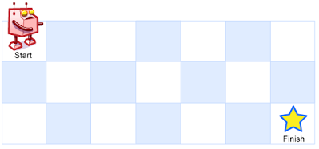

# 216. 组合总和 III

## 1. 递归传参的逻辑

​		在回溯不重复问题中，递归传参需要传递当前位置的下一个位置，作为下一层递归 for 循环的起始位置。

​		注意这个传参，传递的应该是当前位置的下一个位置。也就是说，在 for 循环中：

```python
for num in range(start_index, min(10, rest + 1, 11 - k)):  # 这里同时有两重剪枝可以做
	k -= 1
	rest -= num
	curr_result.append(num)
	# 这里：需要向下一层传递的应该是当前的 num 的下一个元素
	# 第一次整体逻辑对了，但是写成了 start_index + 1，所以从 2 往后的全都有重复……
	self.getCombines(k, rest, num + 1, curr_result[:])
	k += 1
	rest += num
	curr_result.pop(-1)
```

在 for 循环即将进入下一层递归时，当前的位置应该是 `num`，而不是  `start_index`。这里写错的话，会导致从 2 开始往后的元素都会被多次重复。

## 2. 终止条件

​		本题的终止条件适合用 `k` （剩余可选的元素数量）做判断，因为 `k` 在递归中只有两种情况：`> 0` 或 `== 0`。（因为 `k` 每次只减1，不会像 `rest` 那样突变。）

​		如果用 `rest`（剩余待拼凑的总和）做判断，需要同时对 `> 0`，`< 0` 和 `== 0` 三种情况做判断，会多写很多代码。

```python
# 这里：用 k 来做终止条件
# 用 rest 的话需要三重判断
if k == 0:
	if rest == 0:  # 达成条件了，直接返回就行，没有必要再遍历下面的节点了
	return
```

## 3. 剪枝优化

​		本题可以做的剪枝有两种：当前元素集合中剩余可选元素的数量要大于等于题目要求的还需要加入组合的元素数量；当前剩余需要拼凑的总和要小于等于准备加入当前组合的元素值，也即：
$$
num <= rest
$$

$$
10 - num <= k
$$

还有一个默认的条件是：
$$
num <= 9
$$
所以在 `for` 循环上写剪枝条件：

```python
for num in range(start_index, min(10, rest + 1, 11 - k)):
```

## 4. 整体代码

```python
class Solution(object):
    def __init__(self):
        self.result_list = []

    def getCombines(self, k, rest, start_index, curr_result):
        # 这里：用 k 来做终止条件
        # 用 rest 的话需要三重判断
        if k == 0:
            if rest == 0:  # 达成条件了，直接返回就行，没有必要再遍历下面的节点了
                self.result_list.append(curr_result)
            return
        for num in range(start_index, min(10, rest + 1, 11 - k)):  # 这里同时有两重剪枝可以做
            k -= 1
            rest -= num
            curr_result.append(num)
            # 这里：需要向下一层传递的应该是当前的 num 的下一个元素
            # 第一次整体逻辑对了，但是写成了 start_index + 1，所以从 2 往后的全都有重复……
            self.getCombines(k, rest, num + 1, curr_result[:])
            k += 1
            rest += num
            curr_result.pop(-1)

    def combinationSum3(self, k, n):
        """
        :type k: int
        :type n: int
        :rtype: List[List[int]]
        """
        self.getCombines(k, n, 1, [])
        return self.result_list
```

# 40. 组合总和 II

​		给定一个候选人编号的集合 candidates 和一个目标数 target ，找出 candidates 中所有可以使数字和为 target 的组合。
​		candidates 中的每个数字在每个组合中只能使用一次。
​		注意：解集不能包含重复的组合。 

```python
示例 1:
输入: candidates = [10,1,2,7,6,1,5], target = 8,
输出:
[
[1,1,6],
[1,2,5],
[1,7],
[2,6]
]

示例 2:
输入: candidates = [2,5,2,1,2], target = 5,
输出:
[
[1,2,2],
[5]
]
```

​		和组合总和 III 的区别：本题对组合中元素的个数没有限制，并且候选集合中的元素存在重复。

​		和组合总和的区别：本题候选集合中的元素存在重复。

## 1. 同层剪枝

​		因为候选集合中的元素存在重复，想要最终集合中的组合不重复，需要在同一树层上进行剪枝：


​		因为是在同一树层上剪枝，所以这个剪枝的过程一定发生在 `for` 循环中，并且不能影响到不同树层间重复元素的选取（例如 `[1, 1, 6]`）。

​		最简单的做法：

```python
for index in range(start_index, len(candidates)):
    ...
    if index > start_index and candidates[index] == candidates[index - 1]:
        continue
    ...
```

`candidates[index] == candidates[index - 1]` 是在把重复的数字构成的树枝剪掉；`index > start_index` 是为了确保这个剪枝过程发生在同一树层上，而不是树层之间。

​		注意：想要实现上述代码的效果，必须先对候选集合 `candidates` 进行排序。

## 2. 整体代码

```python
class Solution(object):
    def __init__(self):
        self.result_list = []
        self.curr_result = []

    def getCombine(self, candidates, start_index, rest):
        if rest == 0:
            self.result_list.append(self.curr_result[:])
            return

        for index in range(start_index, len(candidates)):
            # 因为排序了，所以后面的元素一定更大，不需要再遍历了
            if rest - candidates[index] < 0:
                break
            # 同层剪枝
            if index > start_index and candidates[index] == candidates[index - 1]:
                continue
            rest -= candidates[index]
            self.curr_result.append(candidates[index])
            self.getCombine(candidates, index + 1, rest)
            rest += candidates[index]
            self.curr_result.pop(-1)

    def combinationSum2(self, candidates, target):
        """
        :type candidates: List[int]
        :type target: int
        :rtype: List[List[int]]
        """
        # 必须要先排序！
        candidates.sort()
        self.getCombine(candidates, start_index=0, rest=target)
        return self.result_list
```

# 131. 分割回文串

## 1. 判断是否为回文串

​		可以用双指针法判断一个字符串是否为回文串：

```python
def is_palindrome(self, s):
    """
    判断 s 是否为回文串
    :param s: string 待判断的字符串
    :return: bool 是否为回文串
    """
    left, right = 0, len(s) - 1
    while left < right:
        if s[left] != s[right]:
            return False
        left += 1
        right -= 1
    return True
```

## 2. 如何把分割问题转化为回溯问题

​		对于子串分割问题，现在 `for` 循环遍历的应该是切割位置。对于长为 `length` 的字符串，一共有 `length + 1` 个切割位置（最后一个切割位置在子串的最后，是为了判断终止条件添加的）。

​		因为不能有重复的切割，所以已经切割过一次的位置就不能再进行切割了，每次应该从下一个切割位置开始切割。这也就导致了把当前子串一分为二之后，左边的那个子串是不需要递归切割的（因为它要么是一个单元素子串，要么包含已经被切割过的位置），只需要对右面的那个子串进行递归切割即可。

## 3. 如何判断终止条件

​		结合 2，终止条件应该是当前整个字符串都切割完成之后，所以在长为 `length` 的字符串的 `length` 索引处添加一个切割位置，这个切割位置会把子串切割为一个子串和一个空串。当递归中出现空串时，说明此时切割已经到了末尾，可以向结果集合中添加本次切割的结果了。

## 4. 剪枝

​		结合 2，本次切割之后，左面的那个子串不需要递归切割，因此它是否满足回文串，决定了本次切割是否还需要进行下去。如果它是回文串，那么递归切割右子串；否则，本次切割失败，直接返回。

​		综合上述 2，3，4，可以写出回溯的代码：

```javascript
def get_partition(self, s):
	// 终止条件：切割到字符串的最后
	if not s:
		self.result_list.append(self.curr_list[:])
		return
	// 让切割位置从 1 到 length，length 位置是为了终止条件添加上去的
	for i in range(1, len(s) + 1):
		s_left, s_right = s[:i], s[i:]
		// 左子串是不需要递归切割的，它是否是回文串决定了本次切割是否还需要进行下去
		if not self.is_palindrome(s_left):
			continue
		self.curr_list.append(s_left[:])
		// 递归切割右子串
		self.get_partition(s_right[:])
		// 回溯
		self.curr_list.pop(-1)
```

# 491. 递增子序列

​		给你一个整数数组 `nums` ，找出并返回所有该数组中不同的递增子序列，递增子序列中 **至少有两个元素** 。你可以按 **任意顺序** 返回答案。

​		数组中可能含有重复元素，如出现两个整数相等，也可以视作递增序列的一种特殊情况。

## 1. 层去重上的陷阱

​		这个题目看起来和之前做的层去重（组合总和 II）很像，但是不能采用之前的方法。因为原始数组不能被排序，否则会破坏题目的要求。也就是说，会出现这样的输入：`nums = [1,2,3,4,5,6,7,8,9,10,1,1,1,1,1]`，还有一些重复的 `1` 和前面的 `1` 是分开的。

​		所以这个题目只能采用复杂一点的字典记录法：用一个字典记录该元素在该层上是否已经搜索过了。

```python
def find_subsequences(self, nums, start_index):
	if len(self.curr_result) >= 2:
		self.result_list.append(self.curr_result[:])
	# 这个 used_dict 不作为参数传递，也不能放在全局的 init 里面
	# 因为它只管层去重，而不是整棵树去重。
	used_dict = {}
	for index in range(start_index, min(len(self.curr_result) + len(nums) - 1, len(nums))):
		used_dict.setdefault(nums[index], False)
        # 层去重的部分在这里
		if used_dict[nums[index]]:
			continue
		used_dict[nums[index]] = True
        # 递增剪枝的部分在这里
		if self.curr_result and nums[index] < self.curr_result[-1]:
			continue
		self.curr_result.append(nums[index])
		self.find_subsequences(nums, index + 1)
		self.curr_result.pop(-1)
```

# 100116. 找到冠军 II

​		一场比赛中共有 `n` 支队伍，按从 `0` 到 `n - 1` 编号。每支队伍也是 **有向无环图（DAG）** 上的一个节点。

​		给你一个整数 `n` 和一个下标从 **0** 开始、长度为 `m` 的二维整数数组 `edges` 表示这个有向无环图，其中 `edges[i] = [ui, vi]` 表示图中存在一条从 `ui` 队到 `vi` 队的有向边。

​		从 `a` 队到 `b` 队的有向边意味着 `a` 队比 `b` 队 **强** ，也就是 `b` 队比 `a` 队 **弱** 。

​		在这场比赛中，如果不存在某支强于 `a` 队的队伍，则认为 `a` 队将会是 **冠军** 。

​		如果这场比赛存在 **唯一** 一个冠军，则返回将会成为冠军的队伍。否则，返回 `-1` *。*

**注意**

- **环** 是形如 `a1, a2, ..., an, an+1` 的一个序列，且满足：节点 `a1` 与节点 `an+1` 是同一个节点；节点 `a1, a2, ..., an` 互不相同；对于范围 `[1, n]` 中的每个 `i` ，均存在一条从节点 `ai` 到节点 `ai+1` 的有向边。
- **有向无环图** 是不存在任何环的有向图。

## 1. 最初的思路

​		和《找到冠军 I》不同，`a` 队比 `b` 队强，`b` 队比 `c` 队强，因此 `a` 队比 `c` 队强的这种递推关系，不一定有边，而是有可能通过边之间的传递来表达，所以不能沿用上一题的做法，直接去找有没有一个节点有 `n - 1` 条出边。

​		然后又想到能不能找到每个节点所有路径上的所有节点，衍生出一个回溯+递归的思路，但是这种做法还有一个需要去重的问题。例如 `edges =[[0,1],[1,2],[0,2]], n=3`，在找 `0` 队的路径时，`2` 会被统计两次。在递归和回溯上很难去重，因此这种方法也不能通过。

## 2. 解决方案

​		其实很简单，冠军 = 不能被打败的队伍。统计 `edge[i][1]` 中出现过的所有队伍编号，这些队伍都是被打败过的，不可能是冠军。如果最后仅有一支队伍不在编号集合中，那么这支队伍就是冠军；否则冠军一定不止一个。

​		可以用几行代码快速解决问题：

```python
is_defeated = [False] * n
for edge in edges:
	if not is_defeated[edge[1]]:
		is_defeated[edge[1]] = True
	if sum(is_defeated) == n - 1:
		for group_id in range(n):
			if not is_defeated[group_id]:
	else:
		return -1
```

# 46. 全排列

​		给定一个不含重复数字的数组 `nums` ，返回其 *所有可能的全排列* 。你可以 **按任意顺序** 返回答案。

## 1. 和组合问题的区别

​		排列问题和组合问题的区别在于，排列问题是有序的。也就是说，`start_index` 没有意义了，每次都要从头开始遍历。


上图中蓝色框的位置，选了 3 之后，还可以调头回来再选 2。

## 2. 最初的想法

​		在递归函数上传递一个 `nums` 的子集，选中一个元素就把这个元素从集合中拿出去，再向下递归；回溯的时候，再把这个元素加回来。

​		可以实现，也能够通过，但是在把元素加回来的时候，需要添加到这个元素原来的位置（否则会重复选取），用到 `python` 的 `insert` 方法，很麻烦。

## 3. 解决方案

​		维护一个 `used` 字典，记录哪些数字已经被选取过了，再 `for` 遍历的时候，把这些数字跳过，不再选取。

​		注意：和 <u>491.递归子序列</u> 的区别。这次的 `used` 字典必须是全局的，因为这次不是在每层上去重，而是在全局路径上去重。也即，对于每条递归路径，不能选取重复的元素。

```python
class Solution(object):
    def __init__(self):
        self.result_list = []
        self.curr_result = []
        # used_dict 必须是一个全局的，因为去重在每条路径上，而不是每层
        self.used_dict = {}

    def get_permute(self, nums):
        if len(self.curr_result) == len(nums):
            self.result_list.append(self.curr_result[:])
            return
        for index in range(0, len(nums)):
            if not self.used_dict[nums[index]]:
                self.curr_result.append(nums[index])
                self.used_dict[nums[index]] = True
                self.get_permute(nums[:])
                self.used_dict[nums[index]] = False
                self.curr_result.pop(-1)

    def permute(self, nums):
        """
        :type nums: List[int]
        :rtype: List[List[int]]
        """
        self.used_dict = {num: False for num in nums}
        self.get_permute(nums)
        return self.result_list
```

# 47. 全排列 II

​		给定一个可包含重复数字的序列 `nums` ，***按任意顺序*** 返回所有不重复的全排列。

## 1. 存在的问题

​		因为 `nums` 包含重复的数字，所以需要在树层上去重。关键问题在于如何判断树层上已经选取过该数字了，同时又不会影响到树枝上的重复选取。

​		因为这里不像是组合问题一样，可以有 `start_index` 标注树层开始的位置，直接用 `if index > 0 and nums[index] == nums[index - 1]` 会把树枝上重复的情况也排除掉，例如 `[1, 1, 2, 2]` 的排列问题。

​		第一次做的时候，我是直接又定义了一个数组 `layer_used`，当选取了一个数字之后，在这个数字之后所有相同的数字，`layer_used` 都设置为 `False`，同层不再重复选取。但是这样需要在 `for` 循环中嵌套小的 `for` 循环，其实并不是很简单……

## 2. 解决方案

​		有 `for` 循环，其实同层数组中的元素一定是按顺序选取的，可以利用这一点。

​		如果 `nums[index] == nums[index - 1]`，同时在全局去重数组 `used[index - 1] == False`，就说明当前 `nums[index]` 已经重复了，可以直接跳过。换言之，我当前选择的数值，和前一个数值相等，但是前一个数值在全局显示没有选取过，说明以它为根的子树已经遍历过了，那么以当前数值为根的子树一定和这个遍历过的子树存在重复，可以直接跳过。如果前一个数值在全局显示选取过了，说明现在正在进行的是树枝上的查找，那么还可以继续遍历当前数值为根的子树。


```python
class Solution(object):
    def __init__(self):
        self.result_list = []
        self.curr_list = []
        self.used = []

    def get_permute(self, nums):
        if len(self.curr_list) == len(nums):
            self.result_list.append(self.curr_list[:])
            return
        for index in range(0, len(nums)):
            # 在什么情况下，才能在上一个还没被选择的时候，选择了当前的 index 呢，只能说明上一个已经被遍历过了
            if index > 0 and nums[index] == nums[index - 1] and not self.used[index - 1]:
                continue
            if not self.used[index]:
                self.used[index] = True
                self.curr_list.append(nums[index])
                self.get_permute(nums[:])
                self.curr_list.pop(-1)
                self.used[index] = False

    def permuteUnique(self, nums):
        """
        :type nums: List[int]
        :rtype: List[List[int]]
        """
        sorted_nums = sorted(nums)
        self.used = [False] * len(nums)
        self.get_permute(sorted_nums[:])
        return self.result_list
```

## 3. 和组合问题树层去重的区别

​		为什么组合问题树层去重不需要这么麻烦？

​		因为在组合问题中有 `start_index`，标志着当前树层遍历的开始，可以很清楚地知道，遍历到当前 `nums[index]` 的时候，前面的 `nums[start_index:index]` 的数值已经被遍历过了。

​		但是对于排列问题，每次 `for` 的遍历都是从 0 开始的，遍历到当前 `nums[index]` 的时候，我没法知道前面的 `nums[:index]` 到底有哪些在当前树层遍历过，需要借助 `used` 数组才行。

# 376. 摆动序列

如果连续数字之间的差严格地在正数和负数之间交替，则数字序列称为 **摆动序列 。**第一个差（如果存在的话）可能是正数或负数。仅有一个元素或者含两个不等元素的序列也视作摆动序列。

- 例如， `[1, 7, 4, 9, 2, 5]` 是一个 **摆动序列** ，因为差值 `(6, -3, 5, -7, 3)` 是正负交替出现的。
- 相反，`[1, 4, 7, 2, 5]` 和 `[1, 7, 4, 5, 5]` 不是摆动序列，第一个序列是因为它的前两个差值都是正数，第二个序列是因为它的最后一个差值为零。

**子序列** 可以通过从原始序列中删除一些（也可以不删除）元素来获得，剩下的元素保持其原始顺序。

给你一个整数数组 `nums` ，返回 `nums` 中作为 **摆动序列** 的 **最长子序列的长度** 。

## 1. 贪心算法

### ① 整体逻辑

​		为了找到哪些数字能在最后的摆动序列中保留，需要统计 `nums` 中山谷和山峰的数量：


尽可能保留山峰和山谷的数字，把在坡上的数字删除，就能得到最长的摆动序列。

​		综上所述，可以得到统计的基本条件：`pre_diff > 0 and curr_diff < 0 or pre_diff < 0 and curr_diff > 0`。

### ②  对山峰山谷情况的讨论

​		上述条件需要补充一些特殊情况，以山峰为例，山谷也是一样的。

​		第一种情况是平顶山峰：


按照原始统计条件，会得到结果 2，但是实际上在平顶山峰上也要统计一次，正确结果应该是 3。如果删除前三个元素，则修改条件为 `pre_diff >= 0 and curr_diff < 0 or pre_diff <= 0 and curr_diff > 0`。换言之，给其中一边加上等号即可。

​		第二种情况是连续上坡：


按照上述统计条件，会得到答案 3，实际上在 2 → 3 的位置根本不应该再统计一次（因为是连续上坡，其实没有山峰）。其实 `pre_diff` 和 `curr_diff` 的值本身不重要，重要的是它们的符号。因此，只有当波动变化时才更新 `pre_diff` 的值。

### ③ 对数组两端的考虑

​		上述条件中没有考虑数组两端元素的情况。按照 ① 中修改的条件，对于数组的左端点，可以想象其前面还有一个伪数字和其值相等，此时 `pre_diff == 0 and curr_diff > 0 (或 < 0)`，正好会被记入一次。对于数组的右端点，可以默认其有一个山峰或山谷，所以让 `result` 从 1 开始。

### ④ 代码实现

```python
class Solution(object):
    def __init__(self):
        # self.pre_diff 从 0 开始，遍历也从 index = 0 开始，相当于数组的左端点
        self.pre_diff = 0
        self.curr_diff = 0
        # result 从 1 开始，相当于数组的右端点
        self.result = 1

    def wiggleMaxLength(self, nums):
        """
        :type nums: List[int]
        :rtype: int
        """
        for index in range(len(nums) - 1):
            self.curr_diff = nums[index + 1] - nums[index]
            # 出现谷底或山峰
            # 注意：平顶山峰或平底山谷也要算 1 个
            if (self.pre_diff <= 0 and self.curr_diff > 0) or (self.pre_diff >= 0 and self.curr_diff < 0):
                self.result += 1
                # self.pre_diff 和 self.curr_diff 的数值不重要，重要的是正负
                # 只有出现波动的时候才更新 self.pre_diff，这样能避开连续上坡或连续下坡的情况
                self.pre_diff = self.curr_diff
        return self.result
```

# 53. 最大子数组和

## 1. 贪心算法

​		这个题目的贪心算法特别不好想。

​		用一个 `count` 记录子数组的和，如果到某个数字时 `count < 0`，说明这个数字对于得到最大子数组和没有益处，甚至有害处（之后再加上的数字都相当于在一个负数的基础上加，都变小了），为了得到最大子数组和，需要将这个数字丢弃，即从下一个数字开始重新计算子数组的和 `count`。

​		每遍历一个数字都需要判断当前 `count` 是不是最大子数组和。

```python
class Solution(object):
    def maxSubArray(self, nums):
        """
        :type nums: List[int]
        :rtype: int
        """
        max_sum = nums[0]
        count = 0
        for i in range(len(nums)):
            count += nums[i]
            max_sum = max(max_sum, count)
            if count < 0:
                count = 0
        return max_sum
```

# 100117.最大化数组末位元素的最少操作次数

​		给你两个下标从 **0** 开始的整数数组 `nums1` 和 `nums2` ，这两个数组的长度都是 `n` 。

​		你可以执行一系列 **操作（可能不执行）**。

​		在每次操作中，你可以选择一个在范围 `[0, n - 1]` 内的下标 `i` ，并交换 `nums1[i]` 和 `nums2[i]` 的值。

​		你的任务是找到满足以下条件所需的 **最小** 操作次数：

- `nums1[n - 1]` 等于 `nums1` 中所有元素的 **最大值** ，即 `nums1[n - 1] = max(nums1[0], nums1[1], ..., nums1[n - 1])` 。
- `nums2[n - 1]` 等于 `nums2` 中所有元素的 **最大值** ，即 `nums2[n - 1] = max(nums2[0], nums2[1], ..., nums2[n - 1])` 。

​		以整数形式，表示并返回满足上述 **全部** 条件所需的 **最小** 操作次数，如果无法同时满足两个条件，则返回 `-1` 。

## 1. 最初的想法

​		第一次做的时候，想法是如果不满足条件，先换最后一个元素，然后对不满足条件的数组，从最大值开始换起，直到满足条件为止。

​		其实整体思路已经对了：如果某个数字比末位元素要大，它必须和另一个数组中的同位元素交换，否则无法满足条件。但是前提条件有问题：一开始末位元素不一定要发生交换。例如：

```python
nums1 = [1, 1, 8, 9]
nums2 = [1, 7, 1, 1]
```

只要交换 `i = 1` 位置的元素就能满足条件，最少操作次数应该为 1。此时，原本的末位元素并没有发生交换。

## 2. 解决方案

​		综上所述，因为只需要最大化末位元素，所以对末位元素分情况讨论：

- 末位元素交换。此时初始的 `count = 1`
- 末位元素不交换。此时初始的 `count = 0`

​		随后，遍历两个数组，如果有不满足条件的元素，就让两个数组的对应位置交换。如果交换后还是不能满足条件，那说明这种方案是行不通的，返回 `-1`。

​		最后，从两种方案里选择成功的那一个，如果两种方案都能成功，就选择更小的那一个。

```python
class Solution(object):
    def count_swaps(self, nums1, nums2, is_swap):
        # 求交换次数
        count = 0
        if is_swap:  # 其实不需要真正的交换两个数组中的元素，计数即可
            last1, last2 = nums2[-1], nums1[-1]
            count += 1
        else:
            last1, last2 = nums1[-1], nums2[-1]
        for index in range(len(nums1) - 1):
            # 如果有一个数组不满足条件，就必须触发交换
            if nums1[index] > last1 or nums2[index] > last2:
                # 如果交换之后还是不满足条件，说明当前方案不成立
                if nums1[index] > last2 or nums2[index] > last1:
                    return -1
                count += 1
        return count

    def minOperations(self, nums1, nums2):
        """
        :type nums1: List[int]
        :type nums2: List[int]
        :rtype: int
        """
        # 末位元素交换
        ans1 = self.count_swaps(nums1=nums1[:], nums2=nums2[:], is_swap=True)
        # 末位元素不交换
        ans2 = self.count_swaps(nums1=nums1[:], nums2=nums2[:], is_swap=False)
        if ans1 < 0:
            if ans2 < 0:
                return -1
            else:
                return ans2
        else:
            if ans2 < 0:
                return ans1
            else:
                return min(ans1, ans2)
```

# 55. 跳跃游戏  & 45. 跳跃游戏 II

​		给你一个非负整数数组 `nums` ，你最初位于数组的 **第一个下标** 。数组中的每个元素代表你在该位置可以跳跃的最大长度。

​		判断你是否能够到达最后一个下标，如果可以，返回 `true` ；否则，返回 `false` 。

----

​		给定一个长度为 `n` 的 **0 索引**整数数组 `nums`。初始位置为 `nums[0]`。

​		每个元素 `nums[i]` 表示从索引 `i` 向前跳转的最大长度。换句话说，如果你在 `nums[i]` 处，你可以跳转到任意 `nums[i + j]` 处:

- `0 <= j <= nums[i]` 
- `i + j < n`

​		返回到达 `nums[n - 1]` 的最小跳跃次数。生成的测试用例可以到达 `nums[n - 1]`。

## 1. 题目存在的问题

​		数组的下标是我们要到达的位置，对应的值是在该位置能够跳跃的最远距离。这点题干说得非常不清楚，最后需要到达的位置应该是 `len(nums) - 1`，和最后一个元素没有什么关系。

## 2.贪心算法

​		无论是找能否跳到还是跳跃的最少步数，都可以用覆盖范围的方法来求解。

​		对于能否跳到，只要覆盖范围能到达最后一个下标，就能跳到。

​		对于最少跳跃次数，在覆盖范围内尽可能跳得远一点，少增加几次跳跃，就能找到最少跳跃次数。需要记录两个数据：当前的最远覆盖范围 `curr_cover` 和下一个最远覆盖范围 `next_cover` 。遍历下标位置 `index`，更新下一个最远覆盖范围 `next_cover`，当 `index` 到达 `curr_cover` 时，说明当前这一步已经走到了尽头，如果此时还没能到达终点，就只能再跳一步，同时启用 `next_cover`。每次跳跃之后都需要判断 `curr_cover` 是否覆盖了终点，如果已经覆盖了终点，就不需要继续遍历了。

```python
class Solution(object):
    def jump(self, nums):
        """
        :type nums: List[int]
        :rtype: int
        """
        if len(nums) == 1:
            return 0
        steps = 0
        curr_cover = 0
        next_cover = 0
        for index in range(len(nums)):
            # 更新下一次能够跳跃到的最远距离
            next_cover = max(next_cover, index + nums[index])
            # 本次跳跃的范围到了尽头，只能再跳一次
            if index == curr_cover:
                steps += 1
                curr_cover = next_cover
                # 如果已经覆盖了终点，可以结束遍历
                if next_cover >= len(nums) - 1:
                    break
        return steps
```

# 1005. K次取反后最大化的数组和

​		给你一个整数数组 `nums` 和一个整数 `k` ，按以下方法修改该数组：

- 选择某个下标 `i` 并将 `nums[i]` 替换为 `-nums[i]` 。

​		重复这个过程恰好 `k` 次。可以多次选择同一个下标 `i` 。

​		以这种方式修改数组后，返回数组 **可能的最大和** 。

## 1. 问题

​		整体思路就是每次把最小的负数转换成正数，当没有负数，但是 `K` 值还有时，来回转换最小的数字，直到把次数耗光。

​		第一次做的时候，把数组从小到大排序，从最小的数字开始转换，但是这样存在一个问题：负数转换成正数之后，数组就不再有序了，所以每次都需要重新排序数组，造成时间复杂度很高。

## 2. 解决方案

​		把数组按照绝对值大小从大到小排序，第一遍从左到右遍历数组，把所有的负数变成正数，同时 `K` 减小。遍历完成之后，如果 `K` 还有次数，就把最右边的数字来回切换，直到次数耗完。

​		第一遍从左到右把负数变成正数之后，因为数组是按照绝对值排序的，转换完成之后数组还是有序的，并且最右边的数字是最小的。如果还有剩下的次数，正好把这个最小的数字来回切换。

```python
class Solution(object):
    def largestSumAfterKNegations(self, nums, k):
        """
        :type nums: List[int]
        :type k: int
        :rtype: int
        """
        nums.sort(key=lambda x: abs(x), reverse=True)
        for index in range(len(nums)):
            if nums[index] < 0:
                nums[index] *= -1
                k -= 1
                if k == 0:
                    break
        while k > 0:
            nums[-1] *= -1
            k -= 1
        return sum(nums)
```

# 134. 加油站

## 1. 贪心思路

​		首先，在环路过程中，能获得的总油量和消耗的总油量是固定的（就是 `gas` 和 `cost` 的和），所以不能绕环的条件一开始就能判断（这点我也想到啦^^)。

​		接下来考虑要从哪个下标位置开始。用 `rest` 表示剩余油量，在每个加油站处，`rest[index] = gas[index] - cost[index]`。为了能够绕环，在整个遍历过程中，应该要求 `rest` 始终不能为负数，否则没法绕环。

​		这里，用和最大子数组和相似的贪心思路！累加 `rest` 的值，如果在某个 `index` 位置，累加和为负数，说明在 `[0, index]` 的区间内都不能作为起始位置，新的起始位置从 `index + 1` 开始算起。

​		完整代码：

```python
class Solution(object):
    def canCompleteCircuit(self, gas, cost):
        """
        :type gas: List[int]
        :type cost: List[int]
        :rtype: int
        """
        if sum(gas) < sum(cost):
            return -1
        start_index, curr_sum = 0, 0
        for index in range(len(gas)):
            curr_sum += (gas[index] - cost[index])
            if curr_sum < 0:
                start_index = index + 1
                curr_sum = 0
        return start_index
```

注意：虽然只遍历了一遍，但是能保证找到的 `index` 位置一定是结果。因为从这个位置开始如果又发现了负数，从环的角度看，新的起始位置就又绕回了刚刚遍历过的位置，但是刚刚遍历过的位置已经没有结果了，那只能说明结果不存在，和整体的条件出现了矛盾。

## 2.一些补充说明

​		（2023年11月25日）在复习的时候突然想到，为什么到`index`的时候`rest`为负数，说明`index`及其之前的节点都不能作为起点了呢？如果说是因为能获得的油量变少了，同理消耗也变少了才对。

​		这里有一个简单的证明。假定一个加油站序列：`gas = [x1, x2, x3, ...], cost = [y1, y2, y3, ...]`，在`index = 1`的位置`rest < 0`，那么有：`x1 + x2 < y1 + y2`。由于在`index = 1`之前的所有位置，`rest >= 0`，所以`x1 >= y1`，那么可以推出`x2 < y2`，否则一定存在矛盾，由此可见，`index = 1`及其之前的位置都不能作为起点。其它的情况也可以以此为基础推导得到。

---

# 452.用最少数量的箭引爆气球

​		有一些球形气球贴在一堵用 XY 平面表示的墙面上。墙面上的气球记录在整数数组 `points` ，其中`points[i] = [xstart, xend]` 表示水平直径在 `xstart` 和 `xend`之间的气球。你不知道气球的确切 y 坐标。

​		一支弓箭可以沿着 x 轴从不同点 **完全垂直** 地射出。在坐标 `x` 处射出一支箭，若有一个气球的直径的开始和结束坐标为 `xstart`，`xend`， 且满足  `xstart ≤ x ≤ xend`，则该气球会被 **引爆** 。可以射出的弓箭的数量 **没有限制** 。 弓箭一旦被射出之后，可以无限地前进。

​		给你一个数组 `points` ，*返回引爆所有气球所必须射出的 **最小** 弓箭数* 。

## 1.思路

​		贪心。

​		尽可能把箭射到气球的重叠位置上，就能一次引爆尽可能多的气球。从整体上来看，最后需要的箭的数量就会更少。

​		我发现我的具体求解思路和代码随想录的有点不一样，不知道将来会不会出现问题，先记录一下。

​		我的想法是，先把气球排序，为了引爆当前`index`位置的气球，在最远位置的箭就是`end`位置的箭，然后继续遍历，让这个位置的箭先引爆气球，如果遍历到某个气球不能被这支箭引爆，就射出一支新的箭，箭的位置是这个`index`的`end`位置。

​		出现的问题是，采用`start`还是`end`来排序呢？

​		我第一遍做的时候，是用`start`来排序的，但是这样会没法 AC：如果出现`[7, 12], [9, 10]`的样例，遍历到`[7, 12]`的时候会把下一支箭的位置更新为 12，再遍历到`[9, 10]`的时候就得射出一支新的箭了，但是实际上在 10 的位置射出一支箭可以直接引爆两个气球，因为这两个气球是互相嵌套的。

​		所以，我换成用`end`来排序，思路和上述贪心的思路相同，最后就能 AC 了。

## 2.代码随想录的解决方案

​		代码随想录上的解题方案按照`start`来排序，同时去找前后两个气球的重叠位置，以重叠位置较小的那个`end`作为箭射出的位置。（这么一想，或许和我的思路也差不多？）

---

# 435.无重叠区间

​		给定一个区间的集合 `intervals` ，其中 `intervals[i] = [starti, endi]` 。返回 *需要移除区间的最小数量，使剩余区间互不重叠* 。

## 1.最初的思路

​		最初我想把区间按照`start`从前到后排序，当两个区间重叠时，就删除较长的那一个。

​		这种贪心的思路是错误的：对于区间`[58, 95], [66, 98], [82, 97], [95, 99]`，按照上述逻辑会删除 3 个区间（因为上来就会把`[58, 95]`给删除，剩下 3 个区间全都相互重叠），但是实际上只删除 2 个区间即可（`[66, 98], [82, 97]`）。

## 2.正确的思路

​		删除的区间 = 全部区间 - 互不重叠的区间。

​		换言之，想要被删除的区间尽可能少，互不重叠的区间需要尽可能多。因此，应该按照`end`从前到后排序。

​		当遇到互不重叠的区间时，计数加 1，同时更新当前区间的`end`位置。

```python
class Solution(object):
    def eraseOverlapIntervals(self, intervals):
        """
        :type intervals: List[List[int]]
        :rtype: int
        """
        intervals.sort(key=lambda interval: (interval[1], interval[0]))
        count = 1
        pre_end = intervals[0][1]
        for index in range(1, len(intervals)):
            # 遇到互不重叠的区间
            if intervals[index][0] >= pre_end:
                count += 1
                pre_end = intervals[index][1]
        return len(intervals) - count
```

---

# 763.划分字母区间

​		给你一个字符串 `s` 。我们要把这个字符串划分为尽可能多的片段，同一字母最多出现在一个片段中。

​		注意，划分结果需要满足：将所有划分结果按顺序连接，得到的字符串仍然是 `s` 。

​		返回一个表示每个字符串片段的长度的列表。

## 1.我的思路

​		和重叠区间的思路差不多：先统计每个字母出现的起始和终点位置，然后找到所有的无重叠包裹区间。

```python
class Solution(object):
    def partitionLabels(self, s):
        """
        :type s: str
        :rtype: List[int]
        """
        result_list = []
        # 统计每个字母的起止位置
        char_dict = {}
        for index in range(len(s)):
            char = s[index]
            char_dict.setdefault(char, [index, index])
            char_dict[char][1] = index
        index_list = list(char_dict.values())
        index_list.sort(key=lambda item: item[0])
        start, end = index_list[0][0], index_list[0][1]
        for i in range(1, len(index_list)):
            if index_list[i][0] > end:
                # 出现了新的区间
                result_list.append(end - start + 1)
                start, end = index_list[i][0], index_list[i][1]
            else:
                # 统计最远位置
                # 因为要把之前出现过的所有字母都包裹其中
                end = max(end, index_list[i][1])
        result_list.append(end - start + 1)
        return result_list
```

## 2.代码随想录的解决方案

​		只需要统计字母出现的最终位置，然后遍历字符串，每遍历一个字母，计算当前字符串的最远位置。当遍历到下标和最远位置相等的位置时，说明从这里分割，前面出现的所有字母都能被包裹其中（因为已经到达最远位置了！）。


```python
class Solution(object):
    def partitionLabels(self, s):
        """
        :type s: str
        :rtype: List[int]
        """
        result_list = []
        char_dict = {}
        # 统计当前字母出现的最后位置
        for index in range(len(s)):
            char = s[index]
            char_dict.setdefault(char, index)
            char_dict[char] = index
        start, end = 0, 0
        for index in range(len(s)):
            char = s[index]
            end = max(end, char_dict[char])
            # 如果当前下标位置和之前出现字母的最远位置相等
            # 说明在当前下标位置分割，可以把之前所有出现的字母划分到一个片段中
            if index == end:
                result_list.append(end - start + 1)
                start, end = end + 1, end + 1
        return result_list
```

这样能加快运行速度，同时降低内存消耗。

---

# 738.单调递增的数字

​		当且仅当每个相邻位数上的数字 `x` 和 `y` 满足 `x <= y` 时，我们称这个整数是**单调递增**的。

​		给定一个整数 `n` ，返回 *小于或等于 `n` 的最大数字，且数字呈 **单调递增*** 。

## 1.第一次提交出现的问题

​		一开始就想到，从低位开始往高位遍历，一旦遇到`n[i] < n[i - 1]`的情况，为了让数字尽可能大，并且比原始数字要小，需要把`n[i]`设置为 9，`n[i - 1]`减 1。

​		在样例`n = 100`时，正确答案为 99，上述方法得到的答案为 90。

​		出错的原因在于，当遍历 0 和 0 的时候，不会发生变化，但是遍历到 0 和 1 的时候，0 变成 9，1 变成 0，这个时候，0 和 9 又不满足关系了。

​		所以当把`n[i]`设置为 9 的时候，后面的低位也需要全部设置为 9， 这样才能保证满足递增数字关系。

## 2.代码

```python
class Solution(object):
    def monotoneIncreasingDigits(self, n):
        """
        :type n: int
        :rtype: int
        """
        n_bit = []
        rest = n
        while rest > 0:
            n_bit.append(rest % 10)
            rest = int(rest / 10)
        for index in range(len(n_bit) - 1):
            if n_bit[index] < n_bit[index + 1]:
                # 在这个位置发生了变化
                n_bit[index] = 9
                # 需要将之前遍历过的位数都变成9，以保证递增序列
                j = index - 1
                while j >= 0:
                    n_bit[j] = 9
                    j -= 1
                n_bit[index + 1] -= 1
        new_n = 0
        for index in range(len(n_bit) - 1, -1, -1):
            new_n *= 10
            new_n += n_bit[index]
        return new_n
```

---

# 100142. 交换得到字典序最小的数组

​		给你一个下标从 **0** 开始的 **正整数** 数组 `nums` 和一个 **正整数** `limit` 。

​		在一次操作中，你可以选择任意两个下标 `i` 和 `j`，**如果** 满足 `|nums[i] - nums[j]| <= limit` ，则交换 `nums[i]` 和 `nums[j]` 。

​		返回执行任意次操作后能得到的 **字典序最小的数组** 。

​		如果在数组 `a` 和数组 `b` 第一个不同的位置上，数组 `a` 中的对应字符比数组 `b` 中的对应字符的字典序更小，则认为数组 `a` 就比数组 `b` 字典序更小。例如，数组 `[2,10,3]` 比数组 `[10,2,3]` 字典序更小，下标 `0` 处是两个数组第一个不同的位置，且 `2 < 10` 。

## 1. 最初的想法

​		第一次做的时候觉得可以用贪心算法去模拟：从最高位开始，依次换成后续数字中满足条件的最小值，得到的数组应该就是字典序最小的数组。

​		这样做的问题在于，实际上在每个位置上的交换并不是只执行一次就能得到最终结果的。例如：`nums = [4, 52, 38, 59, 71, 27, 31, 83, 88, 10], limit = 14`，对于`index = 1`的位置，会进行如下交换：

```
52 → 38
38 → 27
```

也就是说，换过来的数字（38）对于原来在这个位置上的数字（52）是满足条件的最小值，但是对于这个新的数字（38）不一定是（后续还有更小的 27）。

## 2. 解决方案

​		正确的思路是分组排序。

​		首先，把原始数组排序，满足条件的数字分成一组，注意，为了交换，同时需要记录它们的下标。然后，对于每组中的数字，把它们排序之后，放回原来的位置上。

​		例如，对于上面的例子：

```
第一个分组：(0, 4), (9, 10)
第二个分组：(5, 27), (6, 31), (2, 38), (1, 52), (3, 59), (4, 71)
第二个分组：(7, 83), (8, 88)
```

每个分组中前后两个数字间的差距都小于等于`limit`。把第一个分组中的所有数字，按照大小顺序放回其坐标上，也就是：

```
第一个分组：
0: 4
9: 10

第二个分组：
1: 27
2: 31
3: 38
4: 52
5: 59
6: 71

第三个分组：
7: 83
8: 88
```

这就是最终的答案。

​		为什么这种方法能够实现，我的感觉是，因为每个分组中前后两个数字之间的差距都小于等于`limit`，两两交换之下总可以把该分组中最小的数字换到最前面。所以也能知道为什么要记录下标，就是为了保证交换一定是发生在同组之内的，组间因为不满足条件，即使有更小的数字也不能交换（例如上一个例子中的 10 是永远换不到前面的）。

## 3. 完整代码

```python
class Solution(object):
    def lexicographicallySmallestArray(self, nums, limit):
        """
        :type nums: List[int]
        :type limit: int
        :rtype: List[int]
        """
        num_list = list(enumerate(nums))
        # 排序，同时记录下标
        num_list.sort(key=lambda item: item[1])
        n = len(nums)
        a = [num_list[0][0]]
        b = [num_list[0][1]]
        for i in range(1, n):
            # 找同组元素
            if num_list[i][1] - num_list[i-1][1] <= limit:
                a.append(num_list[i][0])
                b.append(num_list[i][1])
            else:
                a.sort()
                m = len(a)
                # 同组中的元素按照从小到大的顺序放回原位
                for j in range(m):
                    nums[a[j]] = b[j]
                # 分组更新
                a = [num_list[i][0]]
                b = [num_list[i][1]]
        # 最后一个分组手动更新
        a.sort()
        m = len(a)
        for j in range(m):
            nums[a[j]] = b[j]
        return nums
```

---

# 62. 不同路径

​		一个机器人位于一个 `m x n` 网格的左上角 （起始点在下图中标记为 “Start” ）。

​		机器人每次只能向下或者向右移动一步。机器人试图达到网格的右下角（在下图中标记为 “Finish” ）。

​		问总共有多少条不同的路径？



## 1. 初始化的小问题

​		我第一遍自己做的时候，只初始化了`dp[0][1]`和`dp[1][0]`两个位置的数值，结果每行遍历的时候，还需要判断`i - 1`和`j - 1`是否合法，不仅耗时变长了，内存损耗也变大了……还需要对`m = 1`或`n = 1`的情况单独判断……

​		其实，`dp`数组的第一行和第一列都可以直接初始化为 1，因为机器人只能往右或者往下走，整个第一行和第一列都只有一种走法。这样再从左到右遍历的时候，就可以直接都从 1 开始，`i - 1`和`j - 1`在任何情况下都是合法的了。

## 2. 简化后的代码

```python
class Solution(object):
    def uniquePaths(self, m, n):
        """
        :type m: int
        :type n: int
        :rtype: int
        """
        dp = [[0 for _ in range(n)] for _ in range(m)]
        # 这里：初始化的方法
        for i in range(1, m):
            dp[i][0] = 1
        for j in range(1, n):
            dp[0][j] = 1
        # 动态规划
        for i in range(1, m):
            for j in range(1, n):
                dp[i][j] = dp[i - 1][j] + dp[i][j - 1]
        return dp[-1][-1]
```

---

# 63. 不同路径 II

​		一个机器人位于一个 `m x n` 网格的左上角 （起始点在下图中标记为 “Start” ）。

​		机器人每次只能向下或者向右移动一步。机器人试图达到网格的右下角（在下图中标记为 “Finish”）。

​		现在考虑网格中有障碍物。那么从左上角到右下角将会有多少条不同的路径？

​		网格中的障碍物和空位置分别用 `1` 和 `0` 来表示。


## 1. 处理障碍物的小问题

​		因为最开始的时候把整个`dp`数组初始化为全 0，所以在处理障碍物上有一些小技巧。

​		对于初始化第一行和第一列来说，如果在第一行和第一列上出现了障碍物，那么这个位置和之后的位置就都不可达了，这个时候可以直接跳过。

```python
for i in range(m):
	if obstacleGrid[i][0] == 1:
		break
	dp[i][0] = 1
```

​		对于递推计算的时候，如果出现了障碍物，那么这个位置不可达，可以直接跳过，但是之后的位置依然有可能可达，所以要继续循环。说简单点，就是当这个位置没有障碍物的时候才计算，否则直接用之前初始化的 0 就行。

```python
for i in range(1, m):
	for j in range(1, n):
		if obstacleGrid[i][j] == 0:
			dp[i][j] = dp[i - 1][j] + dp[i][j - 1]
```

如果真的要重新赋值一下 0 的话，在初始化的时候，考虑为 0 的情况比为 1 的情况更好写。

## 2. 简化后的代码

```python
class Solution(object):
    def uniquePathsWithObstacles(self, obstacleGrid):
        """
        :type obstacleGrid: List[List[int]]
        :rtype: int
        """
        m, n = len(obstacleGrid), len(obstacleGrid[0])
        dp = [[0 for _ in range(n)] for _ in range(m)]
        # 初始化
        for i in range(m):
            # 这里：当有一个障碍的时候，后面的位置就都不可达了，直接用原来的初始值 0 就行
            if obstacleGrid[i][0] == 1:
                break
            dp[i][0] = 1
        for j in range(n):
            if obstacleGrid[0][j] == 1:
                break
            dp[0][j] = 1
        for i in range(1, m):
            for j in range(1, n):
                # 这里：反正之前初始化的时候就是初始化为 0。当不满足条件的时候直接跳过就行了，不需要再赋值一遍 0
                if obstacleGrid[i][j] == 0:
                    dp[i][j] = dp[i - 1][j] + dp[i][j - 1]
        return dp[-1][-1]
```

---

# 343. 整数拆分

​		给定一个正整数 `n` ，将其拆分为 `k` 个 **正整数** 的和（ `k >= 2` ），并使这些整数的乘积最大化。

​		返回 *你可以获得的最大乘积* 。

## 1. 思路

​		这个题目比之前的路径等等题目都要难，主要是想不到递推公式怎么写。

​		递推五步：

- `dp`和`i`的含义
  - `dp`是最大乘积
  - `i`是需要拆分的整数
  - `dp[i]`表示拆分整数`i`能够获得的最大乘积
- 递推公式
  - `dp[i] = max(dp[i], j * (i - j), j * dp[i - j])`
  - `j`从1遍历到`i - 1`
  - 表示先从`i`里面拆出一个`j`，那么剩下的部分可以不拆分；如果要拆分，一定要选择之前推导出来的乘积最大的拆分方式。这就是和之前状态之间的关系
  - 递推里面有遍历也是可能出现的情况
- 初始化
  - `dp[1] = 1, dp[2] = 1`
- 推导方向
  - 从前向后
- 手动推导一部分（略）

## 2. 代码

```python
class Solution(object):
    def integerBreak(self, n):
        """
        :type n: int
        :rtype: int
        """
        dp = [0 for _ in range(n + 1)]
        dp[1], dp[2] = 1, 1
        for i in range(3, n + 1):
            for j in range(1, i):
                dp[i] = max(dp[i], j * (i - j), j * dp[i - j])
        return dp[n]
```

---

# 100153. 需要添加的硬币的最小数量

​		给你一个下标从 **0** 开始的整数数组 `coins`，表示可用的硬币的面值，以及一个整数 `target` 。

​		如果存在某个 `coins` 的子序列总和为 `x`，那么整数 `x` 就是一个 **可取得的金额** 。

​		返回需要添加到数组中的 **任意面值** 硬币的 **最小数量** ，使范围 `[1, target]` 内的每个整数都属于 **可取得的金额** 。

​		数组的 **子序列** 是通过删除原始数组的一些（**可能不删除**）元素而形成的新的 **非空** 数组，删除过程不会改变剩余元素的相对位置。

## 1. 最初的想法

​		第一次做的时候，纠结在两个问题上：

- 如何判断当前数组能构成的所有金额？
- 知道还缺少哪些金额之后，如何添加硬币，使得所需的硬币数量最少？

​		当时甚至想到了硬币可以从小到大排序，当需要添加硬币时，应该添加上限，感觉就差一点点就能找到解法了。

## 2. 思路

​		首先，把整数数组`coins`从小到大排序。

​		其次，遍历`coins`。如果之前可取得的金额范围是`[0, s]`，并且`s < target`，当前遍历的硬币金额是`x`，那么分类讨论：

- 如果`x <= s + 1`，那么可取得的金额范围可以扩展到`[0, s + x]`，因为在`s`的地方是连续的，而只要把`x`依次加上`[0, s]`中的组合，就可以得到新的金额范围`[0, s + x]`了。不需要添加新的硬币，按顺序遍历下一枚硬币。
- 如果`x > s + 1`，或者当前已经没有能遍历的硬币了，那么必须添加一个金额为`s + 1`的硬币，同时可取得的金额范围会被扩展到`[0, 2 * s + 1]`。下一次在再遍历面值为`x`的硬币。

​		最后，返回需要添加的硬币数量即可。

## 3. 代码

```python
class Solution(object):
    def minimumAddedCoins(self, coins, target):
        """
        :type coins: List[int]
        :type target: int
        :rtype: int
        """
        coins.sort()
        # 需要添加的硬币数
        count = 0
        # 遍历硬币的索引
        i = 0
        # 上限，目前可取得的金额范围为：[0, s]
        s = 0
        while s < target:
            if i < len(coins) and coins[i] <= s + 1:
                # 更新目前可取得的金额范围为：[0, s + x]
                s += coins[i]
                i += 1
            else:
                # 为了能够达到 target 必须添加一枚面值为 s 的硬币
                count += 1
                # 更新目前可取得的金额范围为：[0, 2 * s + 1]
                s = 2 * s + 1
        return count
```

---

# 100145. 统计完全子字符串

​		给你一个字符串 `word` 和一个整数 `k` 。

​		如果 `word` 的一个子字符串 `s` 满足以下条件，我们称它是 **完全字符串：**

- `s` 中每个字符 **恰好** 出现 `k` 次。
- 相邻字符在字母表中的顺序 **至多** 相差 `2` 。也就是说，`s` 中两个相邻字符 `c1` 和 `c2` ，它们在字母表中的位置相差 **至多** 为 `2` 。

​		请你返回 `word` 中 **完全** 子字符串的数目。

​		**子字符串** 指的是一个字符串中一段连续 **非空** 的字符序列。

## 1. 最初的想法

​		拿到这个题目的时候，第一反应是创造前缀，通过前缀相减得到子字符串。

​		不仅代码特别复杂，而且也没能 AC。

​		实际上子字符串的问题还可以通过滑动窗口来求解，特别是这个题目的子字符串中只有小写英文字母，也就是最多只有 26 种不同的情况，遍历完全部也不会有很高的时间复杂度。

## 2. 思路

​		首先，按照条件 2 对字符串分组，这也是为了降低计算复杂度。因为两个相邻字符的位置相差不超过 2，那么在相差超过 2 的地方就可以将字符串分开，分别计算它们内部的完全子字符串个数，然后相加。条件 2 保证完全子字符串一定不会横跨上述分组之后的字符串。

​		其次，在每个子字符串内部查找完全子字符串。从 1 到 26 遍历字母的个数，如果当前字母个数为`m`，那么滑动窗口的长度为`l = m * k`。从子字符串的左边开始滑动滑动窗口，对于每个窗口内部，统计频次等于`k`的字母个数，如果为`m`，也就是当前窗口内所有字母的出现次数都为`k`，满足条件 1 ，找到了一个完全子字符串。

## 3. 代码

​		下述代码超时，但是逻辑完全正确。

```python
from collections import Counter


class Solution(object):
    def countSubStrings(self, word, start, end, k):
        # 返回当前子字符串中的完全子字符串数量
        result = 0
        # 因为只有 26 个英文字母，可以统计
        for m in range(1, 27):
            # 滑动窗口的长度
            l = m * k
            # 如果当前字符串的长度比滑动窗口的长度要短，那么直接结束即可
            if end - start + 1 < l:
                break
            # 初始化滑动窗口
            left, right = start, start + l - 1
            while right <= end:
                counter = Counter(word[left:right+1])
                # 滑动窗口内是完全子字符串
                above_char = 0
                for values in counter.values():
                    if values == k:
                        above_char += 1
                if above_char == m:
                    result += 1
                # 滑动窗口移动
                left += 1
                right += 1
        return result

    def countCompleteSubstrings(self, word, k):
        """
        :type word: str
        :type k: int
        :rtype: int
        """
        # 完全子字符串
        result = 0
        # 按照 distance <= 2 的条件对字符串进行分组
        # 因为完全子字符串是不可能跨组的
        start, end = 0, 1
        while end < len(word):
            if abs(ord(word[end]) - ord(word[end - 1])) > 2:
                # 计算每一个组中的完全字符串数量
                result += self.countSubStrings(word=word, start=start, end=end - 1, k=k)
                start = end
            end += 1
        # 最后一个字符串要单独考虑一下
        result += self.countSubStrings(word=word, start=start, end=end-1, k=k)
        return result
```

---

# 96. 不同的二叉搜索树

​		给你一个整数 `n` ，求恰由 `n` 个节点组成且节点值从 `1` 到 `n` 互不相同的 **二叉搜索树** 有多少种？返回满足题意的二叉搜索树的种数。

## 1. 最初的思路

​		审题！是二叉搜索树，所以左子树上的节点一定比根节点要小，右子树上的节点一定比根节点要大。

​		不要想成二叉树的形状不同了，那个求解不出来的！

## 2. 思路

​		只要解决了二叉搜索树的问题，就基本上解决了全部的问题。

​		动态规划五步：

- `dp[i]`表示有`i`个节点的二叉搜索树的种数；
- 递推公式：`dp[i] = dp[0] * dp[i - 1] + dp[1] * dp[i - 2] + ... + dp[i - 1] * dp[0]`
  - 每一项表示以某个节点`j`为根节点时，左子树有`j - 1`个节点，有`dp[j - 1]`种情况；右子树有`i - j`个节点，有`dp[i - j]`种情况。
  - `j`的取值范围从 `1 ~ i`。
- 初始化：初始化`dp[o] = 1`即可。
- 推导方向：从小向大推导。

## 3. 代码

```python
class Solution(object):
    def numTrees(self, n):
        """
        :type n: int
        :rtype: int
        """
        dp = [0 for _ in range(n + 1)]
        dp[0] = 1
        for i in range(1, n + 1):
            for j in range(1, i + 1):
                dp[i] += dp[j - 1] * dp[i - j]
        return dp[-1]
```

---

# 0-1 背包

​		小明是一位科学家，他需要参加一场重要的国际科学大会，以展示自己的最新研究成果。他需要带一些研究材料，但是他的行李箱空间有限。这些研究材料包括实验设备、文献资料和实验样本等等，它们各自占据不同的空间，并且具有不同的价值。 

​		小明的行李空间为 N，问小明应该如何抉择，才能携带最大价值的研究材料，每种研究材料只能选择一次，并且只有选与不选两种选择，不能进行切割。

​		第一行包含两个正整数，第一个整数 M 代表研究材料的种类，第二个正整数 N，代表小明的行李空间。

​		第二行包含 M 个正整数，代表每种研究材料的所占空间。 

​		第三行包含 M 个正整数，代表每种研究材料的价值。

​		输出一个整数，代表小明能够携带的研究材料的最大价值。

## 1. 思路

​		经典的动态规划题目，0-1 背包。

​		动态规划五步：

- `dp[i][j]`：表示有`i`件物品，背包容量为`j`时，能够获得的最大价值。
- 递推公式：`dp[i][j] = max(dp[i - 1][j], dp[i - 1][j - weight[i]] + value[i])`
  - 对于有`i`件物品，背包容量为`j`的情况，分类讨论：
  - 如果第`i`件物品不装进背包，那么`dp[i][j] = dp[i - 1][j]`
  - 如果第`i`件物品要装进背包，那么`dp[i][j] = dp[i - 1][j - weight[i]] + value[i]`
    - 注意，无论是哪种情况，都是`i - 1`！
    - 因为对于第二种情况而言，如果当前第`i`件物品要装，那么前`i-1`件物品能够占的容量就不能超过`j-weight[i]`。
- 推导方向：先遍历物品也可以，先遍历背包容量也可以。
- 初始化：
  - `dp[i][0]`全部初始化为 0
  - `dp[0][j]`全部初始化为 0
  
  （背包问题：在某个上限的条件下，在某个集合中选取元素，要求选取到的元素的总和最大）

## 2. Python 接收控制台输入

​		卡码网不像力扣一样有一个固定的框架，是要自行处理控制台的输入，然后输出结果的。

​		`Python`接收控制台输入：`input()`，但是不能处理输入换行的情况。

​		如果输入有多行，可以写多个`input()`，依次接收。

​		`input()`接收输入数据默认是字符串形式，通过`int()`可以转换成整型。

​		如果每行有多个数据，可以用`split()`分割，然后再用`list`转换成数组。

```python
_, bag_weight = [int(num) for num in input().split()]
weight = [int(num) for num in input().split()]
value = [int(num) for num in input().split()]
sol = Solution()
print(sol.bag_problem(w=weight, v=value, bag_weight=bag_weight))
```

## 3. 完整版代码

```python
class Solution:
    def bag_problem(self, w, v, bag_weight):
        """
        0-1 背包问题
        :param w: List[int]
        :param v: List[int]
        :param bag_weight: int
        :return: int
        """
        dp = [[0 for _ in range(bag_weight + 1)] for _ in range(len(w) + 1)]
        for i in range(1, len(w) + 1):
            for j in range(1, bag_weight + 1):
                dp[i][j] = max(dp[i - 1][j], dp[i - 1][j - w[i - 1]] + v[i - 1] if j >= w[i - 1] else 0)
        return dp[-1][-1]


if __name__ == '__main__':
    _, bag_weight = [int(num) for num in input().split()]
    weight = [int(num) for num in input().split()]
    value = [int(num) for num in input().split()]
    sol = Solution()
    print(sol.bag_problem(w=weight, v=value, bag_weight=bag_weight))
```

## 3. 滚动数组

​		从上面的递推公式可以看出，`dp[i][j]`默认从上一行中得到(`dp[i-1][j]`)，所以，可以用一维数组代替二维数组。将递推公式转换为：`dp[j] = max(dp[j], dp[j - w[i]] + v[i])`。

​		对于循环求解的过程不发生变化，还是两层`for`循环，但是现在外层必须是物品编号`i`，内层必须是背包体积`j`，而且背包体积的遍历应该是倒过来的。

​		关于为什么`j`要倒过来遍历，举例：

- `w = [1, 3, 4]`
- `v = [15, 20, 30]`
- `bag_weight = 4`

如果像是二维`dp`那样正序遍历：

- `dp[1] = max(dp[1], dp[0] + 15) = 15`
- `dp[2] = max(dp[2], dp[1] + 15) = 30`

可以看出，物品会被选多次（`dp[2]`本来应该是 15，现在变成了 30），所以只能反过来遍历。

​		（可以这样考虑。本身`dp[i][j]`是从上一行的对应元素或者上一行的前面某个元素得到的。当转换成滚动数组时，本行实际上是用上一行的值初始化的，按照原来的对应关系，需要保证在求`dp[j]`时，之前的元素保持上一行的值不变，因此必须倒着遍历。）

```python
class Solution:
    def bag_problem(self, w, v, b):
        """
        滚动数组求解 0-1 背包问题。
        :param w: List[int]
        :param v: List[int]
        :param b: int
        :return: int
        """
        dp = [0 for _ in range(b + 1)]
        for i in range(1, len(w) + 1):
            for j in range(b, w[i - 1] - 1, -1):
                dp[j] = max(dp[j], dp[j - w[i - 1]] + v[i - 1] if j >= w[i - 1] else 0)
        return dp[-1]
```

---

# 416. 分割等和子集

​		给你一个 **只包含正整数** 的 **非空** 数组 `nums` 。请你判断是否可以将这个数组分割成两个子集，使得两个子集的元素和相等。

## 1. 最初的思路

​		关键在于谁是背包的重量，谁是背包的价值？

​		开始的时候，把子集中元素的个数作为背包的重量，假定每一个元素的重量都为 1，但是这样是有问题的：0-1背包问题的递推公式是求最大价值的，上述方法会默认取能取的最大价值，也就是最大的元素……但是取最大的元素不一定能得到两个等和的子集。

## 2. 思路

​		`nums`既是物品的重量也是物品的价值。也就是说，把问题转换成，现在有一个容量大小为`target = sum(nums) // 2`的背包，要装`nums`里的元素；在背包容量允许的范围内，装的元素的价值要尽可能大（尽可能接近`target`。同时因为重量和价值是一个数值，所以永远不可能超过）。如果背包中的元素之和也为`target`，说明背包正好装满，也就找到了等和子集。

## 3. 代码

​		别忘了递推公式中的判断条件。

```python
class Solution(object):
    def canPartition(self, nums):
        """
        :type nums: List[int]
        :rtype: bool
        """
        if sum(nums) % 2 != 0:
            return False
        target = sum(nums) // 2
        dp = [[0 for _ in range(target + 1)] for _ in range(len(nums) + 1)]
        for i in range(1, len(nums) + 1):
            for j in range(1, target + 1):
                # 物品能否真的装进背包需要判断条件
                dp[i][j] = max(dp[i - 1][j], dp[i - 1][j - nums[i - 1]] + nums[i - 1] if j >= nums[i - 1] else 0)
                if j == target and dp[i][j] == target:
                    return True
        return False
```

---

# 417. 最后一块石头的重量 II

​		有一堆石头，用整数数组 `stones` 表示。其中 `stones[i]` 表示第 `i` 块石头的重量。

​		每一回合，从中选出**任意两块石头**，然后将它们一起粉碎。假设石头的重量分别为 `x` 和 `y`，且 `x <= y`。那么粉碎的可能结果如下：

- 如果 `x == y`，那么两块石头都会被完全粉碎；
- 如果 `x != y`，那么重量为 `x` 的石头将会完全粉碎，而重量为 `y` 的石头新重量为 `y-x`。

​		最后，**最多只会剩下一块** 石头。返回此石头 **最小的可能重量** 。如果没有石头剩下，就返回 `0`。

## 1. 问题转换

​		这道题可以转换成416. 分割等和子集问题。每次选出任意两块石头，一起粉碎，可以理解成把一堆石头分成重量尽可能接近的两堆，让这两堆石头相撞（重量相减），得到的就是剩下的石头。那么，对于这两堆石头中的一堆，可以视为一个0-1 背包：在背包容量不超过石头重量总和的一半条件下，尽可能装石头，让石头的重量接近石头重量总和的一半。

​		和分割等和子集一样，`stones`既是物品的重量，又是物品的价值。

​		（背包的体积是上限，有可能不能到达，背包中物品的价值是实际由选取物品得到的）

## 2. 代码

```python
class Solution(object):
    def lastStoneWeightII(self, stones):
        """
        :type stones: List[int]
        :rtype: int
        """
        target = int(sum(stones) / 2)
        dp = [[0 for _ in range(target + 1)] for _ in range(len(stones) + 1)]
        for i in range(1, len(stones) + 1):
            for j in range(1, target + 1):
                dp[i][j] = max(dp[i - 1][j], dp[i - 1][j - stones[i - 1]] + stones[i - 1] if j >= stones[i - 1] else 0)
        return (sum(stones) - dp[-1][-1]) - dp[-1][-1]
```

---

# 494. 目标和

​		给你一个非负整数数组 `nums` 和一个整数 `target` 。

​		向数组中的每个整数前添加 `'+'` 或 `'-'` ，然后串联起所有整数，可以构造一个 **表达式** ：

- 例如，`nums = [2, 1]` ，可以在 `2` 之前添加 `'+'` ，在 `1` 之前添加 `'-'` ，然后串联起来得到表达式 `"+2-1"` 。

​		返回可以通过上述方法构造的、运算结果等于 `target` 的不同 **表达式** 的数目。

## 1. 问题转换

​		首先，如果`sum(nums) < abs(target)`，说明即使把整个非负整数数组全添加正号（此时最大）或者全添加负号（此时最小）都不能满足`target`，则不存在满足要求的表达式。

​		假定添加正号的整数之和为`left`，添加负号的整数之和为`right`，则有`left + right = sum(nums), left - right = target`，可以推出`left = (sum(nums) + target) // 2`。

​		再做判断：如果不能整除，说明也不存在满足要求的表达式。

​		如果能整除，问题转换成，如何选择`nums`中的整数，使其和为`left`，求这样的选择有多少种（`right`就是选剩下的整数）。

​		动态规划：

- `dp[i][j]`：前`i`个整数，凑成和为`j`，有多少种凑法。
- 递推公式：`dp[i][j] = dp[i - 1][j] + dp[i - 1][j - nums[i - 1]]`（注意：物品编号从 1 开始）
  - 如果不选择`nums[i - 1]`，那么就要用前`i - 1`个元素凑出和`j`，一共有`dp[i - 1][j]`种凑法；
  - 如果选择`nums[i - 1]`，那么就要用前`i - 1`个元素凑出和`j - nums[i - 1]`，一共有`dp[i - 1][j - nums[i - 1]]`种凑法。
- 初始化：本题的初始化和0-1背包有些不同。初始化`dp[0][0] = 1`。
  - 为什么初始化为 1？为了让递推公式能够正常推导，如果这里初始化为 0 了，下面就会全都是 0，没法得到正确的结果。
  - 为什么不初始化`dp[i][0]`？因为对于`nums[i]`，和物品的重量不同，可以取值为 0，也就是说要凑 0，也可以有很多种不同的凑法，所以不能直接全部初始化为 0 或者 1。
- 推导方向：从小到大。

## 2. 代码

```python
class Solution(object):
    def findTargetSumWays(self, nums, target):
        """
        :type nums: List[int]
        :type target: int
        :rtype: int
        """
        count = 0
        if sum(nums) < abs(target):  # 数组中的元素最大也不能凑到 target
            return count
        if (sum(nums) + target) % 2 > 0:  # 不能构造成功
            return count
        bag_size = (sum(nums) + target) // 2
        dp = [[0 for _ in range(bag_size + 1)] for _ in range(len(nums) + 1)]
        # 这个题目的初始化和普通的 0-1 背包不同
        dp[0][0] = 1
        for i in range(1, len(nums) + 1):
            for j in range(bag_size + 1):
                if j >= nums[i - 1]:  # 当选中 nums[i - 1] 时
                    dp[i][j] = dp[i - 1][j] + dp[i - 1][j - nums[i - 1]]
                else:
                    dp[i][j] = dp[i - 1][j]
        return dp[-1][-1]
```

---

# 完全背包

## 1. 思路

​		完全背包和 0-1 背包的区别在于，物品的数量是无限的，也就是每一个物品可以取无限次。

​		递推公式：`dp[i][j] = max(dp[i - 1][j] + dp[i][j - w[i]] + v[i])`（二维数组）`dp[j] = max(dp[j], dp[j - w[i]] + v[i])`（滚动数组）

​		二维递推公式的推导参考：http://t.csdnimg.cn/PQHE9 重点在这里：


​		对于滚动数组，递推公式的形式没有发生变化，但是在遍历背包的时候，现在要从前向后遍历（要先算出`dp[i][j - w[i]]`）。

## 2. 代码

​		二维数组：

```python
def complete_bag_problem(items, bag_size):
    n = len(items)
    dp = [[0 for _ in range(bag_size + 1)] for _ in range(n + 1)]
    for i in range(1, n + 1):
        for j in range(1, bag_size + 1):
            if j >= items[i - 1][0]:
                # 这里：递推公式有变化！
                dp[i][j] = max(dp[i - 1][j], dp[i][j - items[i - 1][0]] + items[i - 1][1])
            else:
                dp[i][j] = dp[i - 1][j]
    return dp[-1][-1]
```

​		滚动数组：

```python
def complete_bag_problem(items, bag_size):
    n = len(items)
    dp = [0 for _ in range(bag_size + 1)]
    for i in range(n):
        # 这里：现在是从前向后遍历了！
        for j in range(items[i][0], bag_size + 1):
            dp[j] = max(dp[j], dp[j - items[i][0]] + items[i][1])
    return dp[-1]
```

---

# 518. 零钱兑换 II

​		给你一个整数数组 `coins` 表示不同面额的硬币，另给一个整数 `amount` 表示总金额。

​		请你计算并返回可以凑成总金额的硬币组合数。如果任何硬币组合都无法凑出总金额，返回 `0` 。

​		假设每一种面额的硬币有无限个。 

​		题目数据保证结果符合 32 位带符号整数。

## 1. 思路

​		和目标和问题一样，只不过把 0-1 背包问题变成了完全背包问题。

- `dp[i][j]`表示用前`i`种硬币，凑出金额为`j`的组合数；
- 递推公式：`dp[i][j] = dp[i - 1][j] + dp[i][j - coins[i]]`
- 初始化：`dp[0][0] = 1, dp[0][j] = 0`
- 遍历方向：均为从小到大遍历。

## 2. 有关遍历顺序的问题

​		对于先遍历物品还是先遍历背包容量的问题。

​		用二维`dp`数组的时候，无论先遍历哪一个都没有区别。

​		用滚动数组的时候，先遍历物品，后遍历背包容量，得到的是组合数；先遍历背包容量，后遍历物品，得到的是排列数。

​		（为什么会是这样……我试着推导了一下，发现在先遍历背包容量，后遍历物品的情况下，`{1, 2}`和`{2, 1}`会被分成两次单独计数，也就是变成了排列问题）

## 3. 代码

```python
# 二维 dp 数组
class Solution(object):
    def change(self, amount, coins):
        """
        :type amount: int
        :type coins: List[int]
        :rtype: int
        """
        dp = [[0 for _ in range(amount + 1)] for _ in range(len(coins) + 1)]
        dp[0][0] = 1
        for i in range(1, len(coins) + 1):
            for j in range(amount + 1):
                dp[i][j] = dp[i - 1][j]
                if j >= coins[i - 1]:
                    dp[i][j] += dp[i][j - coins[i - 1]]
        return dp[-1][-1]
```

```python
# 一维滚动数组
class Solution(object):
    def change(self, amount, coins):
        """
        :type amount: int
        :type coins: List[int]
        :rtype: int
        """
        dp = [0 for _ in range(amount + 1)]
        dp[0] = 1
        # 这里：必须先遍历物品，后遍历背包容量
        for i in range(1, len(coins) + 1):
            for j in range(coins[i - 1], amount + 1):
                dp[j] += dp[j - coins[i - 1]]
        return dp[-1]
```

---

# 100151. 使数组成为等数数组的最小代价

​		给你一个长度为 `n` 下标从 **0** 开始的整数数组 `nums` 。

​		你可以对 `nums` 执行特殊操作 **任意次** （也可以 **0** 次）。每一次特殊操作中，你需要 **按顺序** 执行以下步骤：

- 从范围 `[0, n - 1]` 里选择一个下标 `i` 和一个 **正** 整数 `x` 。
- 将 `|nums[i] - x|` 添加到总代价里。
- 将 `nums[i]` 变为 `x` 。

​		如果一个正整数正着读和反着读都相同，那么我们称这个数是 **回文数** 。比方说，`121` ，`2552` 和 `65756` 都是回文数，但是 `24` ，`46` ，`235` 都不是回文数。

​		如果一个数组中的所有元素都等于一个整数 `y` ，且 `y` 是一个小于 `109` 的 **回文数** ，那么我们称这个数组是一个 **等数数组** 。

​		请你返回一个整数，表示执行任意次特殊操作后使 `nums` 成为 **等数数组** 的 **最小** 总代价。

## 1. 思路

​		（回过头来看题解，发现最初的想法是正确的，差一点就能做出来了。）

​		首先，要找`nums`的中位数，这里有两种情况，第一种情况中位数唯一，第二种情况中位数不唯一。可以用`n`和`n - 1`的方法把它们放在一起考虑：

```python
nums.sort()
n = len(nums)
mid_idx1, mid_idx2 = (n - 1) // 2, n // 2
lower, upper = nums[mid_idx1], nums[mid_idx2]
```

如果中位数唯一（`n`为奇数），则`mid_idx1 = mid_idx2`。

​		其次，找到中位数之后怎么找回文数。其实不需要多麻烦的凑出来，直接用一个`while`循环在左右去找就可以：

```python
while not self.check_palindrome(num=lower):
	lower += 1
while not self.check_palindrome(num=upper):
	upper -= 1
```

注意这里，如果中位数唯一（`lower = upper`），则找到的回文数正好是这个中位数左右两侧的最近回文数；如果中位数不唯一，则找到的回文数要么被夹在两个中位数之间，要么分布在两个中位数左右两侧最近的位置，正好把所有可能的情况都考虑进去了。

​		最后就很简单的看凑到哪个回文数的代价更小即可。

## 2. 代码

```python
class Solution(object):
    def check_palindrome(self, num):
        # 判断一个数字是否为回文数
        num_list = []
        rest = num
        while rest > 0:
            num_list.append(rest % 10)
            rest = rest // 10
        left, right = 0, len(num_list) - 1
        while left < right:
            if num_list[left] != num_list[right]:
                return False
            left += 1
            right -= 1
        return True

    def compute_count(self, nums, p):
        # 计算代价
        count = 0
        for i in range(len(nums)):
            count += abs(p - nums[i])
        return count

    def minimumCost(self, nums):
        """
        :type nums: List[int]
        :rtype: int
        """
        nums.sort()
        n = len(nums)
        mid_idx1, mid_idx2 = (n - 1) // 2, n // 2
        lower, upper = nums[mid_idx1], nums[mid_idx2]
        while not self.check_palindrome(num=lower):
            lower += 1
        while not self.check_palindrome(num=upper):
            upper -= 1
        return min(self.compute_count(nums=nums, p=lower), self.compute_count(nums=nums, p=upper))
```

---

# 139. 单词拆分

​		给你一个字符串 `s` 和一个字符串列表 `wordDict` 作为字典。请你判断是否可以利用字典中出现的单词拼接出 `s` 。

​		**注意：**不要求字典中出现的单词全部都使用，并且字典中的单词可以重复使用。

## 1. 思路

​		因为跟在背包问题后面，所以很容易想到是个完全背包问题，而且是排列数。字符串 `s` 是背包的容量，主要问题在于物品是不是 `wordDict`。

​		如果把 `wordDict` 当做物品，在写递推关系的时候会很困难，因为每次选择一个物品，都会产生一个剩余的字符串，而这个字符串在上一层不一定计算过结果，开始的时候就是卡在了这个地方。

​		举个例子，`s = "catsandog", wordDict = ["cats", "dog", "sand", "and", "cat"]`。当遍历到 `"sand"` 时，如果选上，那么会产生 `"catog"` 的字符串，而这个字符串在之前并没有做过判断，所以不能判断当前是否能够拼接成功。

​		其实这个题目和之前做过的回文串回溯问题和整数拆分很像。对于一个长为 `j` 的字符串，可以从 `i` 的位置拆分，分成长为 `i` 的字符串和剩下的 `s[i:j]`。`dp[i]` 在之前已经判断过能否利用字典中的单词拼接出来，现在只需要判断 `s[i:j]` 能否用字典拼接出来就可以了。如果也能，说明长为 `j` 的字符串可以被拼接出来；否则则不行。

​		所以实际上的物品应该是字符串的分割位置。

- `dp[j]`表示长为 `j` 的字符串能否用字典中的单词拼接出来。
- 递推公式：`dp[j] = dp[j] or (dp[i] and str[i:j] in wordDict)`。
- 初始化：`dp[0] = true`。
- 递推方向：从小到大，先 `j` 后 `i`（因为是排列问题）。

## 2. 代码

```python
class Solution(object):
    def wordBreak(self, s, wordDict):
        """
        :type s: str
        :type wordDict: List[str]
        :rtype: bool
        """
        dp = [False for _ in range(len(s) + 1)]
        dp[0] = True
        for j in range(1, len(s) + 1):
            for i in range(j):
                dp[j] = dp[i] and s[i:j] in wordDict
                if dp[j]:
                    break
        return dp[-1]
```

---

# 100169.移除栅栏得到的正方形田地的最大面积

​		有一个大型的 `(m - 1) x (n - 1)` 矩形田地，其两个对角分别是 `(1, 1)` 和 `(m, n)` ，田地内部有一些水平栅栏和垂直栅栏，分别由数组 `hFences` 和 `vFences` 给出。

​		水平栅栏为坐标 `(hFences[i], 1)` 到 `(hFences[i], n)`，垂直栅栏为坐标 `(1, vFences[i])` 到 `(m, vFences[i])` 。

​		返回通过 **移除** 一些栅栏（**可能不移除**）所能形成的最大面积的 **正方形** 田地的面积，或者如果无法形成正方形田地则返回 `-1`。

​		由于答案可能很大，所以请返回结果对 `109 + 7` **取余** 后的值。

​		**注意：**田地外围两个水平栅栏（坐标 `(1, 1)` 到 `(1, n)` 和坐标 `(m, 1)` 到 `(m, n)` ）以及两个垂直栅栏（坐标 `(1, 1)` 到 `(m, 1)` 和坐标 `(1, n)` 到 `(m, n)` ）所包围。这些栅栏 **不能** 被移除。

## 1.思路

​		（差一点就想到了，感觉还是因为不太敢用暴力法解决问题）

​		枚举任意两条栅栏（包括最外面的边框）之间的距离，找到水平方向距离和垂直方向距离的交集，用其中最大的那个作为正方形田地的边，这样构成的正方形田地就是面积最大的。

## 2.代码

```python
"""
100169.移除栅栏得到的正方形田地的最大面积
暴力枚举。
"""


class Solution(object):
    def compute_distance(self, fences):
        fences.sort()
        distances = []
        for i in range(len(fences)):
            for j in range(i + 1, len(fences)):
                distances.append(fences[j] - fences[i])
        return list(set(distances))
    	"""return set(distances)"""

    def maximizeSquareArea(self, m, n, hFences, vFences):
        """
        :type m: int
        :type n: int
        :type hFences: List[int]
        :type vFences: List[int]
        :rtype: int
        """
        # 暴力枚举任意两个栅栏之间的距离
        hFences.extend([1, m])
        vFences.extend([1, n])
        h_distances = self.compute_distance(fences=hFences)
        v_distances = self.compute_distance(fences=vFences)
        # 查找交集，计算最大的正方形面积
        # 下面是基于列表+双指针的方法
        h_distances.sort()
        v_distances.sort()
        left, right = 0, 0
        max_edge = -1
        while left < len(h_distances) and right < len(v_distances):
            if h_distances[left] == v_distances[right]:
                # 这里注意一下，去找边而不是直接找最大面积，否则会有一点问题
                max_edge = max(max_edge, h_distances[left])
                left += 1
                right += 1
            elif h_distances[left] < v_distances[right]:
                left += 1
            else:
                right += 1
        return max_edge ** 2 % (10 ** 9 + 7) if max_edge != -1 else -1
    	# 下面是基于集合的方法
        """cover_distances = h_distances & v_distances
        if cover_distances:
            ans = max(cover_distances)
        else:
            ans = 0
        return ans ** 2 % (10 ** 9 + 7) if ans else -1"""


if __name__ == '__main__':
    sol = Solution()
    print(sol.maximizeSquareArea(m=6, n=7, hFences=[2], vFences=[4]))

```

---

# 100156.转换字符串的最小成本 I

​		给你两个下标从 **0** 开始的字符串 `source` 和 `target` ，它们的长度均为 `n` 并且由 **小写** 英文字母组成。

​		另给你两个下标从 **0** 开始的字符数组 `original` 和 `changed` ，以及一个整数数组 `cost` ，其中 `cost[i]` 代表将字符 `original[i]` 更改为字符 `changed[i]` 的成本。

​		你从字符串 `source` 开始。在一次操作中，**如果** 存在 **任意** 下标 `j` 满足 `cost[j] == z` 、`original[j] == x` 以及 `changed[j] == y` 。你就可以选择字符串中的一个字符 `x` 并以 `z` 的成本将其更改为字符 `y` 。

​		返回将字符串 `source` 转换为字符串 `target` 所需的 **最小** 成本。如果不可能完成转换，则返回 `-1` 。

​		**注意**，可能存在下标 `i` 、`j` 使得 `original[j] == original[i]` 且 `changed[j] == changed[i]` 。

## 1.多源最短路径：Floyd 算法

​		首先，根据最初的路径情况初始化可达矩阵。

​		然后，遍历节点，执行如下操作：

```python
for u in point_set:
    for v in point_set:
        for k in point_set:
            d[v][k] = min(d[v][u] + d[u][k], d[v][k])
```

用自然语言的方式来描述的话，就是节点`v`到节点`k`之间的距离是否会因为途径节点`u`而变短；如果会，则更新节点`v`到节点`k`之间的距离为新的最短距离。

​		当所有节点都当过一次中转之后，算法结束。

## 2. 思路

​		（差一点点就能做出来了……崩溃……）

​		这个题目有个很小的问题：`original`和`changed`中的字母可能存在重复。

​		如何理解重复，可能是`a`到`b`，`b`到`c`，所以`a`到`c`可以拓展出一条路径；也可以是`a`到`b`，`a`到`c`都有路径。还有一种情况，就是`a`到`b`之间可能存在权重不同的多条路径！

​		为了让总体的成本最小，如果两个节点之间存在多条路径，需要选择其中成本最小的那一条。所以在初始化可达矩阵的时候，需要加一个最小化的判断。

## 3. 代码

```python
"""
100156.转换字符串的最小成本 I
"""


class Solution(object):
    def minimumCost(self, source, target, original, changed, cost):
        """
        :type source: str
        :type target: str
        :type original: List[str]
        :type changed: List[str]
        :type cost: List[int]
        :rtype: int
        """
        MAX_INT = float("inf")
        # 求最短路径
        path = [[MAX_INT for _ in range(26)] for _ in range(26)]
        for i in range(26):
            path[i][i] = 0
        for i in range(len(original)):
            start = ord(original[i]) - ord("a")
            end = ord(changed[i]) - ord("a")
            # 这里有个细节问题：original 和 changed 里面的字母可以重复
            # “可以重复”的意思不仅仅是指路径可以扩展
            # 还有一种可能是 b -> c 这种直接的路线可以重复多次！
            path[start][end] = min(path[start][end], cost[i])
        # 多源最短路径：Floyd 算法
        for i in range(26):
            # 用第 i 个字母作为中转，考虑从第 j 个字母到第 k 个字母的情况
            for j in range(26):
                for k in range(26):
                    if (path[j][i] + path[i][k]) < path[j][k]:
                        path[j][k] = path[j][i] + path[i][k]
        # 开始考虑字符串的转换
        total_cost = 0
        for i in range(len(source)):
            if source[i] == target[i]:
                continue
            total_cost += path[ord(source[i]) - ord("a")][ord(target[i]) - ord("a")]
        return total_cost if total_cost < MAX_INT else -1
```

---

# 卡码网56.携带矿石资源

<!--到写笔记为止，没能在卡码网上通过。如果使用二维dp数组，内存会超限；如果用滚动数组，会提示潜在的指针或数组越界，但是代码本身应该是没有问题的，看评论区也没有用Python通过的，怀疑是后台的判题机制有问题。-->

题目描述

> ​		你是一名宇航员，即将前往一个遥远的行星。在这个行星上，有许多不同类型的矿石资源，每种矿石都有不同的重要性和价值。你需要选择哪些矿石带回地球，但你的宇航舱有一定的容量限制。 
>
> ​		给定一个宇航舱，最大容量为 C。现在有 N 种不同类型的矿石，每种矿石有一个重量 w[i]，一个价值 v[i]，以及最多 k[i] 个可用。不同类型的矿石在地球上的市场价值不同。你需要计算如何在不超过宇航舱容量的情况下，最大化你所能获取的总价值。

输入描述

> 输入共包括四行，第一行包含两个整数 C 和 N，分别表示宇航舱的容量和矿石的种类数量。 
>
> 接下来的三行，每行包含 N 个正整数。具体如下： 
>
> 第二行包含 N 个整数，表示 N 种矿石的重量。 
>
> 第三行包含 N 个整数，表示 N 种矿石的价格。 
>
> 第四行包含 N 个整数，表示 N 种矿石的可用数量上限。

输出描述

> 输出一个整数，代表获取的最大价值。

## 1. 多重背包

​		和0-1背包和完全背包的区别在于，物品的数量不是1或者无限，而是某个固定的值`nums[i]`。

​		多重背包的解法在于将其转换为0-1背包，也就是把所有的物品展平，变成每个物品只有一个（但是物品的重量和价值可能相等）。这样就可以借用0-1背包的递推式解决多重背包问题了。

## 2. 二维dp数组代码

​		我没想到很好地解决多个物品的方法，所以干脆在求解之前先展平了，这样内存会有一点大。

```python
class Solution(object):
    def bag_problem(self, size, weights, values, nums):
        flat_weights, flat_values = [], []
        for i in range(len(nums)):
            flat_weights.extend([weights[i]] * nums[i])
            flat_values.extend([values[i]] * nums[i])
        # 初始化
        dp = [[0 for _ in range(size + 1)] for _ in range(sum(nums) + 1)]
        # 递推
        for i in range(1, sum(nums) + 1):
            for j in range(1, size + 1):
                if j >= flat_weights[i - 1]:
                    dp[i][j] = max(dp[i - 1][j], dp[i - 1][j - flat_weights[i - 1]] + flat_values[i - 1])
                else:
                    dp[i][j] = dp[i - 1][j]
        return dp[-1][-1]
```

## 3. 滚动数组代码

​		用滚动数组会比二维数组要好想一点。直接在两层0-1背包遍历里面，加一层遍历物品数量即可。

```python
class Solution(object):
    def bag_problem(self, size, weights, values, nums):
        # 初始化
        dp = [0 for _ in range(size + 1)]
        for i in range(len(weights)):
            for j in range(size, weights[i] - 1, -1):
                for k in range(1, nums[i] + 1):
                    if j >= k * weights[i]:
                        dp[j] = max(dp[j], dp[j - k * weights[i]] + k * values[i])
        return dp[-1]
```

---

# 213. 打家劫舍 II

​		你是一个专业的小偷，计划偷窃沿街的房屋，每间房内都藏有一定的现金。这个地方所有的房屋都 **围成一圈** ，这意味着第一个房屋和最后一个房屋是紧挨着的。同时，相邻的房屋装有相互连通的防盗系统，**如果两间相邻的房屋在同一晚上被小偷闯入，系统会自动报警** 。

​		给定一个代表每个房屋存放金额的非负整数数组，计算你 **在不触动警报装置的情况下** ，今晚能够偷窃到的最高金额。

## 1. 思路

​		其实就是两种情况，考虑从第一间房屋到倒数第二间房屋这个区间里能偷窃到的最高金额，或者从第二间房屋到最后一间房屋这个区间里能偷窃到的最高金额，两者之间取更大的那个。具体要不要偷第一间房屋和最后一间房屋由递推公式自己决定。

<!--被绕进去的地方在于，我认为是三种情况：必须偷第一间，必须偷最后一间，第一间和最后一间都不偷，所以根本没法用递推公式求出来。其实在第一种情况，如果不偷第一间想偷最后一间，在第二种情况里面已经包含了，反过来也是同理，具体偷不偷让递推公式自己决定就可以了。-->

## 2. 代码

```python
class Solution(object):
    def rob(self, nums):
        """
        :type nums: List[int]
        :rtype: int
        """
        if len(nums) == 1:
            return nums[0]
        dp1 = [0 for _ in range(len(nums))]
        dp2 = [0 for _ in range(len(nums))]
        # 初始化
        dp1[1] = nums[0]
        dp2[1] = nums[1]
        # 递推
        for i in range(2, len(nums)):
            dp1[i] = max(dp1[i - 1], dp1[i - 2] + nums[i - 1])
            dp2[i] = max(dp2[i - 1], dp2[i - 2] + nums[i])
        return max(dp1[-1], dp2[-1])
```

---

# 337. 打家劫舍 III

​		小偷又发现了一个新的可行窃的地区。这个地区只有一个入口，我们称之为 `root` 。

​		除了 `root` 之外，每栋房子有且只有一个“父“房子与之相连。一番侦察之后，聪明的小偷意识到“这个地方的所有房屋的排列类似于一棵二叉树”。 如果 **两个直接相连的房子在同一天晚上被打劫** ，房屋将自动报警。

​		给定二叉树的 `root` 。返回 ***在不触动警报的情况下** ，小偷能够盗取的最高金额* 。


## 1. 思路

​		首先这里必须用后序遍历！因为当遍历到某个节点时，计算当前节点偷或不偷能得到的最大金额，必须由孩子节点偷或者不偷计算，而且初始化也应该从叶子节点开始初始化。

​		其次，这里的 `dp` 不是一个长为 `n` 的数组，而是一个二维数组：第一个元素为不偷当前节点时能够得到的最大金额，第二个元素为偷当前节点时能够得到的最大金额。

​		对于每个节点，首先进行后序遍历，得到左子树的 `left`，右子树的 `right`。对于当前节点，如果偷，那么左右子树节点都不能偷，所以最终的结果是：`node.val + left[0] + right[0]`；如果不偷，那么左右子树节点可以偷，也可以不偷，由动态规划递推公式决定：`max(left[0], left[1]) + max(right[0], right[1])`。

​		对于初始化，如果当前节点是空节点，直接返回 `[0, 0]`；如果当前节点的左右节点均为空，直接返回 `[0, node.val]`。

## 2. 代码

```python
class Solution(object):
    def post_order(self, root):
        if not root:
            return [0, 0]
        if not root.left and not root.right:
            return [0, root.val]
        # 后序遍历
        left = self.post_order(root.left)
        right = self.post_order(root.right)
        # 偷当前节点
        val1 = root.val + left[0] + right[0]
        # 不偷当前节点
        val2 = max(left[0], left[1]) + max(right[0], right[1])
        return [val2, val1]

    def rob(self, root):
        """
        :type root: TreeNode
        :rtype: int
        """
        result = self.post_order(root=root)
        return max(result[0], result[1])
```

---

# 121. 买卖股票的最佳时机

​		给定一个数组 `prices` ，它的第 `i` 个元素 `prices[i]` 表示一支给定股票第 `i` 天的价格。

​		你只能选择 **某一天** 买入这只股票，并选择在 **未来的某一个不同的日子** 卖出该股票。设计一个算法来计算你所能获取的最大利润。

​		返回你可以从这笔交易中获取的最大利润。如果你不能获取任何利润，返回 `0` 。

## 1. 思路

​		和之前做过的贪心方法不同，这里股票的交易只能进行一次。

​		开始的时候，想用一维 `dp` 数组解决，但是没法记录股票是在哪一天买入的，所以根本写不出递推公式。

​		其实和 打家劫舍 III 一样，可以用二维数组来记录，第一个元素表示在第 `i` 天不持有股票时能获取的最大利润，第二个元素表示在第 `i` 天持有股票时能获得的最大利润。

​		那么可以写递推公式。当第 `i` 天不持有股票时，可能是之前一直未持有过股票 `dp[i - 1][0]`，也可能是之前持有股票，但是在第 `i` 天卖出 `dp[i - 1][1] + price[i]`，所以有 `dp[i][0] = max(dp[i - 1][0], dp[i - 1][1] + price[i])`。当第 `i` 天持有股票时，可能是之前一直持有股票 `dp[i - 1][1]`，也可能是在第 `i` 天买入了股票 `-price[i]`<!--这里稍微有个细节。关于在第 i 天买入股票能够获得的最大利润为什么是 -price[i] 而不是 dp[i - 1][0] - price[i]，因为股票买卖只有一次，所以如果在第 i 天买入了股票，说明之前从来没有进行过股票交易，持有的利润一定是 0。-->，所以有 `dp[i][1] = max(dp[i - 1][1], -price[i])`。

​		对于初始化，在第一天，如果不持有股票，那么能获得的利润为 0；如果持有股票，一定是在这一天买入的，能获得的利润为 `-price[0]`。

## 2. 代码

​		有个可以优化的细节：因为 `dp[i]` 只由 `dp[i - 1]` 决定，这里也可以用滚动数组代替多维数组。

```python
class Solution(object):
    def maxProfit(self, prices):
        """
        :type prices: List[int]
        :rtype: int
        """
        # dp = [[0， -price[0]]]
        # for i in range(1, len(prices)):
        #     val1 = max(dp[i - 1][0], dp[i - 1][1] + price[i])
        #     val2 = max(dp[i - 1][1], -price[i])
        #     dp.append([val1, val2])
        # return dp[-1][0]
        dp = [0, -price[0]]
        for i in range(1, len(prices)):
            dp[0] = max(dp[0], dp[1] + price[i])
            dp[1] = max(dp[1], -price[i])
            dp = [val1, val2]
        return dp[0]
```

---

# 123. 买卖股票的最佳时机 III

​		给定一个数组，它的第 `i` 个元素是一支给定的股票在第 `i` 天的价格。

​		设计一个算法来计算你所能获取的最大利润。你最多可以完成 **两笔** 交易。

​		**注意：**你不能同时参与多笔交易（你必须在再次购买前出售掉之前的股票）。

## 1. 思路

​		<!--关键问题是，如何记录现在已经完成了第几笔交易了。-->

​		`dp` 数组的每个元素有四个状态：（第一次持有股票，第一次不持有股票，第二次持有股票，第二次不持有股票）。

​		递推公式：

`dp[i][0] = max(dp[i - 1][0], -price[i])` - 第一次持有股票：之前就持有股票，在第 `i` 天买入股票

`dp[i][1] = max(dp[i - 1][1], dp[i][0] + price[i])` - 第一次不持有股票：之前就不持有股票，在第 `i` 天把第一次买入的股票卖出

`dp[i][2] = max(dp[i - 1][2], dp[i][1] - price[i])` - 第二次持有股票：之前就持有股票，在第 `i` 天在第一次不持有股票的基础上买入股票

`dp[i][3] = max(dp[i - 1][3], dp[i - 1][2] + price[i])` - 第二次不持有股票：之前就不持有股票，在第 `i` 天把第二次买入的股票卖出

​		初始化：`dp[0][0] = -price[0], dp[0][1] = 0, dp[0][2] = -price[0], dp[0][3] = 0`。对于第二次持有或不持有股票的情况，可以认为在第一天反复买入卖出。

## 2. 代码

```python
class Solution(object):
    def maxProfit(self, prices):
        """
        :type prices: List[int]
        :rtype: int
        """
        # 四状态：(第一次不持有, 第一次持有, 第二次不持有, 第二次持有)
        dp = [[0, -prices[0], 0, -prices[0]]]
        for i in range(1, len(prices)):
            val1 = max(dp[i - 1][0], dp[i - 1][1] + prices[i])
            val2 = max(dp[i - 1][1], -prices[i])
            val3 = max(dp[i - 1][2], dp[i - 1][3] + prices[i])
            val4 = max(dp[i - 1][3], dp[i - 1][0] - prices[i])
            dp.append([val1, val2, val3, val4])
        return max(val for val in dp[-1])
```

---

# 309. 买卖股票的最佳时机含冷冻期

## 1. 思路

​		对于股票问题，添加各种条件的时候，一个直观的想法就是让动态规划的 `dp` 数组多几个状态。比如121.买卖股票的最佳时机就是`[持有股票, 不持有股票]`，123.买卖股票的最佳时机 III就是`[第一次持有股票, 第一次不持有股票, 第二次持有股票, 第二次不持有股票]`。

​		这个题目最好设置四个状态：`[持有股票, 保持股票卖出状态, 当天卖出股票, 处于冷冻期]`。其中，保持股票卖出状态时指，上一回合可能就是该状态，或者在两天前卖出了股票，刚好度过了冷冻期。

​		<!--其实开始的时候我设置了三个状态，把状态二和状态四合在一起，这样确实不好想，而且递推公式还有一个地方想错了，导致怎么推也推不出来。-->

​		根据上述分析，递推公式：

- 持有股票，可能是在昨天就持有股票，也可能昨天是保持股票卖出状态，也可能昨天处于冷冻期：

`dp[i][0] = max(dp[i - 1][0], dp[i - 1][1] - price[i], dp[i - 1][3] - price[i])`。

- 保持股票卖出状态：

`dp[i][1] = max(dp[i - 1][1], dp[i - 1][3])`。

- 当天卖出股票，前一天必须持有股票：

`dp[i][2] = dp[i - 1][0] + price[i]`。

- 处于冷冻期，说明前一天必须卖出了股票，因为冷冻期只能持续一天：

`dp[i][3] = dp[i - 1][2]`。

​		初始化：`dp[0] = [-price[0], 0, 0, 0]`。

## 2. 代码

```python
class Solution(object):
    def maxProfit(self, prices):
        """
        :type prices: List[int]
        :rtype: int
        """
        # (持有股票，保持卖出股票状态，今天卖出股票，处于冷冻期状态)
        dp = [[0, 0, 0, 0] for _ in range(len(prices))]
        dp[0] = [-prices[0], 0, 0, 0]
        for i in range(1, len(prices)):
            dp[i][0] = max(dp[i - 1][0], dp[i - 1][1] - prices[i], dp[i - 1][3] - prices[i])
            dp[i][1] = max(dp[i - 1][1], dp[i - 1][3])
            dp[i][2] = dp[i - 1][0] + prices[i]
            dp[i][3] = dp[i - 1][2]
        return max(dp[-1])
```

## 3. 另一种思路

​		如果一定要用三种状态来做，三种状态分别是：`[持有股票, 今天卖出股票, 一直不持有股票]`。

​		递推公式：

- 持有股票，可能是昨天就持有股票，也可能昨天及之前已经度过了冷冻期：

`dp[i][0] = max(dp[i - 1][0], dp[i - 1][2] - price[i])`。

- 今天卖出股票，要求昨天或之前必须买入过股票：

`dp[i][1] = dp[i - 1][0] + price[i]`。

- 一直不持有股票，可能是处于冷冻期（昨天卖出过股票），也可能是之前一直不持有股票：

`dp[i][2] = max(dp[i - 1][2], dp[i - 1][1])`。<!--第一次做就是这里出错了：一直不持有股票，说明昨天可以是冷冻期。-->

```python
class Solution(object):
    def maxProfit(self, prices):
        """
        :type prices: List[int]
        :rtype: int
        """
        # (持有股票，不持有股票且处于冷冻期，不持有股票且不处于冷冻期)
        dp = [[0, 0, 0] for _ in range(len(prices))]
        dp[0] = [-prices[0], 0, 0]
        for i in range(1, len(prices)):
            dp[i][0] = max(dp[i - 1][0], dp[i - 1][2] - prices[i])
            dp[i][1] = dp[i - 1][0] + prices[i]
            dp[i][2] = max(dp[i - 1][2], dp[i - 1][1])
        print(dp)
        return max(dp[-1])
```

---

# 300. 最长递增子序列

​		给你一个整数数组 `nums` ，找到其中最长严格递增子序列的长度。

​		**子序列** 是由数组派生而来的序列，删除（或不删除）数组中的元素而不改变其余元素的顺序。例如，`[3,6,2,7]` 是数组 `[0,3,1,6,2,2,7]` 的子序列。

## 1. 思路

​		和打家劫舍类问题不同，在这个题目里面，`dp[i]` 必须表示以 `i` 结尾的最长递增子序列长度，`nums[i]` 必须选中，否则没法找到子序列中上一个的位置了！

​		递归五步：

- `dp[i]` 表示以 `nums[i]` 为结尾的最长递增子序列长度。
- 递推公式：

$$
dp[i] =
\begin{cases}
	max(dp[i], dp[j] + 1) & nums[i] > nums[j], j \in [0, i - 1] \\
	dp[i] & others
\end{cases}
$$

- 初始化：`dp` 数组整个初始化为 1。
- 递推方向：从小到大。

## 2. 代码

```python
class Solution(object):
    def lengthOfLIS(self, nums):
        """
        :type nums: List[int]
        :rtype: int
        """
        dp = [1 for _ in range(len(nums))]
        for i in range(1, len(nums)):
            for j in range(i):
                if nums[i] > nums[j]:
                    dp[i] = max(dp[i], dp[j] + 1)
        return max(dp)
```

---

# 1035. 不相交的线

​		在两条独立的水平线上按给定的顺序写下 `nums1` 和 `nums2` 中的整数。

​		现在，可以绘制一些连接两个数字 `nums1[i]` 和 `nums2[j]` 的直线，这些直线需要同时满足满足：

-  `nums1[i] == nums2[j]`
- 且绘制的直线不与任何其他连线（非水平线）相交。

​		请注意，连线即使在端点也不能相交：每个数字只能属于一条连线。

​		以这种方法绘制线条，并返回可以绘制的最大连线数。

## 1. 最初的思路

​		<!--单纯分析问题的话，其实原本也快考虑出来了，就是在递推公式上出了问题……-->

​		想要绘制一条从 `nums1[i]` 到 `nums2[j]` 之间的连线，需要两个条件：

1. `nums1[i] = nums2[j]`
2. 在 `nums1[i]` 和 `nums2[j]` 上没有其它连线了。换言之，最近可能的上一条连线只能是 `nums1[i - 1]` 和 `nums2[j - 1]` 之间的，否则一定会有重叠。

递推公式写出来发现和最长公共子序列是一样的。

## 2. 思路

​		从公共子序列的角度去思考。

​		能连线的节点之间构成的序列，相当于是 `nums1` 和 `nums2` 的公共子序列，而只要子序列中的相对位置不发生变化，连线之间一定不会重叠！

​		所以找最大连线数，相当于找 `nums1` 和 `nums2` 的最长公共子序列。

---

# 一些规律

​		我发现在做子序列（不连续）的问题时，一般会把 `dp[i]` 定义为到下标 `i` 为止的长度，因为子序列不连续，放弃某个下标对应的元素，下一个元素也不需要特殊标记；而在做子数组（连续）的问题时，一般会把 `dp[i]` 定义为以下标 `i` 结尾的长度，因为子数组必须是连续的，所以在放弃前面 `dp[i - 1]` 的计算结果时，必须知道下一个位置要从哪里开始才行。

---

# 115. 不同的子序列

​		给你两个字符串 `s` 和 `t` ，统计并返回在 `s` 的 **子序列** 中 `t` 出现的个数，结果需要对 $10^9 + 7$ 取模。

## 1. 思路

​		递归五步：

1. `dp[i][j]` 表示 `t[:j - 1]` 在 `s[:i - 1]` 中出现的次数。（为什么会 `- 1` 是因为让 `dp` 从 1 开始递推不需要考虑初始化问题）

2. 递推公式：
   $$
   dp[i][j] = 
   \begin{cases}
   	dp[i - 1][j - 1] + dp[i - 1][j] & s[i - 1] = t[j - 1] \\
   	dp[i - 1][j] & s[i - 1] \ne t[j - 1] \\
   \end{cases}
   $$
   解释：

   对于 `s[i - 1] = t[j - 1]` 的情况，计算此时子序列的个数有两种情况：`t[:j - 2]` 在 `s[:i - 2]` 中出现的次数（算上 `s[i - 1]`），还有`t[:j - 1]` 在 `s[:i - 2]` 中出现的次数（不算 `s[i - 1]`）。

   对于 `s[i - 1] != t[j - 1] ` 的情况，计算此时的子序列个数只有一种情况：`t[:j - 1]` 在 `s[:i - 2]` 中出现的次数。

3. 初始化：$dp[0][j] = 0, 1 \le j \le t.length$，$dp[i][0] = 1, 0 \le i \le s.length$，特别注意 $dp[0][0] = 1$。

4. 推导方向：`i` 从小到大，`j` 从小到大。

5. 尝试推导

## 2. 代码

```python
class Solution(object):
    def numDistinct(self, s, t):
        """
        :type s: str
        :type t: str
        :rtype: int
        """
        dp = [[0 for _ in range(len(t) + 1)] for _ in range(len(s) + 1)]
        # 初始化
        for i in range(len(s) + 1):
            dp[i][0] = 1
        # 递推公式
        for i in range(1, len(s) + 1):
            for j in range(1, len(t) + 1):
                dp[i][j] = dp[i - 1][j - 1] + dp[i - 1][j] if s[i - 1] == t[j - 1] else dp[i - 1][j]
        return dp[-1][-1]
```

---

# 72. 编辑距离

​		给你两个单词 `word1` 和 `word2`， *请返回将 `word1` 转换成 `word2` 所使用的最少操作数* 。

​		你可以对一个单词进行如下三种操作：

- 插入一个字符
- 删除一个字符
- 替换一个字符

## 1. 思路

<!--连蒙带猜，结合着前面做的题目基本上想到了，挺好的。-->

​		`dp[i][j]` 表示将 `word1[:i]` 转换成 `word2[:j]` 需要的最小操作数。

​		递推公式：
$$
dp[i][j] = 
\begin{cases}
	dp[i - 1][j - 1] & word1[i - 1] = word2[j - 1] \\
	min(dp[i][j - 1] + 1, dp[i - 1][j] + 1, dp[i - 1][j - 1] + 1) & others \\
\end{cases}
$$
分析：

- 当 `word1[i - 1] = word2[j - 1]` 时，不需要做任何操作，继承 `dp[i - 1][j - 1]` 的操作数；

- 当 `word[i - 1] != word2[j - 1]` 时，需要在上述三个操作里面随机选择一个：
  - 插入一个字符：在 `word1` 的位置 `i` 上插入一个字符相当于把 `word2` 位置 `j` 上的字符删除，所以 `dp[i][j - 1] + 1`
  - 删除一个字符：把 `word1` 的位置 `i` 上的字符删除，`dp[i - 1][j] + 1`
  - 替换一个字符：把 `word1` 的位置 `i` 上的字符替换成 `word2`，`dp[i - 1][j - 1] + 1`

​		初始化：`dp[0][j] = j, dp[i][0] = i`。

## 2. 代码

```python
class Solution(object):
    def minDistance(self, word1, word2):
        """
        :type word1: str
        :type word2: str
        :rtype: int
        """
        dp = [[0 for _ in range(len(word2) + 1)] for _ in range(len(word1) + 1)]
        # 初始化
        for i in range(1, len(word1) + 1):
            dp[i][0] = i
        for j in range(1, len(word2) + 1):
            dp[0][j] = j
        # 递推公式
        for i in range(1, len(word1) + 1):
            for j in range(1, len(word2) + 1):
                dp[i][j] = dp[i - 1][j - 1] if word1[i - 1] == word2[j - 1] else \
                    min(dp[i - 1][j - 1] + 1, dp[i - 1][j] + 1, dp[i][j - 1] + 1)
        return dp[-1][-1]
```

---

# 647. 回文子串

​		给你一个字符串 `s` ，请你统计并返回这个字符串中 **回文子串** 的数目。

​		**回文字符串** 是正着读和倒过来读一样的字符串。

​		**子字符串** 是字符串中的由连续字符组成的一个序列。

​		具有不同开始位置或结束位置的子串，即使是由相同的字符组成，也会被视作不同的子串。

## 1. 思路

​		<!--如果把dp像是之前那样定义为回文子串的数目，会发现找不到递推的规律。-->

​		`dp[i][j]` 表示以 `s[i]` 为首，`s[j]` 为尾的子串是否是回文子串。

​		递推公式：
$$
dp[i][j] = 
\begin{cases}
	False & s[i] \ne s[j] \\
	\begin{cases}
		True & 0 \le j - i < 2 \\
		dp[i + 1][j - 1] & j - i \ge 2 \\
	\end{cases} & s[i] = s[j] \\
\end{cases}
$$
分析：

- 如果 `s[i] != s[j]`，该子串不可能为回文子串；
- 如果 `s[i] = s[j]`，有三种情况：
  - `j = i`，单个字符构成的子串一定是回文串（例如 `a`）；
  - `j = i + 1`，在 `s[i] = s[j]` 的前提条件下，一定是回文串，可以和第一种情况合并（例如，`aa`）；
  - `j > i + 1`，需要看以 `s[i + 1]` 为首，`s[j - 1]` 为尾的子串的情况。如果该子串是回文串，那么两边加上一个相等的字符，会构成一个新的回文串（例如 `aba`）；如果该子串不是回文串，那么即使两边的字符相等，整体也不是回文串（例如 `abca`）。

​		初始化：有两种初始化方法。可以把整个 `dp` 初始化为 False（上面的递推公式其实考虑了对角线上的情况），在循环时，`i <= j`；或者先把对角线初始化为 True，但是这样结果需要先加上 `s` 的长度，并且在循环时，`i < j`。

​		推导方向：因为 `dp[i][j]` 需要用 `dp[i + 1][j - 1]` 来求值，所以外层循环（`i`）从大到小循环，内层循环（`j`）从小到大循环；或者先循环 `j`，再循环 `i`。

## 2. 代码

```python
class Solution(object):
    def countSubstrings(self, s):
        """
        :type s: str
        :rtype: int
        """
        result = 0
        # dp[i][j]表示以s[i]开头s[j]结尾的子串是否为回文串
        dp = [[False for _ in range(len(s))] for _ in range(len(s))]
        # 递推公式
        for i in range(len(s) - 1, -1, -1):
            for j in range(i, len(s)):
                if s[i] != s[j]:
                    dp[i][j] = False
                else:
                    if j - i < 2:
                        dp[i][j] = True
                    else:
                        dp[i][j] = dp[i + 1][j - 1]
                if dp[i][j]:
                    result += 1
        return result
```

---

# 739. 每日温度

​		给定一个整数数组 `temperatures` ，表示每天的温度，返回一个数组 `answer` ，其中 `answer[i]` 是指对于第 `i` 天，下一个更高温度出现在几天后。如果气温在这之后都不会升高，请在该位置用 `0` 来代替。

## 1. 思路

​		单调栈问题。如果当前遍历的温度比栈顶的温度要高，说明找到了下一个更高温度，于是栈顶弹栈，给 `answer` 的对应位置赋值。当栈顶的温度比当前遍历的温度要高时，当前遍历的下标入栈，继续遍历下一个元素。

​		因为温度可以通过下标从 `temperatures` 中获得，所以不需要同时在栈内保存温度和下标，保存下标即可。

## 2. 代码

```python
class Solution(object):
    def dailyTemperatures(self, temperatures):
        """
        :type temperatures: List[int]
        :rtype: List[int]
        """
        answer = [0 for _ in range(len(temperatures))]
        stack = []
        for i in range(len(temperatures)):
            while stack and temperatures[stack[-1]] < temperatures[i]:
                answer[stack[-1]] = i - stack[-1]
                stack.pop(-1)
            stack.append(i)
        return answer
```

---

# 42. 接雨水

​		给定 `n` 个非负整数表示每个宽度为 `1` 的柱子的高度图，计算按此排列的柱子，下雨之后能接多少雨水。

## 1. 思路

​		<!--想出来了一个解法，使用单调栈，但是非常麻烦，其实有更简化的方法。-->

​		从行和列两个方向考虑。

​		从列的方向，除了第一根柱子和最后一根柱子，中间的柱子都可以用顶部接水，接水的多少取决于其附近最高的两根柱子中间比较矮的那一根。如图所示，橘色标注的柱子高度为0，左右两边最高的两根柱子高度分别为2和3，所以该柱子能接水 $2 - 0 = 2$。


可以很容易的想到，遍历除了第一根和最后一根的其它柱子，找到其左右两边最高的柱子，就能计算出该柱子能接的水量，相加即可得到总接水量，由此产生前后缀方法。

​		从行的方向，如果把接的水视为一个矩形，那么接水量即为长 * 宽，长是柱子间间距，宽由中间那根柱子的高度决定。如图所示，左右的柱子之间形成了一个凹槽，中间的柱子高度为 1，左右柱子间较矮的那根高度为 2，根据索引值，矩形的长为 3，所以这部分接水量为 $(2 - 1) * 3 = 3$。


可以通过单调栈来判断是否出现了凹槽。一旦栈顶元素小于当前遍历的元素，说明出现了可以接水的凹槽。此时，弹出栈顶元素后的下一个元素是凹槽的左边界，当前遍历的元素是凹槽的右边界，栈顶元素是中间的柱子，借助这三个数值可以求出凹槽的接水量。

​		对于单调栈，还有一些问题：

- 栈顶元素等于当前遍历的元素：栈顶元素出栈。这个不会影响到计算接水量的。

- 是否会重复计算<!--自己做的时候就是在这里费了很多功夫-->：不会，因为把接水的凹槽视为一个矩形。如图所示：

  

- 如果弹出栈顶元素之后栈为空：表示这个凹槽没有左边界，所以没法接雨水，直接跳过。

## 2. 代码

### ① 前后缀方法

```python
class Solution(object):
    def trap(self, height):
        """
        :type height: List[int]
        :rtype: int
        """
        # 方法1：双指针
        result = 0
        # 前缀最大值
        pre_max = [height[i] for i in range(len(height))]
        for i in range(1, len(height)):
            pre_max[i] = max(pre_max[i], pre_max[i - 1])
        # 后缀最大值
        post_max = [height[i] for i in range(len(height))]
        for i in range(len(height) - 2, -1, -1):
            post_max[i] = max(post_max[i], post_max[i + 1])
        # 每个柱子顶端接雨水
        for i in range(1, len(height) - 1):  # 第一根柱子和最后一根柱子的顶端不能接雨水
            bound = min(pre_max[i], post_max[i])
            result += (bound - height[i]) if bound > height[i] else 0
        return result
```

### ② 单调栈方法

```python
class Solution(object):
    def trap(self, height):
        """
        :type height: List[int]
        :rtype: int
        """
        # 方法2：单调栈
        result = 0
        stack = []  # 单调栈
        for i in range(len(height)):
            while stack and height[stack[-1]] <= height[i]:  # 遇到凹坑
                index = stack.pop(-1)
                if stack:  # 没有左边界的凹坑是没法装雨水的
                    bound = min(height[stack[-1]], height[i])  # 凹坑的边缘是当前遍历的元素和单调栈中的上一个元素
                    result += (bound - height[index]) * (i - stack[-1] - 1)  # 能装的雨水是长 * 宽的矩形区域
            stack.append(i)
        return result
```

---

# 84. 柱状图中最大的矩形

​		给定 *n* 个非负整数，用来表示柱状图中各个柱子的高度。每个柱子彼此相邻，且宽度为 1 。

​		求在该柱状图中，能够勾勒出来的矩形的最大面积。

## 1. 思路

​		和42.接雨水思路相似：接雨水是算柱子顶端的面积，柱状图中的矩形是算柱子内部的面积。

​		总体逻辑是，让每根柱子都有机会作为矩形的长，看看能勾勒出的矩形面积是多少，再从其中选出最大的那个作为答案。


​		和接雨水逻辑相反。单调栈必须是递减栈，即找最接近的更小的元素，作为右边界，此时的栈顶元素对应的柱子高度为勾勒出来的矩形的长，栈顶元素的下一个元素为左边界（左右边界不参与矩形运算）。

​		与接雨水的不同之处在于，对于接雨水问题，如果没有左边界（栈为空），说明这个凹槽不能盛水，盛水量为 0。但是对于柱状图，没有左边界依然可以计算矩形面积。为了简便起见，给柱状图高度列表的最左边添加一个 0，当没有左边界时，会拿这个 0 作为左边界（0 作为最小值，永远不会出栈）。同理，如果最后几个柱形图的高度保持递增状态，遍历完毕之后会出现没有右边界的情况，给柱状图高度列表的最右边也添加一个 0。

## 2. 代码

```python
class Solution(object):
    def largestRectangleArea(self, heights):
        """
        :type heights: List[int]
        :rtype: int
        """
        # 单调栈：从大到小
        stack = []
        # 为了防止错过答案，添加一个首尾边界
        heights.append(0)
        heights.insert(0, 0)
        # 开始遍历
        result = 0
        for i in range(len(heights)):
            while stack and heights[stack[-1]] > heights[i]:
                mid = stack.pop(-1)
                result = max(result, heights[mid] * (i - stack[-1] - 1))
            stack.append(i)
        return result
```

----

# 深度优先搜索

​		本质上是回溯法。整体逻辑接近二叉树的前中后序遍历，区别在于二叉树的子节点最多只有两个，所以不需要 `for` 循环。

​		深度优先搜索三部曲：

1. 确定递归的返回值和参数；
2. 确定终止条件；
3. 确定单层处理逻辑（在 `for` 循环中）。

​		代码框架：

```python
def dfs(params):
    if (终止条件):
        处理逻辑
        return 返回值
    for (遍历子节点):
        处理逻辑
        dfs(参数)
        回溯，取消处理结果
    return 返回值
```


----

# 广度优先搜索

​		和二叉树的层序遍历相似，也可以借助队列实现。区别在于二叉树是同一个方向的，所以不存在遍历到的节点可能重复的情况，但是图上有多个不同的方向，遍历到的节点有可能重复，要通过一个数组 `visited` 记录节点是否已经被遍历过（加入过队列就算遍历过）。


​		代码框架：

```python
def bfs(x, y, grid):
    steps = [(-1, 0), (0, 1), (1, 0), (0, -1)] # 可以遍历的方向
    visited = [[False for _ in range(len(grid[0]))] for _ in range(len(grid))] # 去重复节点
    queue = deque([(x, y)])
    visited[x][y] = True
    while queue:
        pos_x, pos_y = queue.popleft()
        for step in steps:
            new_x, new_y = pos_x + step[0], pos_y + step[1]
            if 0 <= new_x < len(grid) and 0 <= new_y < len(grid[0]) and not visited[new_x][new_y]:
                queue.append((new_x, new_y))
                visited[new_x][new_y] = True
```

---

# 200.岛屿数量

​		给你一个由 `'1'`（陆地）和 `'0'`（水）组成的的二维网格，请你计算网格中岛屿的数量。

​		岛屿总是被水包围，并且每座岛屿只能由水平方向和/或竖直方向上相邻的陆地连接形成。

​		此外，你可以假设该网格的四条边均被水包围。

## 1. 思路

​		岛屿是指在规定方向上彼此连接的陆地。换言之，如果一个位置 `(x, y)` 的值 `grid[x][y] = "1"` （注意这里是字符而不是数字），以它为中心可达的所有陆地构成了一个岛屿，不可达的陆地构成另一个岛屿。

​		顺着这个分析，可以得到解题思路：当找到一块没有遍历过的陆地时，意味着找到了一个新的岛屿（和之前遍历过的所有陆地都不相连），然后把与这块陆地相连的所有陆地都遍历到并且打上标记（方便岛屿之间加以区分）。可以采用 BFS 或 DFS 遍历。

<!--这道题目没法通过一次BFS或DFS解决，因为没法判断找到的陆地是不是之前岛屿的一部分。-->

## 2. 深度优先搜索 DFS

​		DFS 以某块陆地为起始点 `(x, y)`，递归地遍历四个方向上的陆地，并且在遍历完成后回溯。

```python
class Solution(object):
    def __init__(self):
        # 网格
        self.grid = []
        # 是否遍历过
        self.visited = []
        # 边界条件
        self.x_upper = 0
        self.y_upper = 0
        # 四个遍历方向
        self.steps = [(-1, 0), (0, 1), (1, 0), (0, -1)]

    def dfs_lands(self, x, y):
        for step in self.steps:
            x, y = x + step[0], y + step[1]
            if 0 <= x < self.x_upper and 0 <= y < self.y_upper \
                    and self.grid[x][y] == "1" and not self.visited[x][y]:
                self.visited[x][y] = True
                self.dfs_lands(x, y)
            x, y = x - step[0], y - step[1]
        return

    def numIslands(self, grid):
        """
        :type grid: List[List[str]]
        :rtype: int
        """
        count = 0
        self.grid = grid
        self.x_upper, self.y_upper = len(grid), len(grid[0])
        self.visited = [[False for _ in range(self.y_upper)] for _ in range(self.x_upper)]
        for x in range(self.x_upper):
            for y in range(self.y_upper):
                if self.grid[x][y] == "1" and not self.visited[x][y]:
                    self.visited[x][y] = True
                    count += 1
                    self.dfs_lands(x, y)
        return count
```

## 3. 广度优先搜索 BFS

​		直接使用 BFS 的标准框架即可，区别在于跳过水的位置，只考虑陆地的位置。

```python
class Solution(object):
    def __init__(self):
        # 网格
        self.grid = []
        # 边界条件
        self.x_upper = 0
        self.y_upper = 0
        # 移动方向
        self.steps = [[-1, 0], [0, 1], [1, 0], [0, -1]]
        # 判断当前位置是否已经遍历过
        self.visited = []

    def bfs_search(self, x, y):
        # 以 (x, y) 为中心标记所有相连的陆地
        queue = deque([(x, y)])
        self.visited[x][y] = True
        while queue:
            pos_x, pos_y = queue.popleft()
            for step in self.steps:
                new_x, new_y = pos_x + step[0], pos_y + step[1]
                if 0 <= new_x < self.x_upper and 0 <= new_y < self.y_upper \
                		and self.grid[new_x][new_y] == "1" and not self.visited[new_x][new_y]:
                    queue.append((new_x, new_y))
                    self.visited[new_x][new_y] = True

    def numIslands(self, grid):
        """
        :type grid: List[List[str]]
        :rtype: int
        """
        # 岛屿个数
        count = 0
        # 初始化
        self.grid = grid
        self.x_upper = len(grid)
        self.y_upper = len(grid[0])
        self.visited = [[False for _ in range(self.y_upper)] for _ in range(self.x_upper)]
        # 开始遍历所有尚未遍历过的陆地
        for i in range(self.x_upper):
            for j in range(self.y_upper):
                if self.grid[i][j] == "1" and not self.visited[i][j]:
                    count += 1
                    # 通过广度优先搜索标记所有与这块陆地相连的陆地，它们构成了一个岛屿
                    self.bfs_search(i, j)
        return count
```

有一个细节，如果没有做好会导致超时：在某个陆地块加入到队列中时就需要将`visited`数组设置为`True`了，不能等到离开队列的时候再设置，否则某个陆地块可能会重复进入队列。

## 4. DFS 和 BFS 方法的区别

​		都从 `(x, y)` 开始时，DFS 方法会改变 `x` 和 `y` 的值，并在递归完成之后回溯到原来的值。BFS 方法起始点的坐标不会变化，而是从内向外一圈圈的遍历，把每次新产生的值放入队列中，它没有先改变其值再回溯的过程。

## 5. 并查集

​		`grid`相当于一张无向图，因此也可以用并查集来做。一种直接的思路是，先构造并查集（`for`嵌套遍历一次），然后再遍历一次，查看现在有几个互相不连接的并查集，这种方式显然会超时。于是换一种思路，开始假定每个陆地块都是一个独立的岛屿，然后嵌套遍历构造并查集，如果发生了`join`操作，则说明该陆地块和之前某个岛屿连接上了，就将岛屿数减1。

### ① Python

```python
class DisJointSet:
    def __init__(self, length):
        self.fathers = [i for i in range(length)]

    def find(self, x):
        if self.fathers[x] == x:
            return x
        self.fathers[x] = self.find(self.fathers[x])
        return self.fathers[x]

    def is_same(self, x, y):
        return self.find(x) == self.find(y)

    def join(self, x, y):
        x = self.find(x)
        y = self.find(y)
        if x == y:
            return
        self.fathers[y] = x


class Solution(object):
    def numIslands(self, grid):
        """
        200.岛屿数量
        并查集
        关键在于什么时候判断当前已经是一座新的岛屿了
        换言之，如果count的初始值是为陆地块的数量，什么时候count应该减1：两个岛屿合并的时候。
        :type grid: List[List[str]]
        :rtype: int
        """
        count = 0
        steps = [[-1, 0], [0, -1]]
        m, n = len(grid), len(grid[0])
        dis_joint_set = DisJointSet(m * n)
        for i in range(m):
            for j in range(n):
                if grid[i][j] == "1":
                    idx = i * n + j
                    count += 1
                    for step_i, step_j in steps:
                        if 0 <= i + step_i < m and 0 <= j + step_j < n and grid[i + step_i][j + step_j] == "1":
                            new_idx = (i + step_i) * n + (j + step_j)
                            if not dis_joint_set.is_same(new_idx, idx):
                                dis_joint_set.join(new_idx, idx)
                                count -= 1
        return count
```

### ② JavaScript

```javascript
function DisJointSet(n) {
  this.fathers = new Array(n).fill(0)
  // 初始化
  for (let i = 0; i < n; i ++) this.fathers[i] = i

  this.find = function (u) {
    if (u === this.fathers[u]) return u
    this.fathers[u] = this.find(this.fathers[u])
    return this.fathers[u]
  }

  this.isSame = function (u, v) {
    return this.find(u) === this.find(v)
  }

  this.join = function (u, v) {
    u = this.find(u)
    v = this.find(v)
    if (u === v) return
    this.fathers[v] = u
  }
}

/**
 * 200.岛屿数量
 * 并查集
 * @param {character[][]} grid
 * @return {number}
 */
const numIslands = function (grid) {
  let islands = 0
  const steps = [[-1, 0], [0, -1]]
  const m = grid.length, n = grid[0].length
  const disJointSet = new DisJointSet(m * n)
  for (let i = 0; i < m; i ++) {
    for (let j = 0; j < n; j ++) {
      if (grid[i][j] === '1') {
        // 初始岛屿数目应该是1块的个数
        islands += 1
        const idx = i * n + j
        for (let k = 0; k < steps.length; k ++) {
          const [stepI, stepJ] = steps[k]
          const newI = i + stepI, newJ = j + stepJ
          if (newI >= 0 && newI < m && newJ >= 0 && newJ < n && grid[newI][newJ] === '1') {
            const newIdx = newI * n + newJ
            if (!disJointSet.isSame(idx, newIdx)) {
              // 当发生了岛屿的合并时，岛屿数目减1
              disJointSet.join(idx, newIdx)
              islands -= 1
            }
          }
        }
      }
    }
  }
  return islands
}
```


---

# 130. 被围绕的区域

​		给你一个 `m x n` 的矩阵 `board` ，由若干字符 `'X'` 和 `'O'` ，找到所有被 `'X'` 围绕的区域，并将这些区域里所有的 `'O'` 用 `'X'` 填充。


## 1. 思路

​		和 1020.飞地的数量 是同一类型的题目，需要先遍历四条边缘区域，把上面的 `'O'` 位置排除掉，对剩下的 `'O'` 位置进行操作（计数或填充）。

​		不需要设置 `visited` 数组，可以先把边缘区域上的所有相连的 `'O'` 区域转换成一个无关字符 `'A'`，这样，剩下的所有 `'O'` 区域就都是被围绕的区域，直接遍历然后填充即可。最后，把所有 `'A'` 转换回 `'O'`。


注意，后面这一步不需要再用 DFS 或者 BFS 了，直接遍历填充即可。

## 2. 深度优先搜索 DFS

```python
class Solution(object):
    def __init__(self):
        # 矩阵 board
        self.board = []
        self.x_upper = 0
        self.y_upper = 0
        # 移动方向
        self.steps = [(-1, 0), (0, 1), (1, 0), (0, -1)]

    def dfs_solve(self, x, y):
        if x < 0 or x >= self.x_upper or y < 0 or y >= self.y_upper \
                or self.board[x][y] != "O":
            return
        self.board[x][y] = "A"
        for step in self.steps:
            x, y = x + step[0], y + step[1]
            self.dfs_solve(x, y)
            x, y = x - step[0], y - step[1]
        return

    def solve(self, board):
        """
        :type board: List[List[str]]
        :rtype: None Do not return anything, modify board in-place instead.
        """
        self.board = board
        self.x_upper = len(board)
        self.y_upper = len(board[0])
        # 先遍历四个边界上的 "O"，把它们修改成无关的 "A"
        for i in range(self.x_upper):
            if self.board[i][0] == "O":
                self.dfs_solve(i, 0)
            if self.board[i][self.y_upper - 1] == "O":
                self.dfs_solve(i, self.y_upper - 1)
        for j in range(self.y_upper):
            if self.board[0][j] == "O":
                self.dfs_solve(0, j)
            if self.board[self.x_upper - 1][j] == "O":
                self.dfs_solve(self.x_upper - 1, j)
        # 再遍历内部的"O"，它们需要被填充
        for i in range(self.x_upper):
            for j in range(self.y_upper):
                if self.board[i][j] == "O":
                    self.board[i][j] = "X"
                elif self.board[i][j] == "A":
                    self.board[i][j] = "O"
```

## 3. 广度优先搜索 BFS

```python
from collections import deque


class Solution(object):
    def __init__(self):
        # 矩阵 board
        self.board = []
        self.x_upper = 0
        self.y_upper = 0
        # 移动方向
        self.steps = [(-1, 0), (0, 1), (1, 0), (0, -1)]

    def bfs_solve(self, x, y):
        self.board[x][y] = "A"
        queue = deque([(x, y)])
        while queue:
            pos_x, pos_y = queue.popleft()
            for step in self.steps:
                new_x, new_y = pos_x + step[0], pos_y + step[1]
                if 0 <= new_x < self.x_upper and 0 <= new_y < self.y_upper \
                        and self.board[new_x][new_y] == "O":
                    self.board[new_x][new_y] = "A"
                    queue.append((new_x, new_y))

    def solve(self, board):
        """
        :type board: List[List[str]]
        :rtype: None Do not return anything, modify board in-place instead.
        """
        self.board = board
        self.x_upper = len(board)
        self.y_upper = len(board[0])
        # 先遍历四个边界上的 "O"，把它们修改成无关的 "A"
        for i in range(self.x_upper):
            if self.board[i][0] == "O":
                self.bfs_solve(i, 0)
            if self.board[i][self.y_upper - 1] == "O":
                self.bfs_solve(i, self.y_upper - 1)
        for j in range(self.y_upper):
            if self.board[0][j] == "O":
                self.bfs_solve(0, j)
            if self.board[self.x_upper - 1][j] == "O":
                self.bfs_solve(self.x_upper - 1, j)
        # 再遍历内部的"O"，它们需要被填充
        for i in range(self.x_upper):
            for j in range(self.y_upper):
                if self.board[i][j] == "O":
                    self.board[i][j] = "X"
                elif self.board[i][j] == "A":
                    self.board[i][j] = "O"
```

## 4. JavaScript 版本

```javascript
/**
 * @param {character[][]} board
 * @return {void} Do not return anything, modify board in-place instead.
 */
let xUpper = 0
let yUpper = 0
const steps = [[-1, 0], [0, 1], [1, 0], [0, -1]]
// DFS
const dfs = (x, y, board) => {
    if (x < 0 || x >= xUpper || y < 0 || y >= yUpper || board[x][y] !== 'O') return
    // 把边缘上的 O 全部替换为 A
    board[x][y] = 'A'
    for (let i = 0; i < steps.length; i ++) {
        x += steps[i][0]
        y += steps[i][1]
        dfs(x, y, board)
        x -= steps[i][0]
        y -= steps[i][1]
    }
}
// BFS
const bfs = (x, y, board) => {
    if (board[x][y] !== 'O') return
    board[x][y] = 'A'
    const queue = [[x, y]]
    while (queue.length > 0) {
        const [posX, posY] = queue.shift()
        for (let i = 0; i < steps.length; i ++) {
            const newX = posX + steps[i][0]
            const newY = posY + steps[i][1]
            if (newX >= 0 && newX < xUpper && newY >= 0 && newY < yUpper && board[newX][newY] === 'O') {
                board[newX][newY] = 'A'
                queue.push([newX, newY])
            }
        }
    }
}
var solve = function (board) {
    xUpper = board.length
    yUpper = board[0].length
    // 遍历四条边，把所有 O 换成 A
    for (let i = 0; i < xUpper; i ++) {
        // 上边
        // dfs(i, 0, board)
        bfs(i, 0, board)
        // 下边
        // dfs(i, yUpper - 1, board)
        bfs(i, yUpper - 1, board)
    }
    for (let j = 0; j < yUpper; j ++) {
        // 左边
        // dfs(0, j, board)
        bfs(0, j, board)
        // 下边
        // dfs(xUpper - 1, j, board)
        bfs(xUpper - 1, j, board)
    }
    // 遍历整个 board 区域，填充
    for (let i = 0; i < xUpper; i ++) {
        for (let j = 0; j < yUpper; j ++) {
            if (board[i][j] === 'O') board[i][j] = 'X'
            else if (board[i][j] === 'A') board[i][j] = 'O'
        }
    }
}
const board = [["X", "X", "X", "X"], ["X", "O", "O", "X"], ["X", "X", "O", "X"], ["X", "O", "X", "X"]]
solve(board)
console.log(board)
```

---

# 417. 太平洋大西洋水流问题

​		有一个 `m × n` 的矩形岛屿，与 **太平洋** 和 **大西洋** 相邻。 **“太平洋”** 处于大陆的左边界和上边界，而 **“大西洋”** 处于大陆的右边界和下边界。

​		这个岛被分割成一个由若干方形单元格组成的网格。给定一个 `m x n` 的整数矩阵 `heights` ， `heights[r][c]` 表示坐标 `(r, c)` 上单元格 **高于海平面的高度** 。

​		岛上雨水较多，如果相邻单元格的高度 **小于或等于** 当前单元格的高度，雨水可以直接向北、南、东、西流向相邻单元格。水可以从海洋附近的任何单元格流入海洋。

​		返回网格坐标 `result` 的 **2D 列表** ，其中 `result[i] = [ri, ci]` 表示雨水从单元格 `(ri, ci)` 流动 **既可流向太平洋也可流向大西洋** 。


## 1. 最初的思路

​		首先想到的是暴力解法。对网格中的每个点，通过 BFS 或 DFS 查看其能否到达太平洋或大西洋。这种方法的问题在于，所有节点都需要单独遍历一次，每次遍历之后需要清空 `visited` 数组重头开始，必定会超时（实际上也超时了）。

​		为了避免超时，开始想优化的方法。想到的一种优化方法是，对于一个节点，如果其上下左右的任意一个节点在之前的遍历过程中，能到达两个大洋，那么当前这个节点也能够到达两个大洋。这种方法的问题在于，不能像往常一样从上到下，从左到右的遍历整个网格，必须一圈一圈的遍历，保证在计算某个节点时，其上下左右四个节点已经有结果了，而这显然是实现不了的。

## 2. 思路

​		既然从节点到大洋会超时，那么反过来，从大洋到节点逆流。从岛屿网格的四条边界开始逆流，对于左上两条边界上的节点，一定能够到达太平洋，那么逆流找到的所有节点也一定能够到达太平洋；同理，右下两条边界上的节点一定能够到达大西洋，那么逆流找到的所有节点也一定能够到达大西洋。最后，遍历每个节点，根据上述两次逆流遍历结果，判断该节点能否同时流入两个大洋。

## 3. 代码

### ① DFS 方法

```python
class Solution(object):
    def __init__(self):
        # 岛屿网格
        self.heights = []
        self.x_upper = 0
        self.y_upper = 0
        # 是否遍历过
        self.visited = []
        # 四个流动方向
        self.steps = [(-1, 0), (0, 1), (1, 0), (0, -1)]
        # 对两个大洋的流入情况：(P, A)
        self.reach = []

    def dfs(self, x, y, is_pacific):
        self.visited[x][y] = True
        if is_pacific:
            self.reach[x][y][0] = True
        else:
            self.reach[x][y][1] = True
        height = self.heights[x][y]
        for step in self.steps:
            x, y = x + step[0], y + step[1]
            if 0 <= x < self.x_upper and 0 <= y < self.y_upper \
                    and self.heights[x][y] >= height and not self.visited[x][y]:
                self.dfs(x, y, is_pacific)
            x, y = x - step[0], y - step[1]

    def pacificAtlantic(self, heights):
        """
        :type heights: List[List[int]]
        :rtype: List[List[int]]
        """
        # 初始化
        self.heights = heights
        self.x_upper, self.y_upper = len(heights), len(heights[0])
        self.visited = [[False for _ in range(self.y_upper)] for _ in range(self.x_upper)]
        self.reach = [[[False, False] for _ in range(self.y_upper)] for _ in range(self.x_upper)]
        # 逆流遍历“太平洋”
        for i in range(self.x_upper):
            self.dfs(i, 0, True)
        for j in range(self.y_upper):
            self.dfs(0, j, True)
        self.visited = [[False for _ in range(self.y_upper)] for _ in range(self.x_upper)]
        # 逆流遍历“大西洋”
        for i in range(self.x_upper):
            self.dfs(i, self.y_upper - 1, False)
        for j in range(self.y_upper):
            self.dfs(self.x_upper - 1, j, False)
        # 结果集合
        results = []
        for i in range(self.x_upper):
            for j in range(self.y_upper):
                if self.reach[i][j][0] and self.reach[i][j][1]:
                    results.append([i, j])
        return results
```

### ② BFS 方法

```python
from collections import deque


class Solution(object):
    def __init__(self):
        # 岛屿网格
        self.heights = []
        self.x_upper = 0
        self.y_upper = 0
        # 是否遍历过
        self.visited = []
        # 四个流动方向
        self.steps = [(-1, 0), (0, 1), (1, 0), (0, -1)]
        # 对两个大洋的流入情况：(P, A)
        self.reach = []

    def bfs(self, x, y, isPacific):
        self.visited[x][y] = True
        if isPacific:
            self.reach[x][y][0] = True
        else:
            self.reach[x][y][1] = True
        queue = deque([(x, y)])
        while queue:
            pos_x, pos_y = queue.popleft()
            for step in self.steps:
                new_x, new_y = pos_x + step[0], pos_y + step[1]
                if 0 <= new_x < self.x_upper and 0 <= new_y < self.y_upper \
                        and self.heights[new_x][new_y] >= self.heights[pos_x][pos_y] \
                	    and not self.visited[new_x][new_y]:
                    self.visited[new_x][new_y] = True
                    if isPacific:
                        self.reach[new_x][new_y][0] = True
                    else:
                        self.reach[new_x][new_y][1] = True
                    queue.append((new_x, new_y))

    def pacificAtlantic(self, heights):
        """
        :type heights: List[List[int]]
        :rtype: List[List[int]]
        """
        # 初始化
        self.heights = heights
        self.x_upper, self.y_upper = len(heights), len(heights[0])
        self.visited = [[False for _ in range(self.y_upper)] for _ in range(self.x_upper)]
        self.reach = [[[False, False] for _ in range(self.y_upper)] for _ in range(self.x_upper)]
        # 逆流遍历“太平洋”
        for i in range(self.x_upper):
            self.bfs(i, 0, True)
        for j in range(self.y_upper):
            self.bfs(0, j, True)
        self.visited = [[False for _ in range(self.y_upper)] for _ in range(self.x_upper)]
        # 逆流遍历“大西洋”
        for i in range(self.x_upper):
            self.bfs(i, self.y_upper - 1, False)
        for j in range(self.y_upper):
            self.bfs(self.x_upper - 1, j, False)
        # 结果集合
        results = []
        for i in range(self.x_upper):
            for j in range(self.y_upper):
                if self.reach[i][j][0] and self.reach[i][j][1]:
                    results.append([i, j])
        return results
```

### ③ JavaScript 版本

```javascript
/**
 * 417.太平洋大西洋水流问题
 * @param {number[][]} heights
 * @return {number[][]}
 */
let xUpper = 0
let yUpper = 0
const visited = []
const steps = [[-1, 0], [0, 1], [1, 0], [0, -1]]
const checkP = [] // 能否流入太平洋
const checkA = [] // 能否流入大西洋
// 清空 visited 数组
const clearVisited = () => {
    for (let i = 0; i < xUpper; i ++) {
        visited[i] = []
        for (let j = 0; j < yUpper; j ++) {
            visited[i][j] = false
        }
    }
}
// DFS 逆流
const dfs = (x, y, heights, isP) => {
    isP ? checkP[x][y] = true : checkA[x][y] = true
    visited[x][y] = true
    const height = heights[x][y]
    for (let i = 0; i < steps.length; i ++) {
        x += steps[i][0]
        y += steps[i][1]
        if (x >= 0 && x < xUpper && y >= 0 && y < yUpper && !visited[x][y] && heights[x][y] >= height) dfs(x, y, heights, isP)
        x -= steps[i][0]
        y -= steps[i][1]
    }
}
// BFS 逆流
const bfs = (x, y, heights, isP) => {
    isP ? checkP[x][y] = true : checkA[x][y] = true
    visited[x][y] = true
    const queue = [[x, y]]
    while (queue.length > 0) {
        const [posX, posY] = queue.shift()
        for (let i = 0; i < steps.length; i ++) {
            const newX = posX + steps[i][0]
            const newY = posY + steps[i][1]
            if (newX >= 0 && newX < xUpper && newY >= 0 && newY < yUpper && !visited[newX][newY] && heights[newX][newY] >= heights[posX][posY]) {
                isP ? checkP[newX][newY] = true : checkA[newX][newY] = true
                visited[newX][newY] = true
                queue.push([newX, newY])
            }
        }
    }
}
var pacificAtlantic = function (heights) {
    const results = []
    xUpper = heights.length
    yUpper = heights[0].length
    clearVisited()
    for (let i = 0; i < xUpper; i ++) {
        checkP[i] = []
        checkA[i] = []
        for (let j = 0; j < yUpper; j ++) {
            checkP[i][j] = false
            checkA[i][j] = false
        }
    }
    for (let i = 0; i < xUpper; i ++) {
        // 左边能流入太平洋
        // dfs(i, 0, heights, true)
        bfs(i, 0, heights, true)
    }
    for (let j = 0; j < yUpper; j ++) {
        // 上边能流入太平洋
        // dfs(0, j, heights, true)
        bfs(0, j, heights, true)
    }
    clearVisited()
    for (let i = 0; i < xUpper; i ++) {
        // 右边能流入大西洋
        // dfs(i, yUpper - 1, heights, false)
        bfs(i, yUpper - 1, heights, false)
    }
    for (let j = 0; j < yUpper; j ++) {
        // 下边能流入大西洋
        // dfs(xUpper - 1, j, heights, false)
        bfs(xUpper - 1, j, heights, false)
    }
    // 遍历找到结果
    for (let i = 0; i < xUpper; i ++) {
        for (let j = 0; j < yUpper; j ++) {
            if (checkP[i][j] && checkA[i][j]) results.push([i, j])
        }
    }
    return results
}
const results = pacificAtlantic([[1, 2, 2, 3, 5], [3, 2, 3, 4, 4], [2, 4, 5, 3, 1], [6, 7, 1, 4, 5], [5, 1, 1, 2, 4]])
console.log(results)
```

---

# 827. 最大人工岛

​		给你一个大小为 `n x n` 二进制矩阵 `grid` 。**最多** 只能将一格 `0` 变成 `1` 。

​		返回执行此操作后，`grid` 中最大的岛屿面积是多少？

​		**岛屿** 由一组上、下、左、右四个方向相连的 `1` 形成。

## 1. 思路

​		首先考虑暴力解法。对每个为 0 的位置，将其设置为 1，计算此时的最大岛屿面积，再从中选出最大的那个作为答案。这个方法明显会超时。

​		考虑优化的算法。其实每个岛屿的面积只需要计算一次，然后给不同的岛屿打上不同的标记。对于每个为 0 的位置，其变成 1 之后，能够连接的岛屿一定是位于上下左右四个方向的岛屿，把**不同**的岛屿面积相加，再从中选出最大的那个作为答案即可。


需要注意的一个细节：当没有为 0 的块时，最大的岛屿面积是整块网格区域，在最后返回时需要单独判断一下。

## 2. 代码

### ① DFS 方法

```python
class Solution(object):
    def __init__(self):
        # 网格
        self.grid = []
        self.x_upper = 0
        self.y_upper = 0
        # 相连的方向
        self.steps = [(-1, 0), (0, 1), (1, 0), (0, -1)]
        # 当前岛屿面积（DFS用）
        self.curr_area = 0
        # 岛屿面积
        self.island_area = {}
        # 最大岛屿面积
        self.max_area = 0

    def dfs_lands(self, x, y, sign):
        if x < 0 or x >= self.x_upper or y < 0 or y >= self.y_upper \
                or self.grid[x][y] != 1:
            return
        self.grid[x][y] = sign
        self.curr_area += 1
        for step in self.steps:
            x, y = x + step[0], y + step[1]
            self.dfs_lands(x, y, sign)
            x, y = x - step[0], y - step[1]

    def largestIsland(self, grid):
        """
        :type grid: List[List[int]]
        :rtype: int
        """
        # 初始化
        self.grid = [[num for num in rows] for rows in grid]
        self.x_upper = len(grid)
        self.y_upper = len(grid[0])
        # 遍历一次，记录所有岛屿面积
        sign = 2
        for i in range(self.x_upper):
            for j in range(self.y_upper):
                if self.grid[i][j] == 1:
                    self.island_area.setdefault(sign, 0)
                    self.dfs_lands(i, j, sign)
                    self.island_area[sign] = self.curr_area
                    sign += 1
                    self.curr_area = 0
        # 再遍历一次，对于所有的 0，观察其能够将上下左右四个方向上的哪些不同岛屿连接起来，求总面积
        for i in range(self.x_upper):
            for j in range(self.y_upper):
                if self.grid[i][j] == 0:
                    area = 1
                    signs = []
                    for step in self.steps:
                        new_i, new_j = i + step[0], j + step[1]
                        if 0 <= new_i < self.x_upper and 0 <= new_j < self.y_upper \
                                and self.grid[new_i][new_j] > 0 and self.grid[new_i][new_j] not in signs:
                            area += self.island_area[self.grid[new_i][new_j]]
                            signs.append(self.grid[new_i][new_j])
                    self.max_area = max(self.max_area, area)
        return self.max_area if self.max_area > 0 else self.x_upper * self.y_upper
```

### ② BFS 方法

```python
from collections import deque


class Solution(object):
    def __init__(self):
        # 网格
        self.grid = []
        self.x_upper = 0
        self.y_upper = 0
        # 相连的方向
        self.steps = [(-1, 0), (0, 1), (1, 0), (0, -1)]
        # 岛屿面积
        self.island_area = {}
        # 最大岛屿面积
        self.max_area = 0

    def bfs_lands(self, x, y, sign):
        # 遍历的同时，给该岛屿上的所有点打上唯一标记 sign
        self.grid[x][y] = sign
        # 开始 BFS
        area = 1
        queue = deque([(x, y)])
        while queue:
            pos_x, pos_y = queue.popleft()
            for step in self.steps:
                new_x, new_y = pos_x + step[0], pos_y + step[1]
                if 0 <= new_x < self.x_upper and 0 <= new_y < self.y_upper \
                        and self.grid[new_x][new_y] == 1:
                    self.grid[new_x][new_y] = sign
                    area += 1
                    queue.append((new_x, new_y))
        return area

    def largestIsland(self, grid):
        """
        :type grid: List[List[int]]
        :rtype: int
        """
        # 初始化
        self.grid = [[num for num in rows] for rows in grid]
        self.x_upper = len(grid)
        self.y_upper = len(grid[0])
        # 遍历一次，记录所有岛屿面积
        sign = 2
        for i in range(self.x_upper):
            for j in range(self.y_upper):
                if self.grid[i][j] == 1:
                    self.island_area.setdefault(sign, 0)
                    self.island_area[sign] = self.bfs_lands(i, j, sign)
                    sign += 1
        # 再遍历一次，对于所有的 0，观察其能够将上下左右四个方向上的哪些不同岛屿连接起来，求总面积
        for i in range(self.x_upper):
            for j in range(self.y_upper):
                if self.grid[i][j] == 0:
                    area = 1
                    signs = []
                    for step in self.steps:
                        new_i, new_j = i + step[0], j + step[1]
                        if 0 <= new_i < self.x_upper and 0 <= new_j < self.y_upper \
                                and self.grid[new_i][new_j] > 0 and self.grid[new_i][new_j] not in signs:
                            area += self.island_area[self.grid[new_i][new_j]]
                            signs.append(self.grid[new_i][new_j])
                    self.max_area = max(self.max_area, area)
        return self.max_area if self.max_area > 0 else self.x_upper * self.y_upper
```

### ③ JavaScript 版本代码

```javascript
/**
 * 827.最大人工岛
 * @param {number[][]} grid
 * @return {number}
 */
let xUpper = 0
let yUpper = 0
const steps = [[-1, 0], [0, 1], [1, 0], [0, -1]]
let sign = 2 // 岛屿编号
let area = 0 // 岛屿面积
// DFS 给岛屿打标记，同时求面积
const dfs = (x, y, grid, sign) => {
    if (x < 0 || x >= xUpper || y < 0 || y >= yUpper || grid[x][y] !== 1) return
    grid[x][y] = sign
    area += 1
    for (let i = 0; i < steps.length; i ++) {
        x += steps[i][0]
        y += steps[i][1]
        dfs(x, y, grid, sign)
        x -= steps[i][0]
        y -= steps[i][1]
    }
}
// BFS 给岛屿打标记，同时求面积
const bfs = (x, y, grid, sign) => {
    grid[x][y] = sign
    area += 1
    const queue = [[x, y]]
    while (queue.length > 0) {
        const [posX, posY] = queue.shift()
        for (let i = 0; i < steps.length; i ++) {
            const newX = posX + steps[i][0]
            const newY = posY + steps[i][1]
            if (newX >= 0 && newX < xUpper && newY >= 0 && newY < yUpper && grid[newX][newY] === 1) {
                grid[newX][newY] = sign
                area += 1
                queue.push([newX, newY])
            }
        }
    }
}
var largestIsland = function (grid) {
    let maxArea = 0
    xUpper = grid.length
    yUpper = grid[0].length
    // 岛屿编号和面积字典
    const islandArea = []
    // 遍历，给所有岛屿打上标记，并求面积
    for (let i = 0; i < xUpper; i ++) {
        for (let j = 0; j < yUpper; j ++) {
            if (grid[i][j] === 1) {
                // dfs(i, j, grid, sign)
                bfs(i, j, grid, sign)
            }
            islandArea[sign] = area
            maxArea = Math.max(maxArea, area)
            sign ++
            area = 0
        }
    }
    // 遍历，对所有 0 位置，判断其能够连接的不同岛屿，面积求和
    for (let i = 0; i < xUpper; i ++) {
        for (let j = 0; j < yUpper; j ++) {
            if (grid[i][j] === 0) {
                let connectArea = 1
                const connectList = []
                for (let k = 0; k < steps.length; k ++) {
                    const islandX = i + steps[k][0]
                    const islandY = j + steps[k][1]
                    if (islandX >= 0 && islandX < xUpper && islandY >= 0 && islandY < yUpper && grid[islandX][islandY] > 0 && !(connectList.includes(grid[islandX][islandY]))) {
                        connectArea += islandArea[grid[islandX][islandY]]
                        connectList.push(grid[islandX][islandY])
                    }
                }
                maxArea = Math.max(maxArea, connectArea)
            }
        }
    }
    return maxArea
}
```

注意：JavaScript 的列表查找可以使用 `.includes()` 方法。

---

# 127. 单词接龙

​		字典 `wordList` 中从单词 `beginWord` 和 `endWord` 的 **转换序列** 是一个按下述规格形成的序列 `beginWord -> s1 -> s2 -> ... -> sk`：

- 每一对相邻的单词只差一个字母。
-  对于 `1 <= i <= k` 时，每个 `si` 都在 `wordList` 中。注意， `beginWord` 不需要在 `wordList` 中。
- `sk == endWord`

​		给你两个单词 `beginWord` 和 `endWord` 和一个字典 `wordList` ，返回 *从 `beginWord` 到 `endWord` 的 **最短转换序列** 中的 **单词数目*** 。如果不存在这样的转换序列，返回 `0` 。

## 1. 思路

​		本质上还是一个在无向图上找最短路径的问题，适合 BFS 方法。当两个单词只有一位字母不同时，它们之间就存在一条连线，只要找到从 `beginWord` 到 `endWord` 的最短路径即可。注意单词不可重复选取，否则可能走入环路，所以 `beginWord` 也需要放进 `visited` 字典中。


在实际求解过程中不需要建图。

## 2. 代码

```python
from collections import deque


class Solution(object):
    def __init__(self):
        self.begin_word = ""
        self.end_word = ""
        self.word_list = set()
        # 是否已经遍历过
        self.visited = {}
        # 可以遍历的方向
        self.steps = 0
        # 可以改换的字母
        self.char_orders = 26

    def bfs_ladder(self):
        # 遍历长度
        length = 1
        queue = deque([self.begin_word])
        while queue:
            for _ in range(len(queue)):
                s_word = queue.popleft()
                for step in range(self.steps):
                    s_word_list = list(s_word)
                    for order in range(self.char_orders):
                        s_word_list[step] = chr(ord('a') + order)
                        new_word = ''.join(s_word_list)
                        if new_word in self.word_list and not self.visited[new_word]:
                            self.visited[new_word] = True
                            if new_word == self.end_word:
                                return length + 1
                            queue.append(new_word)
            length += 1
        return 0

    def ladderLength(self, beginWord, endWord, wordList):
        """
        :type beginWord: str
        :type endWord: str
        :type wordList: List[str]
        :rtype: int
        """
        # 初始化
        self.begin_word = beginWord
        self.end_word = endWord
        self.word_list = set(wordList)
        self.visited = {word: False for word in wordList}
        self.visited.setdefault(beginWord, True)
        self.steps = len(beginWord)
        # 排除
        if self.end_word not in self.word_list:
            return 0
        return self.bfs_ladder()
```

要点：

- 这里把 `wordList` 转换成 `Set` 是为了防止超时
- `beginWord` 也需要放入 `visited` 中，否则也有可能走入环路
- 求路径长度时借用了二叉树层序遍历的技巧，只有当进入下一层时路径才会 `+1`，而不是每次单词出队都要递增

## 3. JavaScript 版本

```javascript
/**
 * 127. 单词接龙
 * @param {string} beginWord
 * @param {string} endWord
 * @param {string[]} wordList
 * @return {number}
 */
const aCode = 'a'.charCodeAt(0)
const visited = {}
// BFS 找最短路径
const bfs = (begin, end, list) => {
    let path = 1
    const queue = [begin]
    while (queue.length > 0) {
        const currLength = queue.length
        for (let i = 0; i < currLength; i ++) {
            const s = queue.shift()
            for (let j = 0; j < s.length; j ++) {
                for (let k = 0; k < 26; k ++) {
                    const sList = s.split('')
                    sList[j] = String.fromCharCode(aCode + k)
                    const newS = sList.join('')
                    if (newS === end) return path + 1
                    if (list.has(newS) && !visited[newS]) {
                        visited[newS] = true
                        queue.push(newS)
                    }
                }
            }
        }
        path += 1
    }
    return 0
}
var ladderLength = function (beginWord, endWord, wordList) {
    if (!wordList.includes(endWord)) return 0
    for (let i = 0; i < wordList.length; i ++) visited[wordList[i]] = false
    const wordSet = new Set(wordList)
    return bfs(beginWord, endWord, wordSet)
}
```

注意：

1. JavaScript 中的集合是 `Set`，在其中查找可以使用 `.has()` 方法；
2. 从字符到编码：`.charCodeAt(index)`；从编码到字符：`String.fromCharCode()`。

---

# 463. 岛屿的周长

​		给定一个 `row x col` 的二维网格地图 `grid` ，其中：`grid[i][j] = 1` 表示陆地， `grid[i][j] = 0` 表示水域。

​		网格中的格子 **水平和垂直** 方向相连（对角线方向不相连）。整个网格被水完全包围，但其中恰好有一个岛屿（或者说，一个或多个表示陆地的格子相连组成的岛屿）。

​		岛屿中没有“湖”（“湖” 指水域在岛屿内部且不和岛屿周围的水相连）。格子是边长为 1 的正方形。网格为长方形，且宽度和高度均不超过 100 。计算这个岛屿的周长。


## 1. 思路

​		这个网格区域中的岛屿只有一个，因此不需要在岛屿之间加以区分，所以不需要使用 DFS/BFS 方法，直接遍历整个网格区域，当碰到陆地格子时，查找它上下左右四个方向的格子，如果超出范围或是水域，那么周长计数加1。

​		DFS/BFS 适用于网格区域中有多个岛屿，并且岛屿之间需要加以区分的情况。或者是从某个位置开始，需要按照某种方式扩散到相连的所有其它位置的情况。

## 2. 代码

```python
class Solution(object):
    def islandPerimeter(self, grid):
        """
        :type grid: List[List[int]]
        :rtype: int
        """
        perimeter = 0
        steps = [(-1, 0), (0, 1), (1, 0), (0, -1)]
        i_upper, j_upper = len(grid), len(grid[0])
        for i in range(i_upper):
            for j in range(j_upper):
                if grid[i][j] == 1:
                    for step in steps:
                        new_i, new_j = i + step[0], j + step[1]
                        if new_i < 0 or new_i >= i_upper or new_j < 0 or new_j >= j_upper \
                                or grid[new_i][new_j] == 0:
                            perimeter += 1
        return perimeter
```

## 3. JavaScript 版本

```javascript
/**
 * 463.岛屿的周长
 * @param {number[][]} grid
 * @return {number}
 */
var islandPerimeter = function (grid) {
    let meters = 0
    const steps = [[-1, 0], [0, 1], [1, 0], [0, -1]]
    const xUpper = grid.length
    const yUpper = grid[0].length
    for (let i = 0; i < xUpper; i ++) {
        for (let j = 0; j < yUpper; j ++) {
            if (grid[i][j] === 1) {
                for (let k = 0; k < steps.length; k ++) {
                    const newI = i + steps[k][0]
                    const newJ = j + steps[k][1]
                    if (newI < 0 || newI >= xUpper || newJ < 0 || newJ >= yUpper || grid[newI][newJ] === 0) meters += 1
                }
            }
        }
    }
    return meters
}
```


---

# 并查集

## 1. 解决问题

​		并查集可以解决连通性问题（判断两个节点是否在同一个集合中），比 DFS / BFS 更高效。

​		但是，并查集不能解决有向图问题。

## 2. 基本原理

​		并查集本质上是一个一维数组 `father`，`father[v] = u` 表示节点 `v` 的父节点是节点 `u`。

​		如果想判断从节点 `u` 到节点 `v` 是否连通，相当于判断这两个节点是否在同一个集合中。此时需要递归地寻找两个节点的根节点，如果它们的根节点相同，说明它们之间连通，否则说明不连通。为了保证查找根节点时也在这个集合中，初始化时需要设定 `father[u] = u`，相当于添加一条从自己到自己的无向边。

```python
def is_same(u, v):
    return find(u) == find(v)
```

​		如果想添加一条从节点 `u` 到节点 `v` 的边到并查集中，也需要递归地寻找两个节点的根节点。如果它们的根节点相同，说明这两个节点已经在同一个集合中了，不需要添加这条边；否则，将这两个节点的根节点连接起来。

```python
def join(u, v):
    u = find(u)
    v = find(v)
    if u == v:
        return
    father[v] = u
```

​		寻找根节点时，如果当前节点的父节点就是当前节点本身，说明已经找到了根节点，直接返回；否则，递归地查找父节点的根节点：

```python
def find(u):
    if u == father[u]:
        return u
    return find(father[u])
```

## 3. 路径压缩

​		对于 `find()`，如果对每个节点都要回溯完整的到根节点的路径，会增加查询需要的时间复杂度。优化的方法是使用路径压缩：让所有节点都直接连接到根节点上。

<div style="display: flex; align-items: center;">
    
    
</div>


把路径压缩的代码放在 `find()` 中，做一些修正：

```python
def find(u):
    if u == father[u]:
        return u
    father[u] = find(father[u])
    return father[u]
```

本质上就是修正 `u` 的父节点为查找到的根节点，效果如上右图所示。这样，无论是 `is_same()` 或者 `join()`，只要调用过 `find()` 方法，都会执行路径压缩的过程，优化查找。

## 4. 代码

```python
class DisJointSet:
    def __init__(self, n):
        self.father = [u for u in range(n)]
    
    def find(self, u):
        if u == self.father[u]:
            return u
        self.father[u] = self.find(self.father[u])
        return self.father[u]
    
    def is_same(self, u, v):
        return self.find(u) == self.find(v)
    
    def join(self, u, v):
        u = self.find(u)
        v = self.find(v)
        if u == v:
            return
        self.father[v] = u
```


---

# 1971. 寻找图中是否存在路径

​		有一个具有 `n` 个顶点的 **双向** 图，其中每个顶点标记从 `0` 到 `n - 1`（包含 `0` 和 `n - 1`）。图中的边用一个二维整数数组 `edges` 表示，其中 `edges[i] = [ui, vi]` 表示顶点 `ui` 和顶点 `vi` 之间的双向边。 每个顶点对由 **最多一条** 边连接，并且没有顶点存在与自身相连的边。

​		请你确定是否存在从顶点 `source` 开始，到顶点 `destination` 结束的 **有效路径** 。

​		给你数组 `edges` 和整数 `n`、`source` 和 `destination`，如果从 `source` 到 `destination` 存在 **有效路径** ，则返回 `true`，否则返回 `false` 。

## 1. DFS 解法

​		可以用 DFS 来解，注意两点：① 找到 `destination` 之后可以提前结束递归，不需要像是遍历全部一样找到最后；② 本题是无向图，在转换成邻接矩阵或字典时，需要将 `ui` 和 `vi` 两个方向都标上，否则得不到正确的答案。

## 2. 并查集解法

​		`source` 和 `destination` 之间是否存在路径，即它们之间是否连通，是并查集能够解决的经典问题。

## 3. 代码

### ① DFS

​		注意这里的 DFS 有返回值，需要根据返回值做一些处理。

```python
class Solution(object):
    def __init__(self):
        self.edges = {}
        self.source = 0
        self.destination = 0
        # 是否访问过
        self.visited = []

    def dfs_path(self, node):
        if node == self.destination:
            return True
        self.visited[node] = True
        for next_node in self.edges[node]:
            if not self.visited[next_node]:
                if self.dfs_path(node=next_node):
                    return True
        return False

    def validPath(self, n, edges, source, destination):
        """
        :type n: int
        :type edges: List[List[int]]
        :type source: int
        :type destination: int
        :rtype: bool
        """
        # 初始化
        for i in range(n):
            self.edges.setdefault(i, [])
        for u, v in edges:
            self.edges[u].append(v)
            self.edges[v].append(u)
        self.source = source
        self.destination = destination
        self.visited = [False for _ in range(n)]
        # 开始遍历
        return self.dfs_path(node=source)
```

### ② 并查集

```python
class DisJointSet:
    def __init__(self, n):
        self.father = [i for i in range(n)]

    def find(self, u):
        if u == self.father[u]:
            return u
        # 路径压缩
        self.father[u] = self.find(self.father[u])
        return self.father[u]

    def is_same(self, u, v):
        return self.find(u) == self.find(v)

    def join(self, u, v):
        u = self.find(u)
        v = self.find(v)
        if u == v:
            return
        self.father[v] = u


class Solution(object):
    def validPath(self, n, edges, source, destination):
        """
        :type n: int
        :type edges: List[List[int]]
        :type source: int
        :type destination: int
        :rtype: bool
        """
        disjoint_set = DisJointSet(n)
        for u, v in edges:
            disjoint_set.join(u, v)
        return disjoint_set.is_same(source, destination)
```

---

# 685. 冗余连接 II

​		在本问题中，有根树指满足以下条件的 **有向** 图。该树只有一个根节点，所有其他节点都是该根节点的后继。该树除了根节点之外的每一个节点都有且只有一个父节点，而根节点没有父节点。

​		输入一个有向图，该图由一个有着 `n` 个节点（节点值不重复，从 `1` 到 `n`）的树及一条附加的有向边构成。附加的边包含在 `1` 到 `n` 中的两个不同顶点间，这条附加的边不属于树中已存在的边。

​		结果图是一个以边组成的二维数组 `edges` 。 每个元素是一对 `[ui, vi]`，用以表示 **有向** 图中连接顶点 `ui` 和顶点 `vi` 的边，其中 `ui` 是 `vi` 的一个父节点。

​		返回一条能删除的边，使得剩下的图是有 `n` 个节点的有根树。若有多个答案，返回最后出现在给定二维数组的答案。

## 1. 思路

​		本题和 684.冗余连接 的区别在于，现在是在有向图上找冗余连接。

​		有向图上的冗余连接存在两种情况：

- 第一种情况：某个节点的入度超过 1（在本题中只可能为 2，因为冗余连接只有 1 条）

  

  这种情况不一定能成环，靠并查集直接检测是检测不出来的。

- 第二种情况：成环

  

  这种情况和无向图上的冗余连接一致，可以被并查集检测出来。

​		对于第一种情况，遍历所有的边，把入度超过 1 的节点的对应入边提取出来（本题只有可能有一个节点的入度超过 2），然后考虑删除其中一条边时，能否依靠剩下的边构成一棵树。**因为冗余的边是在原始的树上多添加的一条边，可以保证排除这条边之后，剩下的边一定能构成一棵树；反之，如果排除了原有的边，剩下的图中一定有环。**因此可以采用并查集的方式，检测剩下的边构成的图是否是一棵树。

​		对于第二种情况，直接用并查集检测是否有环，把冗余的边排除掉即可，和无向图是一样的。

## 2. 代码

```python
"""
685.冗余连接II
"""


class DisJointSet(object):
    def __init__(self, n):
        self.father = [u for u in range(n)]

    def find(self, u):
        if u == self.father[u]:
            return u
        self.father[u] = self.find(self.father[u])
        return self.father[u]

    def is_same(self, u, v):
        return self.find(u) == self.find(v)

    def join(self, u, v):
        u = self.find(u)
        v = self.find(v)
        if u == v:
            return
        self.father[v] = u


class Solution(object):
    def checkTree(self, n, edges, delete_edge):
        """
        判断一张图是不是一棵树
        :param n: 节点数
        :param edges: 边集合
        :return: boolean
        """
        disjoint_set = DisJointSet(n + 1)
        for u, v in edges:
            if u == delete_edge[0] and v == delete_edge[1]:
                continue
            if disjoint_set.is_same(u, v):
                return False
            disjoint_set.join(u, v)
        return True

    def remove_connection(self, n, edges):
        """
        在有向图上找环
        :param n: 节点数
        :param edges: 边集合
        :return: [int, int]
        """
        disjoint_set = DisJointSet(n + 1)
        for u, v in edges:
            if disjoint_set.is_same(u, v):
                return [u, v]
            disjoint_set.join(u, v)

    def findRedundantDirectedConnection(self, edges):
        """
        :type edges: List[List[int]]
        :rtype: List[int]
        """
        # 判断节点数
        n = 0
        for u, v in edges:
            n = max(n, u, v)
        # 第一种情况：节点的入度为 2
        father = [u for u in range(n + 1)]
        redundant_list = []
        for u, v in edges:
            if father[v] == v:
                father[v] = u
            else:
                redundant_list.append([father[v], v])
                redundant_list.append([u, v])
                break
        if redundant_list:
            return redundant_list[0] if not self.checkTree(n, edges, delete_edge=redundant_list[1]) \
                else redundant_list[1]
        # 第二种情况：出现了环路
        return self.remove_connection(n, edges)
```

---

# 1365. 有多少小于当前数字的数字

​		给你一个数组 `nums`，对于其中每个元素 `nums[i]`，请你统计数组中比它小的所有数字的数目。

​		换而言之，对于每个 `nums[i]` 你必须计算出有效的 `j` 的数量，其中 `j` 满足 `j != i` **且** `nums[j] < nums[i]` 。

​		以数组形式返回答案。

## 1. 我的思路

​		暴力解法的话就是对于数组中的每个元素，遍历整个数组，记录比当前元素小的元素个数，时间复杂度是 $O(n^2)$。

​		如果将数组 `nums` 排序，对于其中的每个元素，它当前的位置就是小于它的数字的个数。例如 `[8, 1, 2, 2, 3]`，排序之后是 `[1, 2, 2, 3, 8]`，对于数字 8， 比它小的数字个数为 4。

​		现在关键问题是如何记录排序前的原始位置，于是我的做法是把 `nums` 的每个元素变成一个元组，第一个数字是该元素本身，第二个数字是该元素的原始位置，然后按照第一个数字排序。这种方法的问题是，对于相等的数字，需要单独处理一下。例如上例中的 2，遍历到第二个 2 时，其结果应该为 1，而不是对应的位置 2。

## 2. 思路

​		可以利用哈希表记录比当前数字小的数字个数。由于该题 $nums[i] \le 100$，可以直接定义一个长度为 101 的哈希表（数组）。首先用一个新数组承接排序后的 `nums`，然后倒序遍历这个新数组，将其位置更新到哈希表中。之所以要倒序遍历，是为了在出现相等的数字时，默认保存其最左边的值。最后，遍历 `nums`，从哈希表中获取结果，存放到数组中返回。

## 3. 代码

```python
class Solution(object):
    def smallerNumbersThanCurrent(self, nums):
        """
        :type nums: List[int]
        :rtype: List[int]
        """
        sorted_nums = sorted(nums)
        # 哈希表
        num_smaller = [0 for _ in range(101)]
        for i in range(len(sorted_nums) - 1, -1, -1):
            num_smaller[sorted_nums[i]] = i
        result = []
        for num in nums:
            result.append(num_smaller[num])
        return result
```

---

# 941. 有效的山脉数组

​		给定一个整数数组 `arr`，如果它是有效的山脉数组就返回 `true`，否则返回 `false`。

​		让我们回顾一下，如果 `arr` 满足下述条件，那么它是一个山脉数组：

- `arr.length >= 3`
- 在 `0 < i < arr.length - 1`条件下，存在 `i` 使得：
  - `arr[0] < arr[1] < ... arr[i-1] < arr[i] `
  - `arr[i] > arr[i+1] > ... > arr[arr.length - 1]`


## 1. 我的思路

​		首先遍历一次，找到山峰和山峰的位置，然后再遍历一次。对于山峰左边必须严格单调递增，对于山峰右边必须严格单调递减。

## 2. 思路

​		采用双指针方法，分别移动左右指针，直到不能移动为止，如果左右指针会和（山峰），且左右指针都经历过移动（防止严格单调递增或严格单调递减的数组），说明该数组是有效的山脉数组，否则说明该数组不是有效的山脉数组。

## 3. 代码

```python
class Solution(object):
    def validMountainArray(self, arr):
        """
        :type arr: List[int]
        :rtype: bool
        """
        if len(arr) < 3:
            return False
        # 双指针
        left, right = 0, len(arr) - 1
        while left < len(arr) - 1:
            if arr[left + 1] > arr[left]:
                left += 1
            else:
                break
        while right > 0:
            if arr[right] < arr[right - 1]:
                right -= 1
            else:
                break
        return 0 < left == right < len(arr) - 1
```

---

# 189. 轮转数组

​		给定一个整数数组 `nums`，将数组中的元素向右轮转 `k` 个位置，其中 `k` 是非负数。

## 1. 思路

​		最简单的方法就是再用一个数组记录原始数组 `nums` 中的位置，然后修改 `nums` 的值。这种解法的空间复杂度是 $O(n)$。

​		空间复杂度 $O(1)$ 的解法，对左旋数组和右旋数组同理：

- 对于左旋数组：
  - 分别反转 `[:k]` 和 `[k:]` 的数组；
  - 反转整个数组。
- 对于右旋数组：
  - 反转整个数组；
  - 分别反转 `[:k]` 和 `[k:]` 的数组。

## 2. 代码

### ① Python

​		分别旋转数组的两个部分，写一个函数自己实现。

```python
class Solution(object):
    def list_reverse(self, nums, start, end):
        while start < end:
            nums[start], nums[end] = nums[end], nums[start]
            start += 1
            end -= 1

    def rotate(self, nums, k):
        """
        :type nums: List[int]
        :type k: int
        :rtype: None Do not return anything, modify nums in-place instead.
        """
        k = k % len(nums)
        nums.reverse()
        self.list_reverse(nums, 0, k - 1)
        self.list_reverse(nums, k, len(nums) - 1)
```

### ② JavaScript

```javascript
/**
 * 189.轮转数组
 * @param {number[]} nums
 * @param {number} k
 * @return {void} Do not return anything, modify nums in-place instead.
 */
const reverse = (nums, start, end) => {
  let left = start
  let right = end
  // 注意一下判断条件
  while (left >= 0 && right < nums.length && left < right) {
    const temp = nums[left]
    nums[left] = nums[right]
    nums[right] = temp
    left += 1
    right -= 1
  }
}
const rotate = function (nums, k) {
  // nums.length 次轮转相当于回到原位
  k = k % nums.length
  // 1. 整体反转
  reverse(nums, 0, nums.length - 1)
  // 2. 分段反转
  reverse(nums, 0, k - 1)
  reverse(nums, k, nums.length - 1)
}
```

注意：

- `reverse()` 里面的判断条件，是为了防止 `nums=[-1]` 这样的情况出现；
- `k = k % nums.length` 因为轮转 `nums.length` 次相当于回到原位，实际上需要的轮转次数为 `k % nums.length` 次。

---

# 100245. 每个字符最多出现两次的最长子字符串

​		给你一个字符串 `s` ，请找出满足每个字符最多出现两次的最长子字符串，并返回该子字符串的 **最大** 长度。

## 1. 思路

​		子字符串意味着是原字符串中相连的一部分，可以考虑用 **滑动窗口** 来解决。

​		用一个数组（或者字典）记录滑动窗口内部各个元素的频次，向右滑动窗口。如果某个字符超出了边界条件，滑动窗口的左边界向右移动丢弃字符，直到该字符满足条件为止。

​		在滑动窗口的左边界移动时，只需要考虑超出边界条件的那一个就可以了，因为其它的字符一定满足边界条件。

## 2. 代码

### ① Python

```python
class Solution(object):
    def maximumLengthSubstring(self, s):
        """
        :type s: str
        :rtype: int
        """
        # 滑动窗口
        max_length = 0  # 最长字符串
        start = 0  # 当前滑动窗口的起始位置
        char_count = [0 for _ in range(26)]  # 统计每个字母的出现频率
        a_code = ord('a')  # 字符 a 的 unicode 编码
        for i in range(len(s)):
            char_count[ord(s[i]) - a_code] += 1
            while char_count[ord(s[i]) - a_code] > 2:
                char_count[ord(s[start]) - a_code] -= 1
                start += 1
            max_length = max(max_length, i - start + 1)
        return max_length
```

### ②  JavaScript

```javascript
/**
 * 3090.每个字符最多出现两次的最长子字符串
 * @param {string} s
 * @return {number}
 */
const maximumLengthSubstring = function (s) {
  const aCode = 'a'.charCodeAt(0)
  const freq = []
  for (let i = 0; i < 26; i ++) freq[i] = 0
  let maxLength = 0
  let start = 0
  for (let i = 0; i < s.length; i ++) {
    const code = s.charCodeAt(i) - aCode
    freq[code] += 1
    while (freq[code] > 2) {
      const dropCode = s.charCodeAt(start) - aCode
      freq[dropCode] -= 1
      start += 1
    }
    maxLength = Math.max(maxLength, i - start + 1)
  }
  return maxLength
}
```

---

# 100228. 执行操作使数据元素之和大于等于 K

​		给你一个**正整数** `k` 。最初，你有一个数组 `nums = [1]` 。

​		你可以对数组执行以下 **任意** 操作 **任意** 次数（**可能为零**）：

- 选择数组中的任何一个元素，然后将它的值 **增加** `1` 。
- 复制数组中的任何一个元素，然后将它附加到数组的末尾。

​		返回使得最终数组元素之 **和** 大于或等于 `k` 所需的 **最少** 操作次数。

## 1. 思路

​		第一反应是动态规划，实际上完全不是。

​		贪心：对于步骤2的复制而言，复制当前数组中最大的元素，对于整体和的增益最大，所以优先从最大元素的角度考虑。设最大的元素为 $m$，如果先执行步骤1再执行步骤2，整体和的增益为 $m + 2$；反之，如果先执行步骤2再执行步骤1，整体和的增益为 $m + 1$。因此，为了用更少的操作步数使元素之和大于等于 K，应该先执行步骤1。

​		枚举：步骤1可以执行 $[0, k -1]$ 次，设现在执行步骤1 $steps$ 次，当前数组中的元素为 $[1 + steps]$。现在，为了让元素之和大于等于 K，需要执行步骤2 $\lceil \frac{k}{1 + steps} \rceil - 1$ 次。

​		综上所述，当执行步骤1 $steps$ 次时，总执行操作步数为：$steps + \lceil \frac{k}{1 + steps} \rceil - 1$ 次。枚举所有可能的 $steps$ 值，找到其中最小的即可。

## 2. 代码

### ① Python

```python
class Solution(object):
    def minOperations(self, k):
        """
        :type k: int
        :rtype: int
        """
        min_steps = k - 1
        # 先增加1再复制，枚举所有增加1的情况：0~k-1
        for i in range(k):
            if k % (1 + i) == 0:
                min_steps = min(min_steps, i + int(k / (1 + i)) - 1)
            else:
                min_steps = min(min_steps, i + int(k / (1 + i)) + 1 - 1)
        return min_steps
```

### ② JavaScript

```javascript
/**
 * 3091.执行操作使数组元素之和大于等于 k
 * @param {number} k
 * @return {number}
 */
const minOperations = function (k) {
  let min_ops = k - 1
  for (let i = 0; i < k; i ++) min_ops = Math.min(min_ops, Math.ceil(k / (i + 1) - 1) + i)
  return min_ops
}
```


---

# 100258. 最高频率的 ID

​		你需要在一个集合里动态记录 ID 的出现频率。给你两个长度都为 `n` 的整数数组 `nums` 和 `freq` ，`nums` 中每一个元素表示一个 ID ，对应的 `freq` 中的元素表示这个 ID 在集合中此次操作后需要增加或者减少的数目。

- **增加 ID 的数目：**如果 `freq[i]` 是正数，那么 `freq[i]` 个 ID 为 `nums[i]` 的元素在第 `i` 步操作后会添加到集合中。
- **减少 ID 的数目：**如果 `freq[i]` 是负数，那么 `-freq[i]` 个 ID 为 `nums[i]` 的元素在第 `i` 步操作后会从集合中删除。

​		请你返回一个长度为 `n` 的数组 `ans` ，其中 `ans[i]` 表示第 `i` 步操作后出现频率最高的 ID **数目** ，如果在某次操作后集合为空，那么 `ans[i]` 为 0 。

## 1. 思路

​		思路很简单，就是一边模拟过程，一边记录当前操作执行之后，各个 ID 的出现频次，选择其中最大的放入 `ans` 即可。关键问题在于怎么高效地找到当前最大的频次（超时就发生在这里）。

​		高效地找最值的问题，可以想到用大顶堆和小顶堆。另外的问题在于，当某个 ID 的频次发生变化时，没法同步更新大顶堆里面对应节点的数据。

​		懒删除：每次更新完频次之后，将频次和对应 ID 插入大顶堆中。然后开始从大顶堆的顶部查找，如果当前顶部的频次和记录的频次对应不上，说明是一个没有经过更新的错误节点，就将该节点直接丢弃；如果当前顶部的频次和记录的频次能够对上，这也就是当前操作之后能够获得的最大值了，直接将其放入 `ans` 即可。

## 2. 代码

### ① Python

```python
import heapq


class Solution(object):
    def mostFrequentIDs(self, nums, freq):
        """
        :type nums: List[int]
        :type freq: List[int]
        :rtype: List[int]
        """
        # 最大堆
        answer = []
        set_dict = {}
        heap = []
        for i in range(len(nums)):
            set_dict.setdefault(nums[i], 0)
            set_dict[nums[i]] += freq[i]
            heapq.heappush(heap, (-set_dict[nums[i]], nums[i]))
            while heap and -heap[0][0] != set_dict[heap[0][1]]:
                heapq.heappop(heap)
            answer.append(-heap[0][0])
        return answer
```

### ② JavaScript

​		原生 JS 中没有堆的数据结构，需要自己实现，或者使用 `@datastructures-js/priority-queue` 包：

```javascript
const mostFrequentIDs = function (nums, freq) {
  const idCount = []
  // 大顶堆
  const heap = new PriorityQueue({compare: (a, b) => b[1] - a[1]})
  const ans = []
  for (let i = 0; i < nums.length; i ++) {
    idCount[nums[i]] ? idCount[nums[i]] += freq[i] : idCount[nums[i]] = freq[i]
    heap.enqueue([nums[i], idCount[nums[i]]])
    while (!heap.isEmpty() && heap.front()[1] !== idCount[heap.front()[0]]) {
      heap.dequeue()
    }
    heap.isEmpty() ? ans[i] = 0 : ans[i] = heap.front()[1]
  }
  return ans
}
```


---

# 234. 回文链表

​		给你一个单链表的头节点 `head` ，请你判断该链表是否为回文链表。如果是，返回 `true` ；否则，返回 `false` 。

## 1. 思路

​		要实现一个 $O(n)$ 的时间复杂度，$O(1)$ 的空间复杂度的算法。

​		先找分割点，和螺旋链表一样，设置快慢指针，慢指针每次走一步，快指针每次走两步。当快指针到达链表末端时，慢指针到达回文链表的分割点。需要多设置一个慢指针的父亲节点，这样在慢指针到达分割点时，可以将原始链表分开。

​		然后，对后半段链表进行整体反转。

​		当原始链表长度为偶数时，前后段链表长度相同；反之，前段链表比后段少一个节点。所以，最后以前段链表的长度为准，依次比较每个位置的节点值，如果全部相等，说明该链表是回文链表；否则说明不是。

## 2. 代码

### ① Python

```python
class Solution(object):
    def isPalindrome(self, head):
        """
        :type head: ListNode
        :rtype: bool
        """
        # 先找分割点位置 split
        prev = head
        split, split2 = head, head
        while split2 and split2.next:
            prev = split
            split = split.next
            split2 = split2.next.next
        prev.next = None
        # 反转后半段字符串
        head2 = None  # 后半段的头节点
        prev, curr = None, split
        while curr:
            temp = curr.next
            curr.next = prev
            if not temp:
                head2 = curr
            prev = curr
            curr = temp
        # 按照前半段的长度，比较前后半段
        p1, p2 = head, head2
        while p1:
            if p1.val != p2.val:
                return False
            p1 = p1.next
            p2 = p2.next
        return True
```

注意：找前后半段分割位置时，如果链表中节点的个数为奇数个，`fast` 指针到达最后一个节点时，`slow` 指针到达分割位置，此时用 `fast.next = None` 来判断；如果链表中节点的个数为偶数个，`fast` 指针到达 `None` 节点时，`slow` 指针到达分割位置，此时用 `fast = None` 来判断。

### ② JavaScript

```javascript
/**
 * Definition for singly-linked list.
 * function ListNode(val, next) {
 *     this.val = (val===undefined ? 0 : val)
 *     this.next = (next===undefined ? null : next)
 * }
 */
/**
 * LCR 027.回文链表
 * @param {ListNode} head
 * @return {boolean}
 */
const isPalindrome = function (head) {
  if (!head.next) return true
  // 找后半段的头节点
  let pre = null
  let slow = head
  let fast = head
  while (fast && fast.next) {
    pre = slow
    slow = slow.next
    fast = fast.next.next
  }
  pre.next = null
  let head2 = slow
  // 翻转后半段链表
  slow = null
  fast = head2
  while (fast) {
    const temp = fast.next
    if (!temp) head2 = fast
    fast.next = slow
    slow = fast
    fast = temp
  }
  // 检查是否为回文链表
  slow = head
  fast = head2
  while (slow) {
    if (slow.val !== fast.val) return false
    slow = slow.next
    fast = fast.next
  }
  return true
}
```

注意：找到后半段的头节点之后，为了最后比较的时候不出错，要把原来的链表从头节点开始截断。

---

# 100266.交替子数组计数

​		给你一个二进制数组 `nums` 。

​		如果一个子数组中 **不存在** 两个 **相邻** 元素的值 **相同** 的情况，我们称这样的子数组为 **交替子数组** 。

​		返回数组 `nums` 中交替子数组的数量。

## 1. 思路

​		滑动窗口。

​		首先，需要考虑如何计算子数组的个数。给定一段数组 `nums[left:right+1]`，以 `nums[right]` 结尾的子数组个数为 $right - left + 1$ 个。这是滑动窗口解法的基础。

​		然后，考虑滑动窗口。假定现在有一个滑动窗口，从 `left` 到 `right`，现在把 `right` 指针再向右移动一个位置。如果 `nums[right] == nums[right - 1]`，因为原来的滑动窗口 `nums[left:right]` 一定是交替子数组，只能把 `left` 指针也移动到 `right` 的位置，才能保证以 `nums[right]` 结尾的滑动窗口内是交替子数组。

​		最后，统计现在滑动窗口内的子数组数量。

## 2. 代码

### ① Python

```python
class Solution(object):
    def countAlternatingSubarrays(self, nums):
        """
        :type nums: List[int]
        :rtype: int
        """
        total = 0
        left, right = 0, 0
        while right < len(nums):
            if nums[right] == nums[right - 1]:
                left = right
            total += (right - left + 1)
            right += 1
        return total
```


---

# 100244. 带权图里旅途的最小代价

​		给你一个 `n` 个节点的带权无向图，节点编号为 `0` 到 `n - 1` 。

​		给你一个整数 `n` 和一个数组 `edges` ，其中 `edges[i] = [ui, vi, wi]` 表示节点 `ui` 和 `vi` 之间有一条权值为 `wi` 的无向边。

​		在图中，一趟旅途包含一系列节点和边。旅途开始和结束点都是图中的节点，且图中存在连接旅途中相邻节点的边。注意，一趟旅途可能访问同一条边或者同一个节点多次。

​		如果旅途开始于节点 `u` ，结束于节点 `v` ，我们定义这一趟旅途的 **代价** 是经过的边权按位与 `AND` 的结果。换句话说，如果经过的边对应的边权为 `w0, w1, w2, ..., wk` ，那么代价为`w0 & w1 & w2 & ... & wk` ，其中 `&` 表示按位与 `AND` 操作。

​		给你一个二维数组 `query` ，其中 `query[i] = [si, ti]` 。对于每一个查询，你需要找出从节点开始 `si` ，在节点 `ti` 处结束的旅途的最小代价。如果不存在这样的旅途，答案为 `-1` 。

​		返回数组 `answer` ，其中 `answer[i]` 表示对于查询 `i` 的 **最小** 旅途代价。

## 1. 思路

​		题目里有一个隐含的贪心：对于与运算，参与运算的数据越多，值越小，所以最短的旅途是把所有能走过的边都走一遍。

​		现在关键的问题在于，给定一个起始节点和一个终止节点，怎么知道它们之间有哪些边？可以联想到并查集。在同一个并查集内的所有节点，彼此之间都是可达的，所有包含在其中的边进行与运算的总和，就是该并查集内任意两个节点的最小旅途代价。如果起始节点和终止节点不在同一个并查集内，那么它们之间不可达，按照题目要求返回 -1。

​		在构建并查集的同时计算最小旅途代价。需要修改的方法是 `join`，有两个细节：

1.无论 `u` 和 `v` 的父节点之间是否会连接一条新的边，都需要把 `u` 和 `v` 之间的权重添加到代价里；

2.如果 `u` 和 `v` 的父节点之间要连接一条新的边，相当于把两个并查集合并，那么它们的权重也需要通过与运算合并。

​		另外一个细节是，两个节点之间可能有不止一条边，这里所有的边都保留，不像是之前的做法那样只保留最小的那个。

## 2. 代码

### ① Python

```python
class DisJointSet:
    def __init__(self, n):
        self.father = [i for i in range(n)]
        self.total = [-1 for _ in range(n)]

    def find(self, u):
        if self.father[u] == u:
            return u
        # 路径压缩
        self.father[u] = self.find(self.father[u])
        return self.father[u]

    def is_same(self, u, v):
        return self.find(u) == self.find(v)

    def join(self, u, v, weight):
        u = self.find(u)
        v = self.find(v)
        # 这里：即使 u 和 v 已经在一个并查集内了，但是新来的边的权重也要添加到并查集的总权重中
        self.total[u] = self.total[u] & weight
        if u == v:
            return
        self.father[v] = u
        # 这里：如果 u 和 v 的父节点不同，意味着要将 u 和 v 的两个并查集合并，所以它们的权重也要合并
        self.total[u] = self.total[u] & self.total[v]


class Solution(object):
    def minimumCost(self, n, edges, query):
        """
        100244.带权图里旅途的最小代价
        :type n: int
        :type edges: List[List[int]]
        :type query: List[List[int]]
        :rtype: List[int]
        """
        disjoint_set = DisJointSet(n)
        for start, end, weight in edges:
            disjoint_set.join(start, end, weight)
        answer = []
        for start, end in query:
            if start == end:
                answer.append(0)
            elif not disjoint_set.is_same(start, end):
                answer.append(-1)
            else:
                answer.append(disjoint_set.total[disjoint_set.find(start)])
        return answer
```

## 3. 其它方法

​		这个题目用 DFS/BFS 也能实现，但是需要很小心地修改代码结构，否则在最后两个用例上会超时。和并查集的思路一致，在 DFS 和 BFS 执行的同时，给所有节点打上标记，同一个标记表示属于同一个连通集合，同时也充当 `visited` 的作用。用另一个数组存放每个连通集合的所有相关边的与运算结果。

```python
from collections import deque


class Solution(object):
    def __init__(self):
        self.n = 1  # 节点数
        self.edge_dict = {}  # 以 key 为起点的终点集合：[[dest, weight]]
        self.node_idx = []  # 节点对应的连通块编号
        self.total = []  # 每个连通快对应的边与运算总结果

    def bfs(self, start, idx):
        self.node_idx[start] = idx
        self.total.append(-1)
        queue = deque([start])
        while queue:
            node = queue.popleft()
            if node not in self.edge_dict.keys():
                continue
            for dest, weight in self.edge_dict[node]:
                # 因为边可以重复经过
                self.total[idx] = self.total[idx] & weight if self.total[idx] >= 0 else weight
                # 节点本身不能被重复遍历，否则会无限循环无法退出
                if self.node_idx[dest] < 0:
                    self.node_idx[dest] = idx
                    queue.append(dest)

    def minimumCost(self, n, edges, query):
        """
        100244.带权图里旅途的最小代价
        :type n: int
        :type edges: List[List[int]]
        :type query: List[List[int]]
        :rtype: List[int]
        """
        # 初始化
        self.n = n
        self.node_idx = [-1 for _ in range(n)]
        for start, end, weight in edges:
            self.edge_dict.setdefault(start, [])
            self.edge_dict[start].append([end, weight])
            self.edge_dict.setdefault(end, [])
            self.edge_dict[end].append([start, weight])
        # 执行 BFS 为所有连通块打编号
        index = 0
        for i in range(n):
            if self.node_idx[i] < 0:
                self.bfs(i, index)
                index += 1
        # 返回结果
        answer = []
        for start, end in query:
            if start == end:
                answer.append(0)
            elif self.node_idx[start] != self.node_idx[end]:
                answer.append(-1)
            else:
                answer.append(self.total[self.node_idx[start]])
        return answer
```

注意：

1.同思路中提到的，两个节点之间可能存在多条边，在本题中全部保留；

2.BFS中遍历所有相关边时，无论节点是否已经遍历过，只要是一条新的边，都要纳入连通集合与运算的总和中，否则会丢边；但是为了防止循环无法终止，已经遍历过的节点不会重复打标记和入队。

---

# 844. 比较退格的字符串

​		给定 `s` 和 `t` 两个字符串，当它们分别被输入到空白的文本编辑器后，如果两者相等，返回 `true` 。`#` 代表退格字符。

​		**注意：**如果对空文本输入退格字符，文本继续为空。

## 1. 思路

​		这种退格（匹配）问题，都可以用栈来直接解决。

​		考虑空间复杂度为 O(1) 的解法，能想到要用双指针。开始想像之前一样，从前向后移动双指针，但是这样每次遇到一个不匹配的字符，还要向后找有没有退格字符，有很多复杂情况需要特别处理，所以考虑从后向前移动双指针。

​		从后向前移动双指针的基本逻辑为：

​		首先，根据退格字符的情况，把两个字符串中该删除的字符全部删除（跳过）。具体方法为，碰到退格字符时叠加退格字符的个数；碰到普通字符时，如果当前退格字符的个数还没有用完，表示还可以退格，就直接跳过；否则，将双指针停在当前普通字符的位置，这是要正式参与比较的字符。

​		然后，如果某个字符串已经遍历到头，就跳出循环；否则，比较当前的普通字符是否相同，如果不相同，说明两个字符串不匹配；否则，继续向前遍历。

​		对于跳出循环的情况，如果两个字符串都已经遍历到头了，说明两个字符串达成了匹配；否则，说明两个字符串一定不匹配。

## 2. 代码

### ① Python

​		栈方法：

```python
class Solution(object):
    def process_string(self, s):
        stack = []
        for i in range(len(s)):
            if s[i] == '#':
                if stack:
                    stack.pop(-1)
            else:
                stack.append(s[i])
        return ''.join(stack)

    def backspaceCompare(self, s, t):
        """
        844. 比较含退格的字符串
        栈解法（空间复杂度 O(n)）
        :type s: str
        :type t: str
        :rtype: bool
        """
        return self.process_string(s) == self.process_string(t)
```

​		双指针方法：

```python
class Solution(object):
    def backspaceCompare(self, s, t):
        """
        844. 比较退格的字符串
        双指针解法（空间复杂度 O(1)）
        :type s: str
        :type t: str
        :rtype: bool
        """
        left, right = len(s) - 1, len(t) - 1
        while True:
            skip_s, skip_t = 0, 0
            while left >= 0:
                if s[left] == '#':
                    skip_s += 1
                    left -= 1
                else:
                    if skip_s > 0:
                        left -= 1
                        skip_s -= 1
                    else:
                        # 如果当前字符不能退格了，必须要退出循环，否则会进入无限循环
                        break
            while right >= 0:
                if t[right] == '#':
                    skip_t += 1
                    right -= 1
                else:
                    if skip_t > 0:
                        right -= 1
                        skip_t -= 1
                    else:
                        # 同理
                        break
            # 此时能够退格的字符已经全部退格完毕
            if left < 0 or right < 0:
                break
            if s[left] != t[right]:
                return False
            left -= 1
            right -= 1
        # 如果还有剩下的字符，这些字符不能被退格，一定不能达成匹配
        if left >= 0 or right >= 0:
            return False
        return True
```

注意：

- 大循环的条件必须写成 `True`，判断字符串是否遍历到头的代码必须放在最后，这是为了特别判断一种情况：当某个字符串遍历到头时，另一个字符串剩下的部分正好可以全部被退格掉，例如 `s = "nzp#o#g", t = "b#nzp#o#g"` 字符串 `t` 最后的 `b#` 部分。`while True` 的形式可以让循环多进行一轮，让这些剩下的部分也被退格。
- 第一步退格字符时，已经把所有能够退格的字符全部退格过了，所以不需要担心像是 `a#b#` 这种情况，因为 `a` 和 `b` 都会被退格。
- 接上条，换言之，如果 `skip` 用完了，同时遍历到了一个普通字符，说明这个字符一定要参与比较，此时必须通过 `break` 跳出循环，否则上面的两个 `while` 会变成无限循环，永远无法退出。

---

# 1382. 将二叉搜索树变平衡

​		给你一棵二叉搜索树，请你返回一棵 **平衡后** 的二叉搜索树，新生成的树应该与原来的树有着相同的节点值。如果有多种构造方法，请你返回任意一种。

​		如果一棵二叉搜索树中，每个节点的两棵子树高度差不超过 `1` ，我们就称这棵二叉搜索树是 **平衡的** 。

## 1. 思路

​		不要考虑直接在树上修改，没法解决问题。

​		首先，考虑二叉搜索树的特殊性质。左子树上的所有节点都比根节点要小，右子树上的所有节点都比根节点要大，所以在二叉搜索树上中序遍历的结果一定是有序的数组。

​		其次，考虑从有序数组上构建平衡二叉搜索树。找到当前有序数组的中位数，让它作为当前子树的根节点，然后，递归地将中位数左边的数字构建成平衡二叉搜索子树，它是根节点的左子树；根节点的右子树同理。

## 2. 代码

### ① Python

```python
# Definition for a binary tree node.
class TreeNode(object):
    def __init__(self, val=0, left=None, right=None):
        self.val = val
        self.left = left
        self.right = right


class Solution(object):
    def __init__(self):
        self.sort_list = []

    def inorder(self, node):
        """
        中序遍历
        :type node: TreeNode
        :rtype: None
        """
        if not node:
            return
        if node.left:
            self.inorder(node.left)
        self.sort_list.append(node.val)
        if node.right:
            self.inorder(node.right)
        return

    def construct(self, start, end):
        """
        从有序数组构建平衡二叉搜索树
        :type start: int
        :type end: int
        :rtype: TreeNode
        """
        if start > end:
            return
        mid = int((start + end) / 2)
        root = TreeNode(val=self.sort_list[mid])
        root.left = self.construct(start=start, end=mid - 1)
        root.right = self.construct(start=mid + 1, end=end)
        return root

    def balanceBST(self, root):
        """
        1382.将二叉搜索树变平衡
        :type root: TreeNode
        :rtype: TreeNode
        """
        self.inorder(node=root)
        return self.construct(start=0, end=len(self.sort_list) - 1)
```

注意两个递归方法的终止条件。

---

# 第 k 个能整除的数字

​		是一类题目，解法都是辗转相除法（最大公倍数） + 二分搜索。

## 878. 第 N 个神奇数字

​		一个正整数如果能被 `a` 或 `b` 整除，那么它是神奇的。

​		给定三个整数 `n` , `a` , `b` ，返回第 `n` 个神奇的数字。因为答案可能很大，所以返回答案 **对** `10^9 + 7` **取模** 后的值。

### 1. 思路

​		只有两个数字的情况。

​		首先，能被 `a` 或 `b` 整除的数字就是这两个数字的倍数。

​		因为是 top-n 问题，第一反应就是用堆来解（参考 100258.最高频率的 ID），但是这个题目的 `n` 可能很大（`10^9`），而且 `a` 和 `b` 的倍数之间可能有重复，还需要用一个 `set` 来过滤重复的值，写出代码也会超时（实际上也确实超时了）。

​		假定第 `n` 个神奇数字是 `x`，换言之，$\le x$ 的神奇数字一定有且恰好有 `n` 个（并且互相之间不重复），可以想到对 $\le x$ 的神奇数字计数，如果恰好为 `n` 个，并且 $\le x - 1$ 的神奇数字个数一定比 `n` 小（**这里非常关键！**），说明找到了第 `n` 个神奇数字，也就是 `x`。

​		现在，问题转变为如何找到上述的 `x`。因为 `x` 越大，`n` 一定越大，是一个递增的数列，可以想到用二分搜索。对区间内的中间数 `mid`，统计 $\le mid$ 的神奇数字个数。如果 $>= n$（**注意这里！**），说明现在选定的值太大了，要往区间的左边去找；反之，说明当前选定的值太小了，要往区间的右边去找。

​		最后，使用容斥原理统计 $\le mid$ 的倍数个数。对于 `a` 的倍数区间 `A` 和 `b` 的倍数区间 `B`，有：
$$
A \cup B = |A| + |B| - |A \cap B|
$$
并且：
$$
|A| = \lfloor \frac{mid}{a} \rfloor \\
|B| = \lfloor \frac{mid}{b} \rfloor \\
|A \cap B| = \lfloor \frac{mid}{lcm(a, b)} \rfloor
$$
其中 $lcm(a, b)$ 表示 `a` 和 `b` 的最小公倍数，可以由最大公因数求得：
$$
lcm(a, b) = \frac{a \times b}{gcd(a, b)}
$$
而最大公因数可以由辗转相除法求得。

### 2. 代码

#### ① Python

```python
class Solution(object):
    def __init__(self):
        self.a = 0
        self.b = 0
        self.n = 0

    def get_gcd(self, a, b):
        """
        求 a 和 b 的最大公约数。
        :type a: int
        :type b: int
        :rtype: int
        """
        divisor, rest = a, b
        while True:
            new_rest = divisor % rest
            if new_rest == 0:
                return rest
            divisor = rest
            rest = new_rest

    def binary_search(self, start, end, lcm):
        """
        二分查找，<= mid 的个数有几个
        :type start: int
        :type end: int
        :type lcm: int
        :rtype: int
        """
        if start >= end:
            return end % (10**9 + 7)
        mid = int((start + end) / 2)
        count = int(mid / self.a) + int(mid / self.b) - int(mid / lcm)
        if count >= self.n:
            return self.binary_search(start, mid, lcm)
        else:
            return self.binary_search(mid + 1, end, lcm)

    def nthMagicalNumber(self, n, a, b):
        """
        878. 第 N 个神奇数字
        :type n: int
        :type a: int
        :type b: int
        :rtype: int
        """
        self.a, self.b, self.n = a, b, n
        gcd = self.get_gcd(a, b)
        lcm = int(a * b / gcd)
        # 二分查找
        return (self.binary_search(0, min(a, b) * n, lcm)) % (10**9 + 7)
```

注意：

- 别忘了二分搜索的终止条件。
- 二分搜索的区间可以设置为 `[0, min(a, b) * n]`，在这个范围内，至少有 `n` 个神奇数字。
- 注意二分搜索的区间处理。当 $count \ge n$ 时，往区间的左边去找，但是此时的 `mid` 也有可能是第 `n` 个神奇数字，因此区间范围要包括 `mid`。当 $count < n$ 时，往区间的右边去找，此时的 `mid` 一定不是第 `n` 个神奇数字，所以区间不包括它。

#### ② JavaScript

```javascript
/**
 * 求 a 和 b 的最小公倍数
 * @param {number} a 
 * @param {number} b 
 * @return {number}
 */
const lcm = (a, b) => {
  // 先求最大公约数
  let divide = a
  let rest = b
  while (true) {
    let newRest = divide % rest
    if (newRest === 0) break
    divide = rest
    rest = newRest
  }
  // 根据最大公约数求最小公倍数
  return Math.floor(a * b / rest)
}

/**
 * 二分搜索
 * @param {number} start 
 * @param {number} end 
 * @param {number} target 
 * @param {number} a
 * @param {number} b
 * @param {number} lcm
 * @return {number}
 */
const binarySearch = (start, end, target, a, b, lcm) => {
  if (start >= end) return start
  const mid = Math.floor((start + end) / 2)
  // 统计小于等于 mid 的神奇数字数量
  const count = Math.floor(mid / a) + Math.floor(mid / b) - Math.floor(mid / lcm)
  if (count >= target) return binarySearch(start, mid, target, a, b, lcm)
  else return binarySearch(mid + 1, end, target, a, b, lcm)
}

/**
 * @param {number} n
 * @param {number} a
 * @param {number} b
 * @return {number}
 */
const nthMagicalNumber = function (n, a, b) {
  const lcmAB = a >= b ? lcm(a, b) : lcm(b, a)
  return (binarySearch(0, Math.min(a, b) * n, n, a, b, lcmAB)) % (10**9 + 7)
}
```


## 1201. 丑数 III

​		给你四个整数：`n` 、`a` 、`b` 、`c` ，请你设计一个算法来找出第 `n` 个丑数。

​		丑数是可以被 `a` **或** `b` **或** `c` 整除的 **正整数** 。

### 1. 思路

​		是三个数字的情况。基本思路和两个数字的相同（878.第N个神奇数字）。

​		唯一的区别在于需要把容斥原理拓展到三个数字：
$$
|A \cup B \cup C| = |A| + |B| + |C| - |A \cap B| - |A \cap C| - |B \cap C| + |A \cap B \cap C|
$$
并且：
$$
|A \cap B \cap C| = \lfloor \frac{mid}{lcm(lcm(a, b), c)} \rfloor
$$

### 2. 代码

#### ① Python

```python
class Solution(object):
    def __init__(self):
        self.a = 0
        self.b = 0
        self.c = 0
        self.n = 0
        self.lcms = []

    def get_lcm(self, num1, num2):
        """
        求 num1 和 num2 的最小公倍数。
        :type num1: int
        :type num2: int
        :rtype: int
        """
        # 先求最大公约数
        if num1 < num2:
            num1, num2 = num2, num1
        divisor, rest = num1, num2
        while True:
            temp = divisor % rest
            if temp == 0:
                break
            divisor = rest
            rest = temp
        # 求最小公倍数
        return int(num1 * num2 / rest)

    def binary_search(self, start, end):
        """
        二分搜索。
        :type start: int
        :type end: int
        :rtype: int
        """
        if start >= end:
            return start
        mid = int((start + end) / 2)
        # 计算 <= mid 的，能够被 a 或 b 或 c 整除的数字个数
        count = 0
        for i in range(len(self.lcms)):
            for lcm in self.lcms[i]:
                count += int(mid / lcm * (-1)**i)
        if count >= self.n:
            return self.binary_search(start, mid)
        else:
            return self.binary_search(mid + 1, end)

    def nthUglyNumber(self, n, a, b, c):
        """
        1201.丑数
        :type n: int
        :type a: int
        :type b: int
        :type c: int
        :rtype: int
        """
        self.a, self.b, self.c, self.n = a, b, c, n
        self.lcms.append([a, b, c])
        self.lcms.append([self.get_lcm(a, b), self.get_lcm(a, c), self.get_lcm(b, c)])
        self.lcms.append([self.get_lcm(self.lcms[1][0], c)])
        return self.binary_search(0, min(a, b, c) * n)
```

注意：

- 为了方便计算，这里把 `lcms` 搭了一个结构：每个数组中是该类组合的所有最小公倍数。例如对于 `[a, b, c]` 的情况，对应的 `lcms = [[a, b, c], [ab, ac, bc], [abc]]`。奇数位为正，偶数位为负，可以通过 $(-1)^i$ 来直接控制。

#### ② JavaScript

```javascript
/**
 * 求最大公约数
 * @param {number} a 
 * @param {number} b 
 * @return {number}
 */
const lcm = (a, b) => {
  let divide = a
  let rest = b
  while (true) {
    const newRest = Math.floor(divide % rest)
    if (newRest === 0) break
    divide = rest
    rest = newRest
  }
  return Math.floor(a * b / rest)
}

/**
 * 二分搜索
 * @param {number} start 
 * @param {number} end 
 * @param {number} target 
 * @param {Array} lcms 
 * @return {number}
 */
const binarySearch = (start, end, target, lcms) => {
  if (start >= end) return start
  const mid = Math.floor((start + end) / 2)
  // 计算小于等于 mid 的丑数个数
  let count = 0
  for (let level = 0; level < lcms.length; level ++) {
    for (let i = 0; i < lcms[level].length; i ++) {
      count += Math.floor(mid / lcms[level][i]) * (-1) ** level
    }
  }
  if (count >= target) return binarySearch(start, mid, target, lcms)
  else return binarySearch(mid + 1, end, target, lcms)
}

/**
 * @param {number} n
 * @param {number} a
 * @param {number} b
 * @param {number} c
 * @return {number}
 */
const nthUglyNumber = function (n, a, b, c) {
  // 求 lcms
  const lcms = []
  lcms.push([a, b, c])
  lcms.push([lcm(a, b), lcm(a, c), lcm(b, c)])
  lcms.push([lcm(lcm(a, b), c)])
  return binarySearch(0, Math.min(a, b, c) * n, n, lcms)
}
```


## 3116. 单面值组合的第 K 小金额

​		给你一个整数数组 `coins` 表示不同面额的硬币，另给你一个整数 `k` 。

​		你有无限量的每种面额的硬币。但是，你 **不能** 组合使用不同面额的硬币。

​		返回使用这些硬币能制造的 **第** `kth` **小** 金额。

### 1. 思路

​		转换一下题目：这些硬币能制造的第 `k` 小金额，也就是能够被这些硬币整除的第 `k` 个数字（因为硬币不能组合使用），于是题目变成对 878. 第 N 个神奇数字 和 1201. 丑数 III 的拓展：现在拓展到了一个数组 `coins`。

​		整体思路和上述两道题目类似，使用容斥原理计算数字个数，整体使用二分搜索进行搜索。关键在于如何计算所有组合的最小公倍数。因为 `coins` 的长度较短，可以使用回溯法找到所有可能的组合，并计算其对应的最小公倍数。

### 2. 代码

#### ① Python

```python
class Solution(object):
    def __init__(self):
        self.coins = []
        self.k = 0
        self.m = 0
        self.lcms = []
        # DFS 求 lcms 用
        self.curr_group = []

    def get_lcm(self, a, b):
        """
        求 a 和 b 的最小公倍数。
        :type a: int
        :type b: int
        :rtype: int
        """
        # 先求最大公约数
        # 辗转相除法
        divisor, rest = a, b
        while True:
            new_rest = divisor % rest
            if new_rest == 0:
                break
            divisor = rest
            rest = new_rest
        # 根据最大公约数求最小公倍数
        return int(a * b / rest)

    def backtracking(self, start):
        if start >= len(self.coins):
            return
        for i in range(start, len(self.coins)):
            self.curr_group.append(i)
            level = len(self.curr_group) - 1
            if level == 0:
                self.lcms[level].append(self.coins[i])
            else:
                self.lcms[level].append(self.get_lcm(self.lcms[level-1][-1], self.coins[i]))
            self.backtracking(i + 1)
            self.curr_group.pop()
        return

    def binary_search(self, start, end):
        """
        二分搜索。
        :type start: int
        :type end: int
        :rtype: int
        """
        if start >= end:
            return start
        mid = int((start + end) / 2)
        # 计算当前 <= mid，能被 coins 整除的数字个数
        count = 0
        for i in range(len(self.lcms)):
            for lcm in self.lcms[i]:
                count += int(mid / lcm * (-1) ** i)
        # 如果个数超过了要求的 k，就要向左边区间查找
        if count >= self.k:
            return self.binary_search(start, mid)
        # 如果个数不够 k，就要向右边区间查找
        else:
            return self.binary_search(mid + 1, end)

    def findKthSmallest(self, coins, k):
        """
        100267.单面值组合的第 K 小金额
        :type coins: List[int]
        :type k: int
        :rtype: int
        """
        self.coins, self.k = coins, k
        self.m = min(self.coins) * k
        for i in range(len(self.coins)):
            self.lcms.append([])
        # 回溯求所有组合的 lcm
        self.backtracking(0)
        return self.binary_search(0, self.m)
```

注意：

- 回溯的变量应该是 `i`，不要写成 `start` 了。
- 回溯法的内部：通过当前 `curr_group` 的长度可以判断出应该属于 `lcms` 的哪一层，现在要计算的数值，就是上一层的最后一个元素，与当前元素的最小公倍数。对于第一层，也就是单个元素的情况单独处理一下即可。

#### ② JavaScript

```javascript
/**
 * 求 a 和 b 的最小公倍数
 * @param {number} a 
 * @param {number} b 
 * @return {number}
 */
const lcm = (a, b) => {
  let divide = a
  let rest = b
  while (true) {
    const newRest = divide % rest
    if (newRest === 0) break
    divide = rest
    rest = newRest
  }
  return Math.floor((a * b) / rest)
}

/**
 * 通过 DFS 求所有组合的 LCM
 */
function CreateLCMList () {
  this.list = []
  this.currList = []
  this.lcmList = []
  this.init = function (list) {
    this.list = list
    for (let level = 0; level < list.length; level ++) {
      this.lcmList[level] = []
    }
  }
  this.dfsLCM = function (start) {
    for (let idx = start; idx < this.list.length; idx ++) {
      this.currList.push(this.list[idx])
      const level = this.currList.length - 1
      if (level >= 1) this.lcmList[level].push(lcm(this.lcmList[level - 1][this.lcmList[level - 1].length - 1], this.list[idx]))
      else this.lcmList[level].push(this.list[idx])
      this.dfsLCM(idx + 1)
      this.currList.pop()
    }
  }
}

/**
 * 二分搜索
 * @param {number} start 
 * @param {number} end 
 * @param {number} target 
 * @param {Array} lcmList 
 * @returns 
 */
const binarySearch = (start, end, target, lcmList) => {
  if (start >= end) return start
  let mid = Math.floor((start + end) / 2)
  // 求小于等于 mid 的所有金额数
  let count = 0
  for (let level = 0; level < lcmList.length; level ++) {
    for (let i = 0; i < lcmList[level].length; i ++) {
      count += Math.floor(mid / lcmList[level][i]) * (-1) ** level
    }
  }
  if (count >= target) return binarySearch(start, mid, target, lcmList)
  else return binarySearch(mid + 1, end, target, lcmList)
}

/**
 * 3116.单面值组合的第 K 小金额
 * @param {number[]} coins
 * @param {number} k
 * @return {number}
 */
const findKthSmallest = function (coins, k) {
  const lcmList = new CreateLCMList()
  lcmList.init(coins)
  lcmList.dfsLCM(0)
  return binarySearch(0, Math.min(...coins) * k, k, lcmList.lcmList)
}
```


---

# 116. 填充每个节点的下一个右侧节点指针

​		给定一个 **完美二叉树** ，其所有叶子节点都在同一层，每个父节点都有两个子节点。二叉树定义如下：

```c++
struct Node {
  int val;
  Node *left;
  Node *right;
  Node *next;
}
```

​		填充它的每个 next 指针，让这个指针指向其下一个右侧节点。如果找不到下一个右侧节点，则将 next 指针设置为 `NULL`。

​		初始状态下，所有 next 指针都被设置为 `NULL`。

## 1. 思路

​		显而易见，可以用层序遍历，但是需要额外的空间。

​		考虑不需要额外空间的情况，即递归法（递归调用的栈空间不算）。同一个根节点下的兄弟节点很好连接，在遍历到某个节点时直接将其左孩子的 `next` 连接到右孩子上即可，如下图中的 2 和 3,4 和5,6 和 7。关键是不在同一个根节点下的兄弟节点如何连接。

​		观察连接图，可以借用上一层节点之间的连接，如果当前节点的 `next` 指针不为空，就将其右孩子的 `next` 连接到其 `next` 节点的左孩子上，如下图中的 5 和 6，当遍历到 2 时，将 5 的 `next` 连接到 3 的左孩子，也就是 6 上即可。


## 2. 代码

### ① Python

```python
class Node(object):
    def __init__(self, val=0, left=None, right=None, next=None):
        self.val = val
        self.left = left
        self.right = right
        self.next = next


class Solution(object):
    def preorder(self, node):
        if not node:
            return
        if node.left and node.right:
            # 先连接两个子节点
            node.left.next = node.right
        if node.right and node.next:
            # 再跨子树连接
            node.right.next = node.next.left
        self.preorder(node.left)
        self.preorder(node.right)

    def connect(self, root):
        """
        116. 填充每个节点的下一个右侧节点指针
        先序遍历（递归）
        :type root: Node
        :rtype: Node
        """
        self.preorder(root)
        return root
```

### ② JavaScript

```javascript
/**
 * // Definition for a Node.
 * function Node(val, left, right, next) {
 *    this.val = val === undefined ? null : val;
 *    this.left = left === undefined ? null : left;
 *    this.right = right === undefined ? null : right;
 *    this.next = next === undefined ? null : next;
 * };
 */

/**
 * 递归地填充每个节点两个子节点的 next 指针
 * @param {Node} node 
 * @returns 
 */
const connectSub = (node) => {
  if (!node.left) return
  node.left.next = node.right
  node.right.next = node.next ? node.next.left : null
  connectSub(node.left)
  connectSub(node.right)
}

/**
 * 116.填充每个节点的下一个右侧节点指针
 * @param {Node} root
 * @return {Node}
 */
const connect = function (root) {
  if (!root) return root
  connectSub(root)
  return root
}
```


---

# 117. 填充每个节点的下一个右侧节点指针 II

​		给定一个二叉树：

```
struct Node {
  int val;
  Node *left;
  Node *right;
  Node *next;
}
```

​		填充它的每个 next 指针，让这个指针指向其下一个右侧节点。如果找不到下一个右侧节点，则将 next 指针设置为 `NULL` 。

​		初始状态下，所有 next 指针都被设置为 `NULL` 。

## 1. 思路

​		于是第一反应是使用和 116 相同的方法，但是这里出现了问题：


重点关注红色标记的连接。当遍历到节点 7 时，首先连接其左右节点 1 和 0；因为 9 没有左右孩子，此时 0 应该连接到 8 上，但是，因为 9 和 1 之间还没有连接，0 找不到应该连接的 8，于是红色标记的连接无法连接成功。

​		这是由于本题的二叉树是一棵一般二叉树造成的，没法保证能够通过 `next` 指针找到下一个连接的位置。而对于完美二叉树，也就是满二叉树，除了最后一层都是叶子节点，其余各层的节点都有两个子节点，一定能通过 `next` 指针找到下一个连接的位置。

​		一种方法是使用层序遍历，但是不满足进阶中要求常数空间复杂度的要求，还是只能使用递归。

​		递归法的关键在于，遍历到当前节点时，希望知道它有没有同层的前置节点。如果有，就把前置节点的 `next` 指针连接到它身上；如果没有，说明它是本层最左边的节点。于是可以用一个数组 `preNode` 存储每层的前置节点，并用一个变量 `depth` 存储当前节点 `node` 的层深度。当 `preNode[depth]` 存在时，说明 `node` 有前置节点，那么更新前置节点的 `next` 指针，并更新 `preNode`。

​		对于 `depth` 的更新，对于先序遍历，当开始递归两个孩子时，`depth` 增加一次；当左右子树遍历完毕后，`depth` 减少一次（回溯）。

## 2. 代码

### ① Python

```python
# Definition for a Node.
class Node(object):
    def __init__(self, val=0, left=None, right=None, next=None):
        self.val = val
        self.left = left
        self.right = right
        self.next = next


class Solution(object):
    def __init__(self):
        self.depth = 0
        self.preList = []

    def pre_order(self, node):
        if not node:
            return
        if self.depth == len(self.preList):
            # 说明第 depth 层还没有过节点
            self.preList.append(node)
        else:
            # 说明第 depth 层有前置节点，就把 next 指针连接一下
            self.preList[self.depth].next = node
            self.preList[self.depth] = node
        # 要进入下一层了，层深度增加
        self.depth += 1
        if node.left:
            self.pre_order(node.left)
        if node.right:
            self.pre_order(node.right)
        # 要返回上一层了，层深度减少
        self.depth -= 1

    def connect(self, root):
        """
        :type root: Node
        :rtype: Node
        """
        self.pre_order(root)
        return root
```

### ② JavaScript

```javascript
/**
 * // Definition for a Node.
 * function Node(val, left, right, next) {
 *    this.val = val === undefined ? null : val;
 *    this.left = left === undefined ? null : left;
 *    this.right = right === undefined ? null : right;
 *    this.next = next === undefined ? null : next;
 * };
 */

class Solution {
  constructor () {
    this.depth = 0
    this.preNode = []
  }
  preOrder (node) {
    if (this.preNode[this.depth]) {
      this.preNode[this.depth].next = node
    }
    this.preNode[this.depth] = node
    this.depth += 1
    if (node.left) this.preOrder(node.left)
    if (node.right) this.preOrder(node.right)
    this.depth -= 1
  }
}

/**
 * 117. 填充每个节点的下一个右侧节点指针 II
 * @param {Node} root
 * @return {Node}
 */
const connect = function (root) {
  if (!root) return root
  const sol = new Solution()
  sol.preOrder(root)
  return root
}
```


---

# 649. Dota2 参议院

​		Dota2 的世界里有两个阵营：`Radiant`（天辉）和 `Dire`（夜魇）

​		Dota2 参议院由来自两派的参议员组成。现在参议院希望对一个 Dota2 游戏里的改变作出决定。他们以一个基于轮为过程的投票进行。在每一轮中，每一位参议员都可以行使两项权利中的 **一** 项：

- **禁止一名参议员的权利**：参议员可以让另一位参议员在这一轮和随后的几轮中丧失 **所有的权利** 。
- **宣布胜利**：如果参议员发现有权利投票的参议员都是 **同一个阵营的** ，他可以宣布胜利并决定在游戏中的有关变化。

​		给你一个字符串 `senate` 代表每个参议员的阵营。字母 `'R'` 和 `'D'`分别代表了 `Radiant`（天辉）和 `Dire`（夜魇）。然后，如果有 `n` 个参议员，给定字符串的大小将是 `n`。

​		以轮为基础的过程从给定顺序的第一个参议员开始到最后一个参议员结束。这一过程将持续到投票结束。所有失去权利的参议员将在过程中被跳过。

​		假设每一位参议员都足够聪明，会为自己的政党做出最好的策略，你需要预测哪一方最终会宣布胜利并在 Dota2 游戏中决定改变。输出应该是 `"Radiant"` 或 `"Dire"` 。

## 1. 思路

​		首先，不能简单地通过两个阵营的人数判定哪个阵营会获得胜利，因为在不同的顺序下，即使某个阵营的人数更多，也有可能被另外一个阵营禁止权利。例如，`DDRRR`，虽然 `R` 的人数更多，但是会被 `D` 全部禁止权利，最后 `Dire` 获胜。因此，还是需要模拟整个过程。

​		其次，关于贪心，每个参议员应该优先禁止**顺序在其之后**的敌方参议员的权利。因为顺序在其之前的敌方参议员要么已经被禁止权利而跳过，要么已经行使了权利，禁止了我方某个参议员的权利，再禁止他的权利没法获得更多收益；而顺序在其之后的敌方参议员，如果没有被禁止权利，就还有可能禁止我方参议员的权利，禁止他的权利能获得收益（保住我方一个参议员的权利）。

​		最后，关于顺序在其之后的理解，其实这个字符串可以被视为一个环形。例如 `DDRRR`，在第一轮中，中间的两个 `R` 权利被禁止，最后一个 `R` 可以禁止第一个 `D` 的权利。所以在第二轮开始时，其实第一个 `D` 已经被禁止了权利。如果从题目的角度直接入手，即遍历到某个参议员时，去禁止其后的敌方参议员，时间复杂度会上升到 $O(n^2)$ 级。于是转换一下思路：用一个变量来记录遍历到当前参议员时，前面有多少个还有权利的敌方参议员，以此来判断当前参议员是否会被禁止权利。

## 2. 代码

### ① Python

```python
class Solution(object):
    def predictPartyVictory(self, senate):
        """
        649. Dota2 参议院
        应该优先消灭后面的参议员，因为前面的参议员已经行使过权利了，而后面的参议员依然有可能禁止己方成员的权利。
        :type senate: str
        :rtype: str
        """
        # 记录 D 和 R 的情况
        # 当出现 R 在 D 前面的情况时，flag + 1; D 在 R 前面时，flag - 1
        flag = 0
        # 布尔值，表示该阵营是否还有能够行使权利的参议员
        has_D, has_R = True, True
        # 布尔数组，表示该位置的参议员能否行使权利
        is_valid = [True for _ in range(len(senate))]
        # 如果有一个阵营没有成员了，就结束循环
        while has_D and has_R:
            has_D, has_R = False, False
            for i in range(len(senate)):
                # 如果该位置的成员已经在之前的轮次中被禁止了权利，就跳过
                if not is_valid[i]:
                    continue
                if senate[i] == 'R':
                    if flag < 0:
                        # 表示之前有 D，那么该参议员的权利会被禁止
                        is_valid[i] = False
                    else:
                        # 该参议员能够行使权利
                        has_R = True
                    flag += 1
                else:
                    if flag > 0:
                        is_valid[i] = False
                    else:
                        has_D = True
                    flag -= 1
        return 'Radiant' if has_R else 'Dire'
```

### ② JavaScript 

```javascript
/**
 * 649. Dota2 参议院
 * @param {string} senate
 * @return {string}
 */
const predictPartyVictory = function (senate) {
  // 记录当前议员是否有效
  const isValid = []
  for (let i = 0; i < senate.length; i ++) isValid[i] = true
  // 记录之前是否有某个阵营的有效议员
  // Radiant: +1, Dire: -1
  let flag = 0
  // 记录两个阵营当前是否还有有效的议员
  let rValid = false
  let dValid = false
  while (true) {
    rValid = false
    dValid = false
    for (let i = 0; i < senate.length; i ++) {
      if (!isValid[i]) continue
      if (senate[i] === 'R') {
        // 说明之前有过有效的 Dire 议员，按照贪心，当前 Radiant 议员的权利会被禁止
        if (flag < 0) isValid[i] = false
        // 说明当前 Radiant 议员是有效的，本回合还有有效的 Radiant 议员
        else rValid = true
        flag += 1
      } else {
        if (flag > 0) isValid[i] = false
        else dValid = true
        flag -= 1
      }
    }
    if (!rValid || !dValid) break
  }
  return rValid ? 'Radiant' : 'Dire'
}
```


---

# 100290. 使矩阵满足条件的最少操作次数

​		给你一个大小为 `m x n` 的二维矩形 `grid` 。每次 **操作** 中，你可以将 **任一** 格子的值修改为 **任意** 非负整数。完成所有操作后，你需要确保每个格子 `grid[i][j]` 的值满足：

- 如果下面相邻格子存在的话，它们的值相等，也就是 `grid[i][j] == grid[i + 1][j]`（如果存在）。
- 如果右边相邻格子存在的话，它们的值不相等，也就是 `grid[i][j] != grid[i][j + 1]`（如果存在）。

​		请你返回需要的 **最少** 操作数目。

## 1. 思路

​		因为列上的元素全部相同，所以可以把每列看做一个单位。

​		首先想到贪心。每列选择频次最高，并且和前一列不相等的元素，计算操作次数。但是这种做法有个问题，当某列有多个元素的频次相同，且都和前一列的元素不相等时，没法判定应该选择哪个元素，并且，对于这一列元素的选择还会影响到下一列。

​		于是想到动态规划。这里有两个变量都需要纳入到动态规划中：列数和该列选择的元素值<!--第一次做没做出来，就是因为没想到该列选择的元素值也是动态规划的变量，导致没法从上一列递推到本列。下次碰到这种两列之间相关的变量，都纳入动态规划的变量中即可。-->。写出动态规划的递推公式：
$$
dp[col][num] = \underset{0 \le num \le 9\ and\ num \ne num'}{min}{dp[col - 1][num']} + ops[col][num]
$$
即，当前列 `col` 选择 `num` 时，需要的最少操作次数为：上一列不选择 `num` 的操作数中最小的，与，当前列选择 `num` 时需要的操作数，之和。当前列选择 `num` 时需要的操作数，可以通过 `m` 和 `num` 的频次计算。最后，从 `dp` 的最后一行（相当于矩阵的最后一列）中选择最小的操作数返回。

## 2. 代码

### ① Python

```python
class Solution(object):
    def minimumOperations(self, grid):
        """
        100290.使矩阵满足条件的最少操作数
        贪心：关键问题在于当频率平局的时候，如何选择最佳的数字，因为它会影响到后面的结果。
        动态规划：dp[col][num] 表示第 col 列选择数字 num 时，需要操作的最少次数。
        :type grid: List[List[int]]
        :rtype: int
        """
        m, n = len(grid), len(grid[0])
        # 统计每列各个数字的出现频次
        grid_counter = []
        for col in range(n):
            grid_counter.append([0 for _ in range(10)])
            for row in range(m):
                grid_counter[col][grid[row][col]] += 1
        # 动态规划
        dp = [[0 for _ in range(10)] for _ in range(n)]
        for num in range(10):
            # 对第一列做特殊处理
            dp[0][num] = m - grid_counter[0][num]
        for col in range(1, n):
            for num in range(10):
                # 对于第 col 列，当选择 num 作为列统一的元素时
                # 查找上一列中，在没有选择 num 的情况下，最少的操作次数
                pre_min = m * col
                for pre_num in range(10):
                    if pre_num != num:
                        pre_min = min(pre_min, dp[col - 1][pre_num])
                dp[col][num] = pre_min + (m - grid_counter[col][num])
        return min(dp[-1])
```

### ② JavaScript

```javascript
/**
 * 3122.使矩阵满足条件的最少操作次数
 * @param {number[][]} grid
 * @return {number}
 */
const minimumOperations = function (grid) { 
  const m = grid.length
  const n = grid[0].length
  // 统计每列各个数字的出现次数
  const numColumn = []
  for (let j = 0; j < n; j ++) {
    numColumn[j] = {}
    for (let num = 0; num <= 9; num ++) {
      numColumn[j][num] = 0
    }
    for (let i = 0; i < m; i ++) {
      numColumn[j][grid[i][j]] += 1
    }
  }
  // 最大值
  const MAX_OPS = m * n + 1
  // 初始化
  const dp = []
  for (let j = 0; j < n; j ++) {
    dp[j] = []
    for (let num = 0; num <= 9; num ++) {
      dp[j][num] = MAX_OPS
    }
  }
  // 动态规划
  for (let j = 0; j < n; j ++) {
    for (let num = 0; num <= 9; num ++) {
      if (j === 0) dp[j][num] = Math.min(dp[j][num], m - numColumn[j][num])
      else {
        for (let preNum = 0; preNum <= 9; preNum ++) {
          if (preNum === num) continue
          dp[j][num] = Math.min(dp[j][num], dp[j - 1][preNum] + (m - numColumn[j][num]))
        }
      }
    }
  }
  return Math.min(...dp[n - 1])
}
```


---

# 132. 分割回文串 II

​		给你一个字符串 `s`，请你将 `s` 分割成一些子串，使每个子串都是回文串。

​		返回符合要求的 **最少分割次数** 。

## 1. 思路

​		131题分割回文串要求得到所有的分割方案，所以采用了回溯法。这里要求返回最少分割次数，明显是动态规划。

​		动态规划四步：

- `dp[i]` 表示从 `s[0]` 到 `s[i]`（包括）的最少分割次数。
- 当 `s[0]` 到 `s[i]`（包括）为回文串时，`dp[i] = 0`；否则 `dp[i] = min(dp[i], dp[k] + 1)`，`k` 为所有分割点，要求 $0 \le k \lt i$，并且从 `s[k+1]` 到 `s[i]`（包括）的子串为回文串。
- 初始化 `dp[i] = i`，表示在最糟糕的情况下，每个字符都需要被单独分割出来。
- 递推方向为从小到大。

​		每次搜索 `k` 时，都需要判断 `s[k+1]` 到 `s[i]`（包括）是否为回文串，可以用一个二维数组 `is_palindromic` 预先保存判断结果，`is_palindromic[i][j]` 表示从 `s[i]` 到 `s[j]`（包括）是否为回文串。这个数组可以用动态规划的方式得到，也可以用双指针。

## 2. 代码

### ① Python

```python
class Solution(object):
    def minCut(self, s):
        """
        132.分割回文串 II
        动态规划：dp[i] 表示 s[0:i+1] 的最少分割次数。
        :type s: str
        :rtype: int
        """
        # 记录 s[i:j+1] 是否为回文串
        is_palindromic = [[False for _ in range(len(s))] for _ in range(len(s))]
        for j in range(len(s)):
            for i in range(j, -1, -1):
                if s[i] == s[j]:
                    if i == j or i == j - 1:
                        is_palindromic[i][j] = True
                    else:
                        is_palindromic[i][j] = is_palindromic[i + 1][j - 1]
        # 动态规划
        dp = [i for i in range(len(s))]
        for i in range(1, len(s)):
            if is_palindromic[0][i]:
                dp[i] = 0
                continue
            # 遍历所有的分割点
            for k in range(i):
                # 如果 s[k+1:i+1] 是回文串，意味着可以从 k 开始切割
                if is_palindromic[k+1][i]:
                    dp[i] = min(dp[i], dp[k] + 1)
        return dp[-1]
```


---

# 100282. 数组最后一个元素的最小值

​		给你两个整数 `n` 和 `x` 。你需要构造一个长度为 `n` 的 **正整数** 数组 `nums` ，对于所有 `0 <= i < n - 1` ，满足 `nums[i + 1]` **大于** `nums[i]` ，并且数组 `nums` 中所有元素的按位 `AND` 运算结果为 `x` 。

​		返回 `nums[n - 1]` 可能的 **最小** 值。

## 1. 思路

​		由于与运算的性质，参与的数据越多，结果越小，因此 `nums` 至少要以 `x` 为开头。因为要求 `nums[n - 1]` 的最小值，很容易想到一种构建方案：`nums[0] = x`，`nums[0] & nums[i] = x`。因为 `1 <= n, x <= 10**8`，明显不能用暴力的方法试图把整个 `nums` 构建出来。

​		观察规律。对于 `n = 3, x = 4` 的情况，满足条件的数组为 `nums = [4, 5, 6, 7, 12, 13, 14, 15]`，而它们的二进制表示为：

```
4  -> 0100
5  -> 0101
6  -> 0110
7  -> 0111
12 -> 1100
13 -> 1101
14 -> 1110
15 -> 1111
```

对于 4 的 `0` 位，所有后续元素的对应位置正好是顺序的正整数的二进制表示 `000, 001, 010, 011, 100, 101, 110, 111`。于是，问题被转换为，找到 `x` 中的所有 `0` 位，把 `n - 1` 的各位填入进去。

## 2. 代码

### ① Python

```python
class Solution(object):
    def minEnd(self, n, x):
        """
        100282.数组最后一个元素的最小值
        位运算。
        :type n: int
        :type x: int
        :rtype: int
        """
        n -= 1
        # n 和 x 的移位
        n_step, x_step = 0, 0
        while n >> n_step:
            # 当 n 的位数没有被全部填充完时，需要继续填充
            while (x >> x_step) & 1 != 0:
                x_step += 1
            # 找到 x 中从左边数第一个 0 位，将 n 的当前位赋值给它
            x |= (n >> n_step & 1) << x_step
            x_step += 1
            # 继续赋 n 的下一位，直到赋完为止
            n_step += 1
        return x
```

位运算的解释：

- `n >> n_step` 和 `x >> x_step`：右移 `n_step` 或 `x_step` 位，表示把 `n` 或 `x` 从右边数第 `n_step` 或 `x_step` 位移动到最右边。
- `x >> x_step & 1`：判断 `x` 从右边数第 `x_step` 位是否是 1。如果是 1，则结果为 1；如果是 0，则结果为 0。这里要找 `x` 中的 `0` 位。
- `(n >> n_step & 1) << x_step`：括号内的部分同上，但是这里是为了把这一位的值单独拿出来。`<< x_step` 左移 `x_step` 位，为了方便和 `x` 做或运算，以将其值赋到 `x` 的 `x_step` 位上。

### ② JavaScript

```javascript
/**
 * 3133. 数组最后一个元素的最小值
 * @param {number} n
 * @param {number} x
 * @return {number}
 */
const minEnd = function (n, x) {
  const n_code = (n - 1).toString(2)
  let x_code = x.toString(2)
  let n_step = n_code.length - 1
  let x_step = x_code.length - 1
  while (n_step >= 0) {
    while (x_step >= 0 && x_code[x_step] !== '0') {
      x_step -= 1
    }
    if (x_step < 0) {
      x_code = n_code.slice(0, n_step + 1) + x_code
      break
    } else {
      x_code = x_code.slice(0, x_step) + n_code[n_step] + x_code.slice(x_step + 1)
      x_step -= 1
      n_step -= 1
    }
  }
  return parseInt(x_code, 2)
}
```

这里用的是另外一种思路（因为位运算没能通过所有用例），这里先通过 `.toString(2)` 将数据转换成二进制字符串，然后在对应的 0 位置插值。当 `x` 字符串遍历完之后，直接把剩下的部分拼接到头部即可。最后，通过 `.parseInt()` 将二进制字符串转换回数字本身。

---

# 100257. 找出唯一性数组的中位数

​		给你一个整数数组 `nums` 。数组 `nums` 的 **唯一性数组** 是一个按元素从小到大排序的数组，包含了 `nums` 的所有非空子数组中不同元素的个数。

​		换句话说，这是由所有 `0 <= i <= j < nums.length` 的 `distinct(nums[i..j])` 组成的递增数组。

​		其中，`distinct(nums[i..j])` 表示从下标 `i` 到下标 `j` 的子数组中不同元素的数量。

​		返回 `nums` **唯一性数组** 的 **中位数** 。

​		**注意**，数组的 **中位数** 定义为有序数组的中间元素。如果有两个中间元素，则取值较小的那个。

## 1. 思路

​		令 `nums` 唯一性数组的中位数为 `x`，则 `nums` 所有非空子数组中不同元素的个数小于等于 `x` 的一定占非空子数组总个数的一半。即，$count(distinct(nums[i..j]) \le x) = \lfloor \frac{m}{2} \rfloor, m = \frac{(1 + nums\_length) \times nums\_length}{2}$。同时，`x` 有取值范围：$1 \le x \le distinct(nums)$，于是想到可以二分搜索 `x`。

​		对于二分搜索过程中的每个 `mid`，需要求得当前不同元素个数小于等于 `mid` 的非空子数组个数。随着数组长度的增长，不同元素的个数不会减小，于是想到可以用滑动窗口。

​		对于滑动窗口过程，用一个变量 `count` 记录非空子数组个数，滑动窗口的右侧边界 `right` 为 `nums` 中的每个元素（遍历）。当 `right` 向右移动一位时，需要判断当前滑动窗口内的不同元素个数 `unique_count`（在实现中是用一个集合 `unique_num` 的长度计算的）。如果 `unique_count <= mid`，说明满足条件，不需要改变滑动窗口；如果 `unique_count > mid`，说明滑动窗口内包含的不同元素个数过多，需要移动左侧边界 `left` 直到 `unique_count <= mid` 为止（在实现中需要记录每个元素的出现频次 `num_dict`，辅助窗口移动）。最后把当前滑动窗口内，以 `nums[right]` 为尾的非空子数组个数加到 `count` 上（其实就是滑动窗口的长度 `right - left + 1`）。

​		对于二分搜索过程，如果上述 $count = \lfloor \frac{m}{2} \rfloor$，说明已经找到了中位数，直接返回；如果上述 $count \gt \lfloor \frac{m}{2} \rfloor$，就往左侧区间去找，**注意此时并不意味着 `mid` 不是中位数**，例如唯一性数组 `[1, 1, 1, 1, 1, 2, 2, 2, 2, 2, 2, 2, 3, 3, 3]` 的中位数是 2；如果上述 $count < \lfloor \frac{m}{2} \rfloor$，就到右侧区间去找，此时 `mid` 一定不是中位数。

## 2. 代码

### ① Python

```python
class Solution(object):
    def count_sub(self, nums, unique):
        """
        计算不同元素个数小于等于 unique 的子数组个数。
        :type nums: List[int]
        :type unique: int
        :rtype: int
        """
        # 子数组个数
        count = 0
        # 滑动窗口的左右边界
        left, right = 0, 0
        # 当前滑动窗口内不同的元素
        unique_num = set()
        # 当前滑动窗口内不同元素的对应个数
        num_dict = {}
        while left <= right < len(nums):
            # 先把 nums[right] 加入到统计信息中
            if nums[right] not in unique_num:
                # 如果是从未出现过的元素
                num_dict.setdefault(nums[right], 0)
                unique_num.add(nums[right])
            num_dict[nums[right]] += 1
            # 判断当前滑动窗口内不同的元素个数是否小于等于 unique
            while left <= right and len(unique_num) > unique:
                num_dict[nums[left]] -= 1
                if num_dict[nums[left]] == 0:
                    unique_num.remove(nums[left])
                left += 1
            # 以 nums[right] 为尾，在滑动窗口内的子数组个数和滑动窗口的长度相同
            count += (right - left + 1)
            right += 1
        return count

    def binary_search(self, nums, start, end, target):
        """
        二分搜索唯一性数组的中位数
        :type nums: List[int]
        :type start: int
        :type end: int
        :type target: int
        :rtype: int
        """
        # 终止条件
        if start >= end:
            return start
        mid = int((start + end) / 2)
        # 当不同元素的个数为 mid 时，<= mid 的子数组个数有多少个
        count = self.count_sub(nums, mid)
        if count == target:
            return mid
        elif count > target:
            return self.binary_search(nums, start, mid, target)
        else:
            return self.binary_search(nums, mid + 1, end, target)

    def medianOfUniquenessArray(self, nums):
        """
        100257.找出唯一性数组的中位数
        二分搜索 + 滑动窗口
        :type nums: List[int]
        :rtype: int
        """
        # 整个数组中不同元素的个数
        unique_num = set()
        for num in nums:
            if num not in unique_num:
                unique_num.add(num)
        # 所有子数组个数
        sub_count = int((1 + len(nums)) * len(nums) / 2)
        return self.binary_search(nums, 1, len(unique_num), int((sub_count + 1) / 2))
```

### ② JavaScript

```javascript
/**
 * 二分搜索：唯一性数组的中位数
 * @param {number[]} nums 
 * @param {number} start 
 * @param {number} end 
 * @param {number} target 
 */
const binarySearch = (nums, start, end, target) => {
  // 边界条件
  if (start >= end) return start
  // 中位数候选
  const mid = Math.floor((start + end) / 2)
  // 不同元素个数小于该候选的子数组个数
  let count = 0
  // 定义滑动窗口
  let left = 0
  let right = 0
  // 滑动窗口内不同元素的个数
  let distinctCount = 0
  // 滑动窗口内的元素情况
  const numDict = {}
  // 窗口滑动
  while (right < nums.length) {
    // 添加现在的右边界
    if (!numDict[nums[right]] || numDict[nums[right]] <= 0) {
      distinctCount += 1
      numDict[nums[right]] = 1
    } else {
      numDict[nums[right]] += 1
    }
    // 如果当前滑动窗口内的不同元素个数超过了候选中位数，需要调整滑动窗口的左边界
    while (distinctCount > mid) {
      numDict[nums[left]] -= 1
      if (numDict[nums[left]] <= 0) distinctCount -= 1
      left += 1
    }
    // 如果当前滑动窗口内的元素满足条件，统计以 right 为结尾的子数组个数
    count += right - left + 1
    // 窗口滑动
    right += 1
  }
  // 判断条件
  if (count < target) {
    // 说明当前的中位数候选太小了
    return binarySearch(nums, mid + 1, end, target)
  } else {
    // 说明当前的中位数候选太大了
    return binarySearch(nums, start, mid, target)
  }
}

/**
 * 3134. 找出唯一性数组的中位数
 * @param {number[]} nums
 * @return {number}
 */
const medianOfUniquenessArray = function (nums) {
  const numsLength = nums.length
  // 子数组总数
  const target = Math.ceil((1 + numsLength) * numsLength / 2 / 2)
  // 二分搜索
  return binarySearch(nums, 1, numsLength, target)
}
```

有个新的细节：在算二分搜索的目标，也就是子数组个数的一半时，应该向上取整而不是向下。举个例子，当前数组有 55 个子数组，标志着中位数的应该是第 28 个子数组，而我们的算法考虑的是小于等于子数组个数的一半，所以应该向上取整。

---

# 100283. 同位字符串连接的最小长度

​		给你一个字符串 `s` ，它由某个字符串 `t` 和它的 **同位字符串** 连接而成。

​		请你返回字符串 `t` 的 **最小** 可能长度。

​		**同位字符串** 指的是重新排列一个单词得到的另外一个字符串，原来字符串中的每个字符在新字符串中都恰好只使用一次。

## 1. 思路

​		每个分段的字符串都是同位字符串，说明每个分段中各个字符的出现频次应该是相等的。所以，所有可能的分段长度和整个字符串 `s` 中所有字符出现频次的公因数有关。

​		这里测试用例可能有点问题，用最大公因数对应的长度作为分段长度正好能通过所有测试案例，但是实际上最大公因数不一定就能够成功分段，应该考虑所有的公因数，也就是最大公因数的所有因数。

## 2. 方法

​		首先，统计字符串 `s` 中所有字符的出现频次 `s_counter`；然后使用辗转相除法求这些频次的最大公因数 `s_gcd`；通过 `s_gcd` 的因数可以得到频次的所有公因数 `gcd_division`，从大到小排序以方便后续计算；最后，依次检查每个公因数，其对应的片段能否作为字符串 `t`。

​		注意，对于因数 `division`，其对应的分割片段长度为 `len(s) / division`。

## 3. 代码

### ① Python

```python
class Solution(object):
    def gcd(self, a, b):
        """
        求 a 和 b 的最大公约数
        :type a: int
        :type b: int
        :rtype: int
        """
        if a < b:
            a, b = b, a
        divide, rest = a, b
        while True:
            new_rest = divide % rest
            if new_rest == 0:
                break
            divide = rest
            rest = new_rest
        return rest

    def minAnagramLength(self, s):
        """
        100283. 同位字符串连接的最小长度
        :type s: str
        :rtype: int
        """
        a_code = ord('a')
        # 统计 s 中所有字母的出现频率
        s_counter = [0 for _ in range(26)]
        for i in range(len(s)):
            s_counter[ord(s[i]) - a_code] += 1
        # 求所有字母出现频率的最大公约数（非零）
        s_gcd = 0
        for count in s_counter:
            if count == 0:
                continue
            if s_gcd == 0:
                s_gcd = count
            else:
                s_gcd = self.gcd(s_gcd, count)
        # 如果最大公约数是 1，那么只能把整个 s 字符串作为 t 了，因为无法分割
        if s_gcd == 1:
            return len(s)
        # 如果可能的话，在最大公约数的位置分割
        # 如果不能在最大公约数的位置分割，就往下找其因数
        # 枚举最大公约数的所有因数
        # 从大到小，方便求最小的 t
        gcd_division = []
        for i in range(s_gcd, 1, -1):
            if s_gcd % i == 0:
                gcd_division.append(i)
        # 依次检查每个因数能否作为分段数
        for division in gcd_division:
            splice_counter = [counter // division for counter in s_counter]
            splice_length = len(s) // division
            # 依次检查每个分段
            i = 0
            while i < len(s):
                curr_counter = [counter for counter in splice_counter]
                is_valid = True
                for j in range(i, i + splice_length):
                    if curr_counter[ord(s[j]) - a_code] <= 0:
                        is_valid = False
                        break
                    curr_counter[ord(s[j]) - a_code] -= 1
                if not is_valid or sum(curr_counter) != 0:
                    break
                i += splice_length
            if i >= len(s):
                return splice_length
```

### ② JavaScript

```javascript
const _ = require('lodash')
/**
 * 求 num 的所有因数（倒序）
 * @param {number} num 
 */
const computeFactor = (num) => {
  const factorList = []
  for (let i = num; i >= 1; i --) {
    if (num % i === 0) factorList.push(i)
  }
  return factorList
}

/**
 * 求 num1 和 num2 的最大公因数
 * @param {number} num1 
 * @param {number} num2 
 * @return {number}
 */
const computeLCM = (num1, num2) => {
  let divide = Math.max(num1, num2)
  let rest = Math.min(num1, num2)
  while (true) {
    const newRest = divide % rest
    if (newRest === 0) break
    divide = rest
    rest = newRest
  }
  return rest
}

/**
 * 检查以 splitLength 作为分割长度能否正确分割
 * @param {string} s
 * @param {number} splitLength 
 * @return {boolean}
 */
const checkSplit = (s, splitLength) => {
  const aCode = 'a'.charCodeAt(0)
  // 先算第一段的字母频率，作为基准去检查后面的每一段
  const charDict = []
  for (let i = 0; i < 26; i ++) charDict[i] = 0
  for (let i = 0; i < splitLength; i ++) charDict[s.charCodeAt(i) - aCode] += 1
  let start = splitLength
  while (start < s.length) {
    const checkDict = _.cloneDeep(charDict)
    for (let i = start; i < start + splitLength; i ++) {
      checkDict[s.charCodeAt(i) - aCode] -= 1
      if (checkDict[s.charCodeAt(i) - aCode] < 0) return false
    }
    if (_.sum(checkDict) !== 0) return false
    start += splitLength
  }
  return true
}

/**
 * 3138.同位字符串连接的最小长度
 * @param {string} s
 * @return {number}
 */
const minAnagramLength = function (s) {
  const aCode = 'a'.charCodeAt(0)
  // 统计各个字符出现的频次
  const charDict = []
  for (let i = 0; i < 26; i ++) charDict[i] = 0
  for (let i = 0; i < s.length; i ++) {
    charDict[s.charCodeAt(i) - aCode] += 1
  }
  // 求各个字母频次的最大公因数
  let lcm = 0
  for (let i = 0; i < 26; i ++) {
    if (charDict[i] !== 0) {
      if (lcm === 0) lcm = charDict[i]
      else lcm = computeLCM(lcm, charDict[i])
    }
  }
  // 最大公因数及其所有因数都是可能的分割位置
  const factorList = computeFactor(lcm)
  for (let i = 0; i < factorList.length; i ++) {
    const factor = factorList[i]
    const splitLength = Math.floor(s.length / factor)
    if (checkSplit(s, splitLength)) return splitLength
  }
}
```


---

# 100288. 使数组中所有元素相等的最小开销

​		给你一个整数数组 `nums` 和两个整数 `cost1` 和 `cost2` 。你可以执行以下 **任一** 操作 **任意** 次：

- 从 `nums` 中选择下标 `i` 并且将 `nums[i]` **增加** `1` ，开销为 `cost1`。
- 选择 `nums` 中两个 **不同** 下标 `i` 和 `j` ，并且将 `nums[1]` 和 `nums[2]` 都 **增加** `1` ，开销为 `cost2` 。

​		你的目标是使数组中所有元素都 **相等** ，请你返回需要的 **最小开销** 之和。

​		由于答案可能会很大，请你将它对 `10 ** 9 + 7` **取余** 后返回。

## 1. 思路

​		`nums` 中最大的元素不一定是目标，例如 `[1, 14, 14, 15]`。

​		先考虑特殊情况：

- `len(nums) = 1`：无需任何操作；
- `len(nums) = 2`：不能使用操作二，因为它不能减小两个元素之间的差距，只能对较小的那个元素使用操作一；
- `cost1 * 2 <= cost2`：这意味着对两个元素 `nums[i]` 和 `nums[j]` 使用两次操作一比使用一次操作二更有利，所以不要使用操作二，对每个元素使用操作一即可。

​		于是剩下的所有情况，要尽可能先使用操作二，最后再使用操作一。

​		设目标为 `target`，那么对 `nums` 中所有元素执行的总操作数为 `total_ops = target * len(nums) - sum(nums)`，在所有元素中，需要执行的最大操作数为 `max_ops = target - min(nums)`。于是有：

- `max_ops > total_ops - max_ops`：这意味着可以用 `max_ops` 对应的那个元素，与其它所有元素组合，使用操作二使它们都达到 `target`。最后这个元素剩余的部分使用操作一，次数为 `max_ops - (total_ops - max_ops)`。
- `max_ops <= total_ops - max_ops`：对 `nums` 执行操作二的最大次数为 $\lfloor \frac{total\_ops}{2} \rfloor$，如果 `total_ops` 是奇数，最后还要执行一次操作一。

​		为了让每个元素执行操作一的次数都不会超过 `total_ops` 的半数，`target` 的取值范围为 $[max(nums), 2 \times max(nums)]$。

## 2. 代码

### ① Python

```python
class Solution(object):
    def minCostToEqualizeArray(self, nums, cost1, cost2):
        """
        100288.使数组中所有元素相等的最小开销。
        max(nums) 不一定是最后的结果。
        :type nums: List[int]
        :type cost1: int
        :type cost2: int
        :rtype: int
        """
        total_cost = 0
        # 如果 nums 中只有一个元素，则无需操作
        if len(nums) == 1:
            return total_cost
        # 如果 nums 中只有两个元素，此时只能选择操作一，目标是 nums 中较大的那一个
        if len(nums) == 2:
            return (cost1 * (max(nums) - min(nums))) % (10 ** 9 + 7)
        # 如果执行两步操作一比执行一步操作二更有利，那么只选择操作一即可
        if 2 * cost1 <= cost2:
            target = max(nums)
            for num in nums:
                total_cost += cost1 * (target - num)
            return total_cost % (10 ** 9 + 7)
        # 剩余的情况要尽可能执行操作二，实在不行的时候再执行操作一
        min_num = min(nums)
        max_num = max(nums)
        min_cost = 10 ** 18
        # 需要执行的操作总数
        total_ops = max_num * len(nums) - sum(nums)
        # 需要执行的最多操作数
        max_ops = max_num - min_num
        for target in range(max_num, max_num * 2 + 1):
            total_cost = 0
            # 说明可以用 max_ops 对应的这个元素和其它所有元素都执行完操作二，最后剩下的是这个元素
            if max_ops > total_ops - max_ops:
                total_cost += cost2 * (total_ops - max_ops) + cost1 * (max_ops - (total_ops - max_ops))
            # 总共能执行 total_ops // 2 次操作二，如果 total_ops 是奇数，最后会剩下一次，需要执行操作一
            else:
                if total_ops % 2 == 0:
                    total_cost += cost2 * (total_ops // 2)
                else:
                    total_cost += (cost2 * (total_ops // 2) + cost1)
            min_cost = min(min_cost, total_cost)
            # 目标数每增加1，总操作数增加 len(nums) 次，最大操作数增加 1 次
            total_ops += len(nums)
            max_ops += 1
        return min_cost % (10 ** 9 + 7)
```

注意：为了防止超时，这里有个技巧。当 `target` 增加 1 时，`total_ops` 增加 `len(nums)`，而 `max_ops` 增加 1。

### ② JavaScript

```javascript
/**
 * 3139.使数组中所有元素相等的最小开销
 * @param {number[]} nums
 * @param {number} cost1
 * @param {number} cost2
 * @return {number}
 */
const minCostToEqualizeArray = function (nums, cost1, cost2) {
  const BASE = 10 ** 9 + 7
  let totalCost = 0
  // 特殊情况
  if (nums.length === 1) return totalCost % BASE
  if (nums.length === 2) {
    totalCost += cost1 * (Math.max(...nums) - Math.min(...nums))
    return totalCost % BASE
  }
  if (cost1 * 2 <= cost2) {
    const target = Math.max(...nums)
    nums.forEach((num) => {
      totalCost += cost1 * (target - num)
    })
    return totalCost % BASE
  }
  // 一般情况
  const minNum = Math.min(...nums)
  const maxNum = Math.max(...nums)
  totalCost = cost1 * maxNum * nums.length
  let totalOps = maxNum * nums.length - _.sum(nums)
  let maxOp = maxNum - minNum
  for (let target = maxNum; target <= maxNum * 2; target ++) {
    let currCost = 0
    // 可以用需要最多操作的那个通过操作一让其它所有数字到达 target
    if (maxOp > totalOps - maxOp) currCost += cost2 * (totalOps - maxOp) + cost1 * (maxOp - (totalOps - maxOp))
    else {
      currCost += cost2 * Math.floor(totalOps / 2)
      if (totalOps % 2 !== 0) currCost += cost1
    }
    totalCost = Math.min(totalCost, currCost)
    // 更新策略
    totalOps += nums.length
    maxOp += 1
  }
  return totalCost % BASE
}
```


---

# 1356. 根据数字二进制下 1 的数目排序

​		给你一个整数数组 `arr` 。请你将数组中的元素按照其二进制表示中数字 **1** 的数目升序排序。

​		如果存在多个数字二进制中 **1** 的数目相同，则必须将它们按照数值大小升序排列。

​		请你返回排序后的数组。

## 1. 思路

​		可以直接用右移运算符遍历所有的位，找到该数字的二进制表示包含多少 1。

​		考虑更简单的方法。如果数字 `num` 的二进制表示中有 `k` 个 1，那么 `num & (num - 1)` 将去掉 `num` 中最低位的那个 1，因为它们之间的差异一定反映在低位上。于是不断地对 `num` 和 `num - 1` 进行与运算，直到 `num` 为零，此时循环执行的次数就是 1 的个数。

## 2. 代码

### ① Python

```python
class Solution(object):
    def countBits(self, num):
        """
        计算 num 二进制表示中 1 的数目。
        :type num: int
        :rtype: int
        """
        count_one = 0
        while num:
            num &= (num - 1)
            count_one += 1
        return count_one

    def sortByBits(self, arr):
        """
        1356.根据数字二进制下 1 的数目排序
        :type arr: List[int]
        :rtype: List[int]
        """
        return sorted(arr, key=lambda num: [self.countBits(num), num])
```

### ② JavaScript

```javascript
/**
 * 统计 num 二进制表示中 1 的个数
 * @param {number} num 
 * @returns {number}
 */
const countZero = (num) => {
  let count = 0
  let rest = num
  while (rest > 0) {
    count += 1
    rest &= (rest - 1)
  }
  return count
}

const compareFn = (a, b) => {
  const countA = countZero(a)
  const countB = countZero(b)
  return countA !== countB ? countA - countB : a - b
}

/**
 * 1356.根据数字二进制下 1 的数目排序
 * @param {number[]} arr
 * @return {number[]}
 */
const sortByBits = function (arr) {
  arr.sort(compareFn)
  return arr
}
```


---

# 49. 字母异位词分组

​		给你一个字符串数组，请你将 **字母异位词** 组合在一起。可以按任意顺序返回结果列表。

​		**字母异位词** 是由重新排列源单词的所有字母得到的一个新单词。

## 1. 思路

​		肯定是哈希表，关键在于哈希表的键值如何设计，设计得不好在最后几个用例上会超时。

​		可以对每个字符串按照字母排序，对于字母异位词，排序之后的字符串一定相等，于是将**原来的**字符串分成一组。如果当前哈希表中不存在与之相等的字符串，就新建一个分组，并将其排序后的字符串放到哈希表中。

## 2. 代码

### ① Python

```python
class Solution(object):
    def groupAnagrams(self, strs):
        """
        49.字母异位词分组
        排序。
        :type strs: List[str]
        :rtype: List[List[str]]
        """
        if len(strs) == 1:
            return [strs]
        sorted_strs = ["".join(sorted(list(string))) for string in strs]
        result_list = []
        group_map = {}
        for i in range(len(sorted_strs)):
            if group_map.get(sorted_strs[i], -1) == -1:
                result_list.append([strs[i]])
                group_map.setdefault(sorted_strs[i], len(result_list) - 1)
            else:
                result_list[group_map[sorted_strs[i]]].append(strs[i])
        return result_list
```


---

# 100274. 从魔法师身上吸取的最大能量

​		在神秘的地牢中，`n` 个魔法师站成一排。每个魔法师都拥有一个属性，这个属性可以给你提供能量。有些魔法师可能会给你负能量，即从你身上吸取能量。

​		你被施加了一种诅咒，当你从魔法师 `i` 处吸收能量后，你将被立即传送到魔法师 `(i + k)` 处。这一过程将重复进行，直到你到达一个不存在 `(i + k)` 的魔法师为止。

​		换句话说，你将选择一个起点，然后以 `k` 为间隔跳跃，直到到达魔法师序列的末端，**在过程中吸收所有的能量**。

​		给定一个数组 `energy` 和一个整数`k`，返回你能获得的 **最大** 能量。

## 1. 思路

​		设以第 `i` 个魔法师开始，能吸取的能量为 `total_energy[i]`，`total_energy[i] = energy[i] + total_energy[i + k]`，因此必须从后往前计算。

## 2. 代码

### ① Python

```python
class Solution(object):
    def maximumEnergy(self, energy, k):
        """
        100274.从魔法师身上吸取的最大能量
        直接模拟？超时 => 倒着模拟
        动态规划？
        :type energy: List[int]
        :type k: int
        :rtype: int
        """
        total_energy = [energy[i] for i in range(len(energy))]
        for i in range(len(energy) - 1, -1, -1):
            total_energy[i] = total_energy[i] + total_energy[i + k] if i + k < len(energy) else total_energy[i]
        return max(total_energy)
```

### ② JavaScript

```javascript
/**
 * 3147.从魔法师身上吸取的最大能量
 * @param {number[]} energy
 * @param {number} k
 * @return {number}
 */
const maximumEnergy = function (energy, k) {
  let max_energy = -1001 * energy.length
  // dp[i] 表示从位置 i 开始，能够吸收的所有能量
  const dp = []
  for (let i = 0; i < energy.length; i ++) {
    dp[i] = energy[i]
  }
  // 倒着遍历
  for (let i = energy.length - 1; i >= 0; i --) {
    if (i + k < energy.length) dp[i] += dp[i + k]
    max_energy = Math.max(max_energy, dp[i])
  }
  return max_energy
}
```


---

# 100281. 矩阵中的最大得分

​		给你一个由 **正整数** 组成、大小为 `m x n` 的矩阵 `grid`。你可以从矩阵中的任一单元格移动到另一个位于正下方或正右侧的任意单元格（不必相邻）。从值为 `c1` 的单元格移动到值为 `c2` 的单元格的得分为 `c2 - c1` 。

​		你可以从 **任一** 单元格开始，并且必须至少移动一次。

​		返回你能得到的 **最大** 总得分。

## 1. 思路

​		首先，假定移动的单元格序列为 $c_1, c_2, ..., c_t$，那么得分为 $(c_2 - c_1) + (c_3 - c_2) + ... + (c_t - c_{t-1}) = c_t - c_1$，所以实际上得分只和起点终点这两个单元格有关。

​		设以单元格 `(i, j)` 为终点，起点的最小值为 `dp[i][j]`，有 `dp[i][j] = min(dp[i-1][j], dp[i][j-1], grid[i][j])`。因为要求必须至少移动一次，需要改写为 `dp[i][j] = min(dp[i-1][j], dp[i][j-1], grid[i-1][j], grid[i][j-1])`，添加上 `grid[i-1][j]` 和 `grid[i][j-1]` 时因为当前的 `dp` 不包括这两个值，而它们也可能作为起点。

​		最后，求最大得分：`max(grid[i][j] - dp[i][j])`。

## 2. 代码

### ① Python

```python
class Solution(object):
    def maxScore(self, grid):
        """
        100281.矩阵中的最大得分
        动态规划？只看首尾。
        :type grid: List[List[int]]
        :rtype: int
        """
        # 最大得分
        max_count = -10 ** 5
        m, n = len(grid), len(grid[0])
        # dp[i][j] 表示到 grid[i][j] 时，起点的最小值
        dp = [[0 for _ in range(n)] for _ in range(m)]
        dp[0][0] = grid[0][0]
        for i in range(m):
            for j in range(n):
                if i < 1 and j < 1:
                    continue
                if i >= 1 and j >= 1:
                    dp[i][j] = min(dp[i - 1][j], dp[i][j - 1], grid[i - 1][j], grid[i][j - 1])
                elif i < 1 and j >= 1:
                    dp[i][j] = min(dp[i][j - 1], grid[i][j - 1])
                else:
                    dp[i][j] = min(dp[i - 1][j], grid[i - 1][j])
                max_count = max(max_count, grid[i][j] - dp[i][j])
        return max_count
```

### ② JavaScript

```javascript
/**
 * 3148.矩阵中的最大得分
 * @param {number[][]} grid
 * @return {number}
 */
const maxScore = function (grid) {
  let maxResult = -(10 ** 5)
  // dp[i][j] 表示 grid[i][j] 左上区域的最小值
  const dp = []
  const m = grid.length
  const n = grid[0].length
  for (let i = 0; i < m; i ++) {
    dp[i] = []
  }
  // 动态规划
  for (let i = 0; i < m; i ++) {
    for (let j = 0; j < n; j ++) {
      if (i === 0 && j === 0) {
        dp[i][j] = 10 ** 5 + 1
        continue
      }
      else if (i === 0) dp[i][j] = Math.min(dp[i][j - 1], grid[i][j - 1])
      else if (j === 0) dp[i][j] = Math.min(dp[i - 1][j], grid[i - 1][j])
      else dp[i][j] = Math.min(dp[i - 1][j], dp[i][j - 1], grid[i - 1][j], grid[i][j - 1])
      maxResult = Math.max(maxResult, grid[i][j] - dp[i][j])
    }
  }
  return maxResult
}
```


---

# 128. 最长连续序列

​		给定一个未排序的整数数组 `nums` ，找出数字连续的最长序列（不要求序列元素在原数组中连续）的长度。

​		请你设计并实现时间复杂度为 `O(n)` 的算法解决此问题。

## 1. 思路

​		和动态规划差一点：序列元素在原数组中可以不按照顺序排列，例如 `nums = [100, 4, 200, 1, 3, 2]`，最长连续序列的长度为 4。

​		哈希表：`point_length` 存放以 `key` 为端点的连续区间的长度 `value`。当遍历到一个值 `num` 时：

- 如果 `num` 已经在 `point_length` 的 `key` 中，说明出现了元素重复，直接跳过；
- 找到 `num` 相邻两侧的数字为端点的连续区间长度，即 `left_length = point_length[num - 1]` 和 `right_length = point_length[num + 1]`；
- `num` 将相邻两侧的连续区间连接起来，新得到的连续区间长度为 `curr_length = left_length + 1 + right_length`；
- 因为 `point_length` 的 `key` 一定是端点，所以先要找到新连续区间的**端点**，然后用新的长度更新它们：
  - `point_length[num - left_length] = curr_length`；
  - `point_length[num + right_length] = curr_length`。

## 2. 代码

### ① Python

```python
class Solution(object):
    def longestConsecutive(self, nums):
        """
        128.最长连续序列
        哈希表
        :type nums: List[int]
        :rtype: int
        """
        max_length = 0
        # 以 key 为端点的区间长度
        point_length = {}
        # 不重复的元素集合
        num_set = set()
        for num in nums:
            # 已经在区间内部的点不重复计算
            if num in num_set:
                continue
            # 取出左右相邻区间的长度
            left_length = point_length.get(num - 1, 0)
            right_length = point_length.get(num + 1, 0)
            # 加上 num 之后连接而成的新长度
            curr_length = left_length + right_length + 1
            # 考虑到 left_length 或 right_length 可能为 0
            point_length.setdefault(num, curr_length)
            # 更新区间端点的长度
            if left_length > 0:
                point_length[num - left_length] = curr_length
            if right_length > 0:
                point_length[num + right_length] = curr_length
            # 更新集合
            num_set.add(num)
            # 更新最大值
            max_length = max(max_length, curr_length)
        return max_length
```

### ② JavaScript

```javascript
/**
 * LCR 119.最长连续序列
 * @param {number[]} nums
 * @return {number}
 */
const longestConsecutive = function (nums) {
  let maxLength = 0
  // 以 key 为端点的连续区间的长度
  const lengthDict = {}
  for (let i = 0; i < nums.length; i ++) {
    if (lengthDict['' + nums[i]]) continue
    // 获取左右连续区间的长度
    const leftLength = lengthDict['' + (nums[i] - 1)] || 0
    const rightLength = lengthDict['' + (nums[i] + 1)] || 0
    maxLength = Math.max(maxLength, leftLength + rightLength + 1)
    // 修改左右端点的长度
    lengthDict['' + nums[i]] = leftLength + rightLength + 1
    lengthDict['' + (nums[i] - leftLength)] = leftLength + rightLength + 1
    lengthDict['' + (nums[i] + rightLength)] = leftLength + rightLength + 1
  }
  return maxLength
}
```

这里和 Python 代码稍微有点不一样：判断条件是 `lengthDict` 中有没有 `nums[i]`，这就导致了在后续更新步骤，不是端点的 `lengthDict[nums[i]]` 也必须更新，否则新的元素没法加入到集合中去，会在判断的位置重复计算。

---

# 11. 盛最多水的容器

​		给定一个长度为 `n` 的整数数组 `height` 。有 `n` 条垂线，第 `i` 条线的两个端点是 `(i, 0)` 和 `(i, height[i])` 。

​		找出其中的两条线，使得它们与 `x` 轴共同构成的容器可以容纳最多的水。

​		返回容器可以储存的最大水量。

​		**说明：**你不能倾斜容器。

## 1. 思路

​		双指针法。容纳水的容量存在有序性。

​		考虑双指针 `left` 和 `right`。假定 `height[left] <= height[right]`，这意味着当前能够容纳的水的高度由 `height[left]` 决定。如果此时移动 `right`，首先，容纳的水的宽度会减小；其次，即使 `height[right - 1]` 比 `height[right]` 大，也不会影响到当前能够容纳的水的高度；如果 `height[right - 1]` 更小，甚至有可能减小当前能够容纳的水的高度。总之，如果移动 `right`，能够容纳的水量只会减少，所以只能移动 `left`。

​		总结起来，初始情况下，`left` 和 `right` 分别在数组的两端。循环中，先计算当前能够盛得水量，然后，移动对应高度较小的那一个指针。

## 2. 代码

### ① Python

```python
class Solution(object):
    def maxArea(self, height):
        """
        11. 盛最多水的容器
        :type height: List[int]
        :rtype: int
        """
        max_area = 0
        left, right = 0, len(height) - 1
        while left < right:
            max_area = max(max_area, min(height[left], height[right]) * (right - left))
            if height[left] <= height[right]:
                left += 1
            else:
                right -= 1
        return max_area
```

### ② JavaScript

```javascript
/**
 * 11. 盛最多水的容器
 * @param {number[]} height
 * @return {number}
 */
const maxArea = function (height) {
  let maxResult = 0
  let left = 0
  let right = height.length - 1
  while (left < right) {
    maxResult = Math.max(maxResult, Math.min(height[left], height[right]) * (right - left))
    if (height[left] <= height[right]) left += 1
    else right -= 1
  }
  return maxResult
}
```


---

# 100300. 所有数对中数位不同之和

​		车尔尼有一个数组 `nums` ，它只包含 **正** 整数，所有正整数的数位长度都 **相同** 。

​		两个整数的 **数位不同** 指的是两个整数 **相同** 位置上不同数字的数目。

​		请车尔尼返回 `nums` 中 **所有** 整数对里，**数位不同之和。**

## 1. 思路

​		各个数位之间彼此无关，所以可以分开来计算。每个数位可能的值只有 0 ~ 9 这十种，统计该位上各个值的出现频次。假定值 $x$ 的出现频次为 $c_x$，那么由值 $x$ 构成的不同数对的个数为 $\frac{c_x(length - c_x)}{2}$，$length$ 为数组 $nums$ 的长度。求和所有数位上所有值构成的不同数对个数，最后要除以 2，因为构成的数对没有顺序。

## 2. 代码

### ① Python

```python
class Solution(object):
    def sumDigitDifferences(self, nums):
        """
        100300.所有数对中数位不同之和
        :type nums: List[int]
        :rtype: int
        """
        total_diff = 0
        # 每个数位单独计算
        for _ in range(1, 10):
            # 统计 0 ~ 9 每个数字的出现频次
            bit_counter = [0 for _ in range(10)]
            for i in range(len(nums)):
                bit_counter[nums[i] % 10] += 1
                nums[i] = nums[i] // 10
            for count in bit_counter:
                if count != 0:
                    total_diff += count * (len(nums) - count)
            if nums[0] == 0:
                break
        return total_diff // 2
```

### ② JavaScript

```javascript
/**
 * 3153.所有数对中数位不同之和
 * 各个数位单独计算
 * @param {number[]} nums
 * @return {number}
 */
const sumDigitDifferences = function (nums) {
  const bitCount = []
  // 统计每个数位上所有数字的频次
  while (true) {
    const currCount = [0, 0, 0, 0, 0, 0, 0, 0, 0, 0]
    for (let i = 0; i < nums.length; i ++) {
      currCount[nums[i] % 10] += 1
      nums[i] = parseInt(nums[i] / 10)
    }
    bitCount.push(currCount)
    if (nums[0] === 0) break
  }
  // 每个数位单独计算
  let totalCount = 0
  for (let i = 0; i < bitCount.length; i ++) {
    let currCount = 0
    for (let j = 0; j < 10; j ++) {
      if (bitCount[i][j] != 0) currCount += bitCount[i][j] * (nums.length - bitCount[i][j])
    }
    totalCount += parseInt(currCount / 2)
  }
  return totalCount
}
```


---

# 560. 和为 K 的子数组

​		给你一个整数数组 `nums` 和一个整数 `k` ，请你统计并返回 *该数组中和为 `k` 的子数组的个数* 。

​		子数组是数组中元素的连续非空序列。

## 1. 思路

​		首先这个题目不能用滑动窗口：`nums` 有正有负，且是无序的，没法保证移动右边界之后窗口内的统计量一定变大。

​		于是想到前缀和：如果 `pre_sums[i] - pre_sums[j] == k`，说明找到了一个满足条件的子数组。但是这样时间复杂度为 $O(n^2)$，明显会超时。

​		因为只需要返回满足条件子数组的个数，而不需要记录具体是哪些子数组，类似于两数之和，考虑用哈希表来记录 `pre_sums` 中各个数字的出现频次。当遍历到 `nums[i]` 时，首先计算 `pre_sums[i]`，然后在计数上加上 `sum_dict[pre_sums[i] - k]`（默认是 0）即可。最后，用 `pre_nums[i]` 更新 `sum_dict` 的状态。

​		注意，为了能够记录从 `nums[0]` 开始的子数组，需要在 `sum_dict` 中添加一组 `(0, 1)`，表示在索引为 -1 时，前缀和为 0，且频次为 1 次。

## 2. 代码

### ① Python

```python
class Solution(object):
    def subarraySum(self, nums, k):
        """
        560.和为 K 的子数组
        :type nums: List[int]
        :type k: int
        :rtype: int
        """
        count = 0
        # 前缀和
        pre_sum = 0
        # 前缀和字典
        sum_dict = {0: 1}
        for num in nums:
            pre_sum += num
            sum_dict.setdefault(pre_sum - k, 0)
            count += sum_dict[pre_sum - k]
            sum_dict.setdefault(pre_sum, 0)
            sum_dict[pre_sum] += 1
        return count
```

### ② JavaScript

```javascript
/**
 * LCR 010.和为 K 的子数组
 * @param {number[]} nums
 * @param {number} k
 * @return {number}
 */
const subarraySum = function (nums, k) {
  let totalCount = 0
  const preSumDict = { 0: 1 }
  // 遍历统计前缀和的个数
  let preSum = 0
  for (let i = 0; i < nums.length; i ++) {
    preSum += nums[i]
    if (preSumDict[preSum - k]) totalCount += preSumDict[preSum - k]
    preSumDict[preSum] ? preSumDict[preSum] += 1 : preSumDict[preSum] = 1
  }
  return totalCount
}
```

---

# 437. 路径总和 III

​		给定一个二叉树的根节点 `root` ，和一个整数 `targetSum` ，求该二叉树里节点值之和等于 `targetSum` 的 **路径** 的数目。

​		**路径** 不需要从根节点开始，也不需要在叶子节点结束，但是路径方向必须是向下的（只能从父节点到子节点）。

​		示例：`targetSum = 8`的路径有3条。


## 1. 思路

​		和560题的思路一样，只不过现在求前缀和的过程转移到了二叉树的一条路径上，整体代码可以在回溯的标准代码上修改。

​		对于每个节点，先求前缀和 `curr_sum`，如果 `curr_sum - targetSum`在前缀和表中存在，则在路径总数上加上`sum_dict[curr_sum - targetSum]`。递归地遍历左右子树，遍历完成之后，需要把`curr_sum`和`sum_dict`回溯。

## 2. 代码

### ① Python

```python
# Definition for a binary tree node.
class TreeNode(object):
    def __init__(self, val=0, left=None, right=None):
        self.val = val
        self.left = left
        self.right = right


class Solution(object):
    def __init__(self):
        self.count = 0
        self.curr_sum = 0
        self.sum_dict = {0: 1}

    def check_sum(self, node, target):
        """
        递归
        :param node: TreeNode
        :param target: int
        :return: list[int], list[int]
        """
        if not node:
            return
        self.curr_sum += node.val
        if self.sum_dict.get(self.curr_sum - target):
            self.count += self.sum_dict[self.curr_sum - target]
        self.sum_dict.setdefault(self.curr_sum, 0)
        self.sum_dict[self.curr_sum] += 1
        self.check_sum(node.left, target)
        self.check_sum(node.right, target)
        self.sum_dict[self.curr_sum] -= 1
        self.curr_sum -= node.val
        return

    def pathSum(self, root, targetSum):
        """
        437.路径总和 III
        :type root: TreeNode
        :type targetSum: int
        :rtype: int
        """
        self.check_sum(root, targetSum)
        return self.count
```

### ② JavaScript

```javascript
// Definition for a binary tree node.
function TreeNode(val, left, right) {
    this.val = (val===undefined ? 0 : val)
    this.left = (left===undefined ? null : left)
    this.right = (right===undefined ? null : right)
}
let pathCount = 0  // 路径数
let prefixSum = null  // 前缀和字典
let currSum = 0  // 当前路径的前缀和
const prefixDFS = function (node, targetSum) {
  if (!node) return
  currSum += node.val
  // 找到满足targetSum的路径
  if (prefixSum.get(currSum - targetSum)) pathCount += prefixSum.get(currSum - targetSum)
  // 存储当前前缀和
  if (prefixSum.get(currSum)) prefixSum.set(currSum, prefixSum.get(currSum) + 1)
  else prefixSum.set(currSum, 1)
  prefixDFS(node.left, targetSum)
  prefixDFS(node.right, targetSum)
  // 回溯
  prefixSum.set(currSum, prefixSum.get(currSum) - 1)
  currSum -= node.val
  return
}
/**
 * LCR 050.路径总和
 * @param {TreeNode} root
 * @param {number} targetSum
 * @return {number}
 */
const pathSum = function (root, targetSum) {
  pathCount = 0
  prefixSum = new Map()
  prefixSum.set(0, 1)
  currSum = 0
  prefixDFS(root, targetSum)
  return pathCount
}
```


---

# 239. 滑动窗口最大值

​		给你一个整数数组 `nums`，有一个大小为 `k` 的滑动窗口从数组的最左侧移动到数组的最右侧。你只可以看到在滑动窗口内的 `k` 个数字。滑动窗口每次只向右移动一位。

​		返回 *滑动窗口中的最大值* 。

## 1. 思路

​		首先，很重要的是，滑动窗口每次向右移动一位时，之前滑动窗口最左边的元素会离开滑动窗口，因此它的值不能考虑进当前的最大值中。有考虑过比较直接的方法：当滑动窗口最左边的元素不是之前滑动窗口内的最大值时，只需要比较之前的最大值和 `nums[right]` 的大小即可；关键在于最左边的元素是最大值的情况，如何在较小的时间复杂度内知道次大值，是存在的问题。

​		采用单调队列方法。队列从队首到队尾是严格单调递减的，同时队列内元素的个数一定小于 `k`（为了保证当前队列内的所有值都在滑动区间内）。

​		当滑动窗口向右移动一位时，将 `nums[right]` 的索引 `right` 加入到队列中：如果队尾元素大于 `nums[right]`，直接追加到队尾；如果队尾元素小于等于 `nums[right]`，为了保证队列的单调性，需要将不满足条件的队尾逐个弹出，然后追加到队尾。这里之所以等于也要弹出，主要是为了更新最值，保证**对于相等的值，队列中存放的一定是最新的**，保证队列中的值都在滑动窗口内。

​		检查队首元素是否还包含在滑动窗口内：如果包含，则它就是当前滑动窗口内的最大值；如果不包含，将其弹出，然后新的队首元素就是当前滑动窗口内的最大值。因为滑动窗口每次只向右移动一位，这里只弹出一次即可。

## 2. 代码

### ① Python

```python
from collections import deque


class Solution(object):
    def maxSlidingWindow(self, nums, k):
        """
        239.滑动窗口最大值
        :type nums: List[int]
        :type k: int
        :rtype: List[int]
        """
        result = []
        # 单调递减的队列
        # 存放的是索引
        decrease_queue = deque([])
        for i in range(len(nums)):
            # 如果遇到了新的大值，就更新队列
            while len(decrease_queue) > 0 and nums[i] >= nums[decrease_queue[-1]]:
                decrease_queue.pop()
            decrease_queue.append(i)
            # 如果当前队列中最大值（队首）与当前索引的距离超过了 k，就弹出队首（它现在不在滑动窗口内了）
            if i - decrease_queue[0] >= k:
                decrease_queue.popleft()
            # 现在的队首就是滑动窗口内的最大值
            if i >= k - 1:
                result.append(nums[decrease_queue[0]])
        return result
```

### ② JavaScript

```javascript
/**
 * @param {number[]} nums
 * @param {number} k
 * @return {number[]}
 */
const maxSlidingWindow = function (nums, k) {
  const answer = []
  // 单调队列
  const decreaseList = []
  for (let i = 0; i < nums.length; i ++) {
    if (decreaseList.length <= 0) decreaseList.push(i)
    else {
      while (decreaseList.length > 0 && nums[decreaseList[decreaseList.length - 1]] <= nums[i]) decreaseList.pop()
      decreaseList.push(i)
    }
    if (i >= k - 1) {
      while (i - decreaseList[0] + 1 > k) decreaseList.shift()
      answer.push(nums[decreaseList[0]])
    }
  }
  return answer
}
```


---

# 76. 最小覆盖子串

​		给你一个字符串 `s` 、一个字符串 `t` 。返回 `s` 中涵盖 `t` 所有字符的最小子串。如果 `s` 中不存在涵盖 `t` 所有字符的子串，则返回空字符串 `""` 。

​		**注意：**

- 对于 `t` 中重复字符，我们寻找的子字符串中该字符数量必须不少于 `t` 中该字符数量。
- 如果 `s` 中存在这样的子串，我们保证它是唯一的答案。

## 1. 思路

​		滑动窗口。

​		首先，统计字符串 `t` 中的所有字母和所有字母的出现频次，因为大写和小写字母都有，这里可以直接定义一个长度为 123 （或256）的数组来存储（最后一个字母 `z` 的 ASCII 码为 122）。

​		然后，在字符串 `s` 上滑动窗口，左边界为 `left`，右边界为 `right`。如果 `s[right]` 不在字符串 `t` 中，就直接跳过，防止造成干扰。如果 `s[right]` 在字符串 `t` 中，频次数组的对应字母频次减 1。为了快速检测所有字符是否都覆盖到了，定义一个变量 `not_cover`，存放尚未覆盖的字符个数。当数组中某个字母的频次变成 0 时，`not_cover` 减 1。

​		当 `not_cover` 变成 0 时，说明当前的滑动窗口内已经能够覆盖 `t`，此时开始移动 `left`，更新频次数组，当某个字母的频次大于 0 时，说明它不再能被滑动区间所涵盖，就更新 `not_cover`，直到 `not_cover` 不再为 0 为止。此时刚好不满足条件，说明 `s[left-1:right]` 是以 `s[right]` 为结尾，覆盖字符串 `t` 的最小子字符串，更新结果。

​		最后，将最小的结果返回即可。

## 2. 代码

### ① Python

```python
class Solution(object):
    def minWindow(self, s, t):
        """
        76.最小覆盖子串
        滑动窗口
        :type s: str
        :type t: str
        :rtype: str
        """
        result = ""
        if len(t) > len(s):
            return result
        # 统计 t 中各个字符的出现频次
        char_set = set()
        char_code_dict = [0 for _ in range(123)]
        for i in range(len(t)):
            char_set.add(t[i])
            char_code_dict[ord(t[i])] += 1
        # 滑动窗口
        left, right = 0, 0
        check_code_dict = [freq for freq in char_code_dict]
        # 尚未覆盖的字符个数
        not_cover = len(char_set)
        while right < len(s):
            # 如果遍历到的字符本身不在 t 中，就不考虑
            if s[right] in char_set:
                check_code_dict[ord(s[right])] -= 1
                # 该字符第一次被全部覆盖
                if check_code_dict[ord(s[right])] == 0:
                    not_cover -= 1
                # 如果当前全部字符都被覆盖到了，移动滑动窗口的左边界，直到刚好不再能够覆盖全部字符为止
                if not_cover <= 0:
                    while left <= right and not_cover <= 0:
                        if s[left] in char_set:
                            check_code_dict[ord(s[left])] += 1
                            if check_code_dict[ord(s[left])] > 0:
                                not_cover += 1
                        left += 1
                    if result == "" or right - left + 2 < len(result):
                        result = s[left - 1:right + 1]
            right += 1
        return result
```

注意：

- `char_set` 存放字符串 `t` 中出现的所有字符，它是为了排除掉 `s` 中不在 `t` 中的字符，防止在后面的窗口移动中造成干扰；
- `not_cover` 存放尚未被覆盖的字符个数，根据下面的代码 `check_code_dict[ord(s[right])] == 0` 时，`not_cover -= 1`，只有当前字符第一次被全部覆盖时 `not_cover` 减小，所以 `not_cover` 应该是 `t` 中出现的字符个数。
- `result` 开始定义为空，所以在第一次找到满足条件的子字符串时，需要单独赋值，这就是 `if result == "" or right - left + 2 < len(result)` 的作用。

### ② JavaScript

```javascript
/**
 * LCR 017.最小覆盖子串
 * @param {string} s
 * @param {string} t
 * @return {string}
 */
const minWindow = function (s, t) {
  // 统计子串中的字符频率
  const tSet = new Set([])
  const tDict = new Array(256).fill(0)
  for (let i = 0; i < t.length; i ++) {
    tDict[t.charCodeAt(i)] += 1
    tSet.add(t[i])
  }
  let notCover = tSet.size
  // 记录覆盖子串的起始位置
  let start = -1
  let end = -1
  // 滑动窗口的左右边界
  let left = 0
  let right = 0
  // 滑动窗口滑动
  const windowDict = _.cloneDeep(tDict)
  while (right < s.length) {
    if (tSet.has(s[right])) {
      windowDict[s.charCodeAt(right)] -= 1
      if (windowDict[s.charCodeAt(right)] === 0) notCover -= 1
    }
    if (notCover === 0) {
      // 说明此时找到了一个覆盖子串
      while (left <= right && notCover <= 0) {
        if (tSet.has(s[left])) {
          windowDict[s.charCodeAt(left)] += 1
          if (windowDict[s.charCodeAt(left)] > 0) notCover += 1
          left += 1
        } else {
          left += 1
        }
      }
      left -= 1
      windowDict[s.charCodeAt(left)] -= 1
      notCover -= 1
      if (start === -1 && end === -1) {
        start = left
        end = right
      } else if (right - left + 1 < end - start + 1) {
        start = left
        end = right
      }
    }
    right += 1
  }
  return s.slice(start, end + 1)
}
```

- JavaScript 中的 `Set` 数据结构，`.add()` 方法添加，`.has()` 方法判断包含，`.size` 属性获取长度；
- 因为在 `if (notCover === 0)` 的块中，修改了 `windowDict/notCover/left` 的值，所以在求当前滑动窗口内的最小覆盖子串时，需要先将这些变量回退一位。

---

# 100321. 优质数对的总数 II

​		给你两个整数数组 `nums1` 和 `nums2`，长度分别为 `n` 和 `m`。同时给你一个**正整数** `k`。

​		如果 `nums1[i]` 可以被 `nums2[j] * k` 整除，则称数对 `(i, j)` 为 **优质数对**（`0 <= i <= n - 1`, `0 <= j <= m - 1`）。

​		返回 **优质数对** 的总数。

## 1. 思路

​		统计因数。

​		首先遍历 `nums1`，统计 `nums1[i]` 的全部因数计数，并保存在字典 `factors` 中。然后遍历 `nums2`，如果 `nums2[i] * k` 在 `factors` 中，说明构成了优质数对，并且个数为 `factors[nums2[i] * k]` 个，全部累加起来返回即可。

​		主要的性能瓶颈在全部因数计数上，按照以下方案优化：

- 遍历判断是否为因数时，范围为 `[1 : isqrt(nums1[i])]`，`math.isqrt()` 方法返回平方根结果的向下取整。
- 如果 `nums1[i]` 不能整除 `k`，说明不可能构成优质数对，直接跳过。
- 接上，可以查找 `nums1[i] // k` 的全部因数计数，这样循环的次数还要更少。

## 2. 代码

### ① Python

```python
import math


class Solution(object):
    def __init__(self):
        self.factors = {}

    def get_factors(self, num, limit):
        """
        求 num 从 limit 开始的全部因子，加入到 self.factors 中
        :param num:
        :param limit:
        :return:
        """
        if num < limit:
            return
        for factor in range(limit, math.isqrt(num) + 1):
            if num % factor == 0:
                self.factors.setdefault(factor, 0)
                self.factors[factor] += 1
                # 为了防止重复
                if factor ** 2 < num:
                    self.factors.setdefault(num // factor, 0)
                    self.factors[num // factor] += 1

    def numberOfPairs(self, nums1, nums2, k):
        """
        100321.优质数对的总数 II
        枚举因子
        :type nums1: List[int]
        :type nums2: List[int]
        :type k: int
        :rtype: int
        """
        total_count = 0
        limit = min(nums2)
        for num in nums1:
            # 求 nums1 中所有 num 的因子计数
            if num % k != 0:
                continue
            self.get_factors(num // k, limit)
        print(self.factors)
        # 对于 nums2 中的 num，如果是 nums1 的因子，就把对应的计数加上
        for num in nums2:
            if self.factors.get(num):
                total_count += self.factors[num]
        return total_count
```

### ② JavaScript

```javascript
/**
 * 求 num 的因子
 * @param {number} num 
 * @param {object} dict
 * @returns {number[]}
 */
const getFactors = (num, dict) => {
  for (let i = 1; i <= Math.floor(Math.sqrt(num)); i ++) {
    if (num % i === 0) {
      dict[i] ? dict[i] += 1 : dict[i] = 1
      if (i ** 2 < num) {
        const factor = Math.floor(num / i)
        dict[factor] ? dict[factor] += 1 : dict[factor] = 1
      }
    }
  }
}

/**
 * 3164.优质数对的总数 II
 * @param {number[]} nums1
 * @param {number[]} nums2
 * @param {number} k
 * @return {number}
 */
const numberOfPairs = function (nums1, nums2, k) {
  // 优质数对的总数
  let totalPairs = 0
  const factorDict = {}
  nums1.forEach((num) => {
    if (num % k === 0) {
      getFactors(Math.floor(num / k), factorDict)
    }
  })
  nums2.forEach((num) => {
    if (factorDict[num]) totalPairs += factorDict[num]
  })
  return totalPairs
}
```


---

# 41. 缺失的第一个正数

​		给你一个未排序的整数数组 `nums` ，请你找出其中没有出现的最小的正整数。

​		请你实现时间复杂度为 `O(n)` 并且只使用常数级别额外空间的解决方案。

## 1. 思路

​		开始的时候我在想能不能用类似128题的思路，去找连续的区间。但是题目要求常数级别的额外空间，这意味着没法保存所有可能的连续区间，所以这个方案不可行。

​		原地哈希：数组本身也可以被视为一个哈希表。按照题目要求，缺失的正数只有可能在区间 $[1, nums.length + 1]$ 的范围内，其中，数字 1 应该被放在 `nums[0]` 的位置上，数字 2 应该被放在 `nums[1]` 的位置上……数字 `nums[i]` 应该被放在 `nums[nums[i] - 1]` 的位置上。

​		首先，对 `nums` 执行原地哈希，对于每个 `nums[i]`，当 $nums[i] \in [1, nums.length + 1]$ 并且 $nums[nums[i] - 1] \ne nums[i]$ 时，需要把 `nums[i]` 放到 `nums[nums[i] - 1]` 的位置上（执行交换），否则继续向前遍历。然后，在原地哈希的 `nums` 上重头开始遍历，当发现 $nums[i] \ne i + 1$ 时，说明在数组中找不到应该放在 `i` 位置上的值，这就是缺失的第一个正数；如果所有元素都在其该在的位置上，说明是从 1 开始连续的，就返回 `nums.length + 1` 作为结果。

​		个人感觉原地哈希适用于要利用哈希表找一个值，同时元素值和索引之间存在某种关系的时候。

## 2. 代码

### ① Python

```python
class Solution(object):
    def firstMissingPositive(self, nums):
        """
        41.缺失的第一个正数
        找最小的连续区间范围？不可用，参考用例：[1, 2, 6, 3, 5, 4]，最后的 4 把前后两段区间连接起来了。
        原地哈希。
        :type nums: List[int]
        :rtype: int
        """
        upper_bound = len(nums)
        # 原地哈希
        i = 0
        while i < upper_bound:
            if 0 < nums[i] <= upper_bound and nums[nums[i] - 1] != nums[i]:
                # 把值放到对应的位置上
                num = nums[i]
                nums[i], nums[num - 1] = nums[num - 1], nums[i]
            else:
                i += 1
        # 重新遍历数组，看哪个位置上的值不对
        i = 0
        while i < upper_bound:
            if nums[i] != i + 1:
                return i + 1
            i += 1
        return upper_bound + 1
```

注意：

- 检查一下原地哈希的结果，其实 `nums[nums[i] - 1] != nums[i]` 不仅检测到 `nums[i]` 是否有放在正确的位置上，也能解决数组中有元素重复的情况，防止两个相等的值反复交换；
- `num = nums[i]` 是为了在交换过程中保持索引不变，否则 `nums[i]` 的值发生变化之后，会影响到与之交换的元素索引。

### ② JavaScript

```javascript
/**
 * 41.缺失的第一个正数
 * 原地哈希
 * @param {number[]} nums
 * @return {number}
 */
const firstMissingPositive = function (nums) {
  let i = 0
  while (i < nums.length) {
    // 把 nums[i] 放到该放的位置上去
    if (nums[i] >= 0 && nums[i] <= nums.length && nums[i] !== i + 1 && nums[nums[i] - 1] != nums[i]) {
      temp = nums[nums[i] - 1]
      nums[nums[i] - 1] = nums[i]
      nums[i] = temp
    } else {
      i += 1
    }
  }
  i = 0
  while (i < nums.length) {
    if (nums[i] !== i + 1) return i + 1
    i += 1
  }
  return i + 1
}
```


---

# 73. 矩阵置零

​		给定一个 $m \times n$ 的矩阵，如果一个元素为 **0** ，则将其所在行和列的所有元素都设为 **0** 。请使用 **[原地](http://baike.baidu.com/item/原地算法)** 算法。

**进阶：**

- 一个直观的解决方案是使用 $O(mn)$ 的额外空间，但这并不是一个好的解决方案。
- 一个简单的改进方案是使用 $O(m + n)$ 的额外空间，但这仍然不是最好的解决方案。
- 你能想出一个仅使用常量空间的解决方案吗？

## 1. 思路

​		关键问题在于，当在矩阵中发现 0 时，这个 0 是原本的元素就为 0，还是在之前的置零过程中从一个非零值变成了零。

​		使用 $O(mn)$ 额外空间：用一个新的矩阵保存该矩阵中的所有值，然后遍历这个新矩阵，修改原矩阵。

​		使用 $O(m+n)$ 额外空间：定义两个数组记录矩阵中哪些行和列存在 0，然后根据这两个数组修改矩阵。

​		使用 $O(1)$ 额外空间：在上一个方案上优化，用原矩阵的第一行和第一列作为记录数组，记录矩阵剩下元素的情况。因为这意味着修改了原矩阵的第一行和第一列，需要定义两个指示变量，用于记录第一行和第一列原来的元素中是否有 0。首先根据第一行和第一列修改矩阵剩下的元素，然后根据指示变量单独修改第一行和第一列。

## 2. 代码

### ① Python

​		使用 $O(m+n)$ 的额外空间：

```python
class Solution(object):
    def setZeroes(self, matrix):
        """
        73.矩阵置零
        空间复杂度 O(m + n)
        :type matrix: List[List[int]]
        :rtype: None Do not return anything, modify matrix in-place instead.
        """
        m, n = len(matrix), len(matrix[0])
        # 统计需要置零的行和列
        zero_rows, zero_cols = [False for _ in range(m)], [False for _ in range(n)]
        for i in range(m):
            for j in range(n):
                if matrix[i][j] == 0:
                    if not zero_rows[i]:
                        zero_rows[i] = True
                    if not zero_cols[j]:
                        zero_cols[j] = True
        # 按照统计结果对原矩阵置零
        for i in range(m):
            for j in range(n):
                if zero_rows[i] or zero_cols[j]:
                    matrix[i][j] = 0
```

​		使用 $O(1)$ 的额外空间：

```python
class Solution(object):
    def setZeroes(self, matrix):
        """
        73.矩阵置零
        空间复杂度 O(1)
        用数组的第一行和第一列作为记录数组
        :type matrix: List[List[int]]
        :rtype: None Do not return anything, modify matrix in-place instead.
        """
        m, n = len(matrix), len(matrix[0])
        # 因为第一行和第一列要作为记录数组了，所以它们是否包含零的情况需要单独记录
        row_zero, col_zero = False, False
        for i in range(m):
            if matrix[i][0] == 0:
                col_zero = True
                break
        for j in range(n):
            if matrix[0][j] == 0:
                row_zero = True
                break
        # 遍历矩阵剩下的部分，按照其情况在第一行和第一列上标记
        for i in range(1, m):
            for j in range(1, n):
                if matrix[i][j] == 0:
                    if matrix[i][0] != 0:
                        matrix[i][0] = 0
                    if matrix[0][j] != 0:
                        matrix[0][j] = 0
        # 根据第一行和第一列标记的结果原地修改矩阵的值
        for i in range(1, m):
            for j in range(1, n):
                if matrix[i][0] == 0 or matrix[0][j] == 0:
                    matrix[i][j] = 0
        # 根据标志位修改第一行和第一列的值
        if row_zero:
            for j in range(n):
                matrix[0][j] = 0
        if col_zero:
            for i in range(m):
                matrix[i][0] = 0
```

注意：第一行和第一列作为记录数组时，如果该行或列的其它元素中没有 0，那么该行或列保留原来的值；否则，该行或列的值置零，这和修改的逻辑相同。

### ② JavaScript

```javascript
/**
 * 73.矩阵置零
 * @param {number[][]} matrix
 * @return {void} Do not return anything, modify matrix in-place instead.
 */
const setZeroes = function (matrix) {
  // 记录第一行和第一列的情况
  const rowZero = matrix[0].some((num) => num === 0)
  const columnZero = matrix.some((row) => row[0] === 0)
  // 用第一行和第一列做记录数组
  for (let i = 1; i < matrix.length; i ++) {
    for (let j = 1; j < matrix[0].length; j ++) {
      if (matrix[i][j] === 0) {
        matrix[i][0] = 0
        matrix[0][j] = 0
      }
    }
  }
  // 根据记录数组置零矩阵
  for (let i = 1; i < matrix.length; i ++) {
    for (let j = 1; j < matrix[0].length; j ++) {
      if (matrix[i][0] === 0 || matrix[0][j] === 0) matrix[i][j] = 0
    }
  }
  // 根据标记修改第一行和第一列
  if (rowZero) {
    for (let j = 0; j < matrix[0].length; j ++) matrix[0][j] = 0
  }
  if (columnZero) {
    for (let i = 0; i < matrix.length; i ++) matrix[i][0] = 0
  }
}
```


---

# 54. 螺旋矩阵

​		给你一个 `m` 行 `n` 列的矩阵 `matrix` ，请按照 **顺时针螺旋顺序** ，返回矩阵中的所有元素。

<div style="text-align: center;">
    
    
</div>

## 1. 思路

​		直观的方法是直接模拟，用 `is_visited` 矩阵存放矩阵中元素的遍历情况，按照从左向右，从上向下，从右向左，从下向上的顺序循环遍历，如果遇到已经遍历过的元素，或者到达矩阵的边界，就改变遍历方向。

​		第二种方法是按层遍历，如图所示：


每层循环开始前，记录其左上右下的坐标 `left/top/right/bottom`，然后按照直接模拟的方法遍历一层，注意拐角处的元素不要重复遍历。该层遍历结束后，`left + 1/top + 1/right - 1/bottom - 1` 进入下一层。有两种极端情况需要特殊处理：`left = right` 说明只有从上向下的遍历，`top = bottom` 说明只有从左向右的遍历。

## 2. 代码

### ① Python

​		直接模拟：

```python
class Solution(object):
    def spiralOrder(self, matrix):
        """
        54.螺旋矩阵
        :type matrix: List[List[int]]
        :rtype: List[int]
        """
        m, n = len(matrix), len(matrix[0])
        traverse_list = []
        is_visited = [[False for _ in range(n)] for _ in range(m)]
        # 开始遍历
        i, j = 0, 0
        i_step, j_step = 0, 1
        while len(traverse_list) < m * n:
            traverse_list.append(matrix[i][j])
            is_visited[i][j] = True
            if i_step == 0:
                # 说明当前是在行上遍历
                if j_step > 0:
                    # 说明当前是在从左向右遍历
                    if j + j_step >= n or is_visited[i][j + j_step]:
                        # 到达右边界，开始向下遍历
                        i_step = 1
                        j_step = 0
                else:
                    # 说明当前是在从右向左遍历
                    if j + j_step < 0 or is_visited[i][j + j_step]:
                        # 到达左边界，开始向上遍历
                        i_step = -1
                        j_step = 0
            else:
                # 说明当前是在列上遍历
                if i_step > 0:
                    if i + i_step >= m or is_visited[i + i_step][j]:
                        # 到达下边界，开始向左遍历
                        i_step = 0
                        j_step = -1
                else:
                    if i + i_step < 0 or is_visited[i + i_step][j]:
                        # 到达上边界，开始向右遍历
                        i_step = 0
                        j_step = 1
            i += i_step
            j += j_step
        return traverse_list
```

​		按层遍历：

```python
class Solution(object):
    def spiralOrder(self, matrix):
        """
        54.螺旋矩阵
        按层遍历
        :type matrix: List[List[int]]
        :rtype: List[int]
        """
        traverse_list = []
        m, n = len(matrix), len(matrix[0])
        top, left, bottom, right = 0, 0, m - 1, n - 1
        while len(traverse_list) < m * n:
            i, j = top, left
            # 从左向右
            while j <= right:
                traverse_list.append(matrix[i][j])
                j += 1
            # 从上向下
            j -= 1
            i += 1
            while i <= bottom:
                traverse_list.append(matrix[i][j])
                i += 1
            # 从右向左
            i -= 1
            j -= 1
            if top != bottom:
                while j >= left:
                    traverse_list.append(matrix[i][j])
                    j -= 1
            # 从下向上
            j += 1
            i -= 1
            if left != right:
                while i >= top + 1:
                    traverse_list.append(matrix[i][j])
                    i -= 1
            top += 1
            left += 1
            bottom -= 1
            right -= 1
        return traverse_list
```

### ② JavaScript

```javascript
/**
 * 54.螺旋矩阵
 * @param {number[][]} matrix
 * @return {number[]}
 */
const spiralOrder = function (matrix) {
  const list = []
  // 限定范围
  let top = 0
  let left = 0
  let bottom = matrix.length - 1
  let right = matrix[0].length - 1
  // 按圈遍历
  while (top <= bottom && left <= right) {
    let i = top
    let j = left
    // 从左向右
    while (j <= right) {
      list.push(matrix[i][j])
      j += 1
    }
    j -= 1
    i += 1
    while (i <= bottom) {
      list.push(matrix[i][j])
      i += 1
    }
    i -= 1
    j -= 1
    if (top !== bottom) {
      while (j >= left) {
        list.push(matrix[i][j])
        j -= 1
      }
    }
    j += 1
    i -= 1
    if (left !== right) {
      while (i > top) {
        list.push(matrix[i][j])
        i -= 1
      }
    }
    // 更新矩阵对角
    top += 1
    left += 1
    bottom -= 1
    right -= 1
  }
  return list
}
```

注意：一开始试了另外一种方法：遍历每条边时，不遍历最后一个元素，在转换方向之后从最后一个元素开始。这样从整体逻辑上比现在的代码要简单（在遍历完成之后不需要回退一个元素），但是对于只有从左到右或者只有从上到下的情况，会有值被遗漏，不要用这种方法。

---

# 48. 旋转图像

​		给定一个 *n* × *n* 的二维矩阵 `matrix` 表示一个图像。请你将图像顺时针旋转 90 度。

​		你必须在 **原地** 旋转图像，这意味着你需要直接修改输入的二维矩阵。**请不要** 使用另一个矩阵来旋转图像。

## 1. 思路

​		直观的解法是直接模拟。对于 `matrix[i][j]`，旋转后的位置为 `matrix[j][n - i - 1]`。从最外圈开始，一圈圈向内修改位置，在修改时，需要用一个 `temp` 变量保存原来位置上的值，然后将 `matrix[i][j]` 赋值过去。需要注意的是边界条件：当 `n` 为偶数时，需要遍历的范围是 $\frac{n}{2} \times \frac{n}{2}$ 的方形区域；反之，需要遍历的范围是 $\lfloor \frac{n}{2} \rfloor \times (\lfloor \frac{n}{2} \rfloor + 1)$ 的矩形区域。需要从这些范围的每个 `matrix[i][j]` 开始，完成一圈的旋转。

​		从推导出来的交换位置公式上可以发现第二种解法：先沿着水平轴上下翻转，再沿着主对角线对称翻转。沿着水平轴上下翻转，`matrix[i][j]` 会变成 `matrix[n - i - 1][j]`；再沿着主对角线对称翻转，`matrix[n - i - 1][j]` 变成 `matrix[j][n - i - 1]`。这种方法在两步中都只需要遍历半个矩阵（上半和下三角），并且不需要保存原来值的临时变量。

​		<!--2024年6月9日补充-->对于逆时针旋转90度的情况，`nums[i][j] = nums[n - j - 1][i]`，相当于先沿着竖直轴左右翻转，再沿着主对角线对称翻转。

## 2. 代码

### ① Python

​		直接模拟：

```python
class Solution(object):
    def rotate(self, matrix):
        """
        48.旋转图像
        直接模拟旋转
        :type matrix: List[List[int]]
        :rtype: None Do not return anything, modify matrix in-place instead.
        """
        n = len(matrix)
        # 当前要旋转的位置
        y_bound = n // 2 if n % 2 == 0 else n // 2 + 1
        for i in range(n // 2):
            for j in range(y_bound):
                x, y = i, j
                temp = matrix[x][y]
                while True:
                    temp, matrix[y][n - x - 1] = matrix[y][n - x - 1], temp
                    x, y = y, n - x - 1
                    if x == i and y == j:
                        break
```

​		两次翻转：

```python
class Solution(object):
    def rotate(self, matrix):
        """
        48.旋转图像
        先上下翻转，再按照对角线翻转
        :type matrix: List[List[int]]
        :rtype: None Do not return anything, modify matrix in-place instead.
        """
        n = len(matrix)
        # 先上下翻转
        for i in range(n // 2):
            for j in range(n):
                matrix[i][j], matrix[n - i - 1][j] = matrix[n - i - 1][j], matrix[i][j]
        # 再沿着对角线翻转
        for i in range(1, n):
            for j in range(i):
                matrix[i][j], matrix[j][i] = matrix[j][i], matrix[i][j]
```

### ② JavaScript

```javascript
/**
 * 48.旋转图像
 * @param {number[][]} matrix
 * @return {void} Do not return anything, modify matrix in-place instead.
 */
const rotate = function (matrix) {
  const m = matrix.length
  const n = matrix[0].length
  // 先上下翻转
  for (let i = 0; i < Math.floor(m / 2); i ++) {
    for (let j = 0; j < n; j ++) {
      const temp = matrix[i][j]
      matrix[i][j] = matrix[n - i - 1][j]
      matrix[n - i - 1][j] = temp
    }
  }
  // 再沿着对角线翻转
  for (let i = 0; i < m; i ++) {
    for (let j = 0; j < i; j ++) {
      const temp = matrix[i][j]
      matrix[i][j] = matrix[j][i]
      matrix[j][i] = temp
    }
  }
}
```


---

# 240.搜索二维矩阵 II	

​		编写一个高效的算法来搜索 $m \times n$ 矩阵 `matrix` 中的一个目标值 `target` 。该矩阵具有以下特性：

- 每行的元素从左到右升序排列。
- 每列的元素从上到下升序排列。


## 1. 思路

​		第一种思路是先找到 `target` 可能存在的行（$matrix[i][0] \le target \le matrix[i][n - 1]$），然后在行上做二分搜索，时间复杂度为 `O(mlgn)`。

​		第二种思路是从 `matrix` 的右上角开始搜索，每次搜索的范围是从当前位置到 `matrix` 左下角的矩阵区域。令当前搜索的位置为 `(x, y)`，若 `matrix[x][y] == target`，则搜索到了；若 `matrix[x][y] > target`，只能向左边去查找，即 `y -= 1`；若 `matrix[x][y] < target`，则只能向下边去查找，即 `x += 1`。时间复杂度为 `O(m + n)`。

​		（为什么会从右上角开始，我有一个想法：因为右上角刚好是每行的结束和每列的开始，此时对于 `matrix[i][j]` 和 `target` 的三种大小关系都有唯一的下一步搜索方向。如果从任意位置（例如中心）开始，搜索的方向不唯一。）

## 2. 代码

### ① Python

​		遍历行 + 二分搜索：

```python
class Solution(object):
    def binary_search(self, matrix, i, start, end, target):
        """
        在 matrix 的行 i 中查找 target
        :param matrix: list[list[int]]
        :param i: int
        :param start: int
        :param end: int
        :param target: int
        :return: bool
        """
        if start > end:
            return False
        mid = (start + end) // 2
        if matrix[i][mid] == target:
            return True
        if matrix[i][mid] > target:
            return self.binary_search(matrix, i, start, mid - 1, target)
        if matrix[i][mid] < target:
            return self.binary_search(matrix, i, mid + 1, end, target)

    def searchMatrix(self, matrix, target):
        """
        240.搜索二维矩阵 II
        :type matrix: List[List[int]]
        :type target: int
        :rtype: bool
        """
        m, n = len(matrix), len(matrix[0])
        if target < matrix[0][0] or target > matrix[m - 1][n - 1]:
            return False
        for i in range(m):
            if target < matrix[i][0]:
                # 如果已经比每行的开头要小了，那之后的行都不可能包含 target 了
                break
            if target > matrix[i][n - 1]:
                # 如果比每行的结尾要大，说明不在这一行里，但是下一行也有可能
                continue
            # 行内二分查找
            if self.binary_search(matrix, i, 0, n - 1, target):
                return True
        return False
```

​		从右上角开始搜索：

```python
class Solution(object):
    def searchMatrix(self, matrix, target):
        """
        240.搜索二维矩阵 II
        从右上角开始搜索
        :type matrix: List[List[int]]
        :type target: int
        :rtype: bool
        """
        m, n = len(matrix), len(matrix[0])
        if target < matrix[0][0] or target > matrix[m - 1][n - 1]:
            return False
        i, j = 0, n - 1
        while 0 <= i < m and 0 <= j < n:
            if matrix[i][j] == target:
                return True
            if matrix[i][j] > target:
                j -= 1
            else:
                i += 1
        return False
```


---

# 3171. 找到按位与/或最接近 K 的子数组

题目一：

​		给你一个数组 `nums` 和一个整数 `k` 。你需要找到 `nums` 的一个 子数组 ，满足子数组中所有元素按位与运算 `AND` 的值与 `k` 的 **绝对差** 尽可能 **小** 。换言之，你需要选择一个子数组 `nums[l..r]` 满足 `|k - (nums[l] AND nums[l + 1] ... AND nums[r])|` 最小。

​		请你返回 **最小** 的绝对差值。

​		**子数组**是数组中连续的 **非空** 元素序列。

题目二：

​		给你一个数组 `nums` 和一个整数 `k` 。你需要找到 `nums` 的一个 子数组 ，满足子数组中所有元素按位或运算 `OR` 的值与 `k` 的 **绝对差** 尽可能 **小** 。换言之，你需要选择一个子数组 `nums[l..r]` 满足 `|k - (nums[l] OR nums[l + 1] ... OR nums[r])|` 最小。

​		请你返回 **最小** 的绝对差值。

​		**子数组** 是数组中连续的 **非空** 元素序列。

## 1. 思路

​		整体思路上没有技巧，就是找到数组 `nums` 中的所有不同的按位与/或结果，每个和 `k` 进行一次运算，最后返回最小的那一个。可以原地计算子数组按位与的结果：从左向右遍历 `nums`，当遍历到 `nums[i]` 时，从 `i - 1` 开始从右向左遍历，对于 `nums[j]`，令 `nums[j] = nums[j] AND nums[i]` 或 `nums[j] = nums[j] OR nums[i]`。这样，`nums[j]` 中存放的是 `nums[j..i]` 的与/或运算结果。

​		为了防止超时，添加一步优化：当 `nums[j] == nums[j] AND nums[i]` 或 `nums[j] == nums[j] OR nums[i]` 时，停止内层遍历。因为此时，`nums[j]` 左边的所有值与 `nums[i]` 的与运算结果也一定是 `nums[j]` 本身（根据集合的观点，与运算是在求交集，如果 `nums[j] == nums[j] AND nums[i]`，说明 `nums[j]` 是 `nums[i]` 的子集，其左边的所有值是 `nums[j]` 的子集，自然也是 `nums[i]` 的子集。或运算同理，说明 `nums[j]` 是 `nums[i]` 的父集，那么 `nums[j]` 左边的所有值也是 `nums[j]` 的父集，自然也是 `nums[i]` 的父集）。

​		最后，注意单个元素也可以是一个子数组，所以还要把 `nums[i]` 单独拿出来和 `k` 计算一次。

​		<!--2024年6月15日补充-->复习的时候发现这个题从按位与变成了按位或，所以在上面补充了按位或的解法。其实按位与和按位或的逻辑完全一致，优化方法也一致，关键在于 `nums[j] = nums[j] AND/OR nums[i]` 这个操作在元素之间构建了子集关系。

## 2. 代码

### ① Python

```python
class Solution(object):
    def minimumDifference(self, nums, k):
        """
        100315.找到按位与最接近 K 的子数组
        找最接近的两个数字？不可行，这样不一定能得到最小的。
        找 nums 中所有的按位与运算结果（优化）。
        :type nums: List[int]
        :type k: int
        :rtype: int
        """
        min_diff = abs(nums[0] - k)
        # 原地求按位与结果
        # 在每层循环中，nums[j] 保存从 nums[j] 到 nums[i] 这段区间的与运算结果
        for i in range(1, len(nums)):
            min_diff = min(min_diff, abs(nums[i] - k))
            j = i - 1
            while j >= 0 and nums[j] & nums[i] != nums[j]:
                nums[j] = nums[j] & nums[i]
                min_diff = min(min_diff, abs(nums[j] - k))
                j -= 1
        return min_diff
```

### ② JavaScript

```javascript
/**
 * 3171.找到按位或最接近 K 的子数组
 * @param {number[]} nums
 * @param {number} k
 * @return {number}
 */
const minimumDifference = function (nums, k) {
  let minDiff = 10 ** 9
  for (let i = 0; i < nums.length; i ++) {
    minDiff = Math.min(minDiff, Math.abs(k - nums[i]))
    for (let j = i - 1; j >= 0; j --) {
      const temp = nums[j] | nums[i]
      if (temp === nums[j]) break
      minDiff = Math.min(minDiff, Math.abs(k - temp))
      nums[j] = temp
    }
  }
  return minDiff
}
```


---

# 743. 网络延迟时间

​		有 `n` 个网络节点，标记为 `1` 到 `n`。

​		给你一个列表 `times`，表示信号经过 **有向** 边的传递时间。 `times[i] = (ui, vi, wi)`，其中 `ui` 是源节点，`vi` 是目标节点， `wi` 是一个信号从源节点传递到目标节点的时间。

​		现在，从某个节点 `K` 发出一个信号。需要多久才能使所有节点都收到信号？如果不能使所有节点收到信号，返回 `-1` 。

## 1. 思路

​		单源最短路径，并且所有边的权重都是正数，没有环路，首先考虑迪杰斯特拉算法。从源点开始，每次从剩余节点集合中选出与源点距离最短的那个节点（第一次循环选择源点），用该节点作为枢纽，判断源点经过该节点到达其它节点的距离是否能够变短，如果能，就更新源点到该节点的距离。为了能够快速地从集合中选择到源点距离最短的节点，可以用最小堆存放节点和源点到该节点的距离，每次将堆顶元素弹出作为枢纽，并将更新后的节点距离纳入最小堆中（为了防止重复计算，可以采用延迟更新方法 100258.最高频率的 ID），直到堆内元素为空。

​		也可以使用 Bellman-Ford 算法，它能够处理带负权重边的图，并能够检测负环。进行 `n - 1` 次循环，`n` 为图中的节点数，每次循环遍历所有的边，用该边作为枢纽，判断从源点经过该边是否能够减小从源点到该边终点的距离，如果能，就更新源点到该节点的距离。进行 `n - 1` 次循环之后，如果下一次循环距离还能减小，说明该图中存在负环，无法使用正常的算法得到最短路径。

​		题目能够转换成多源最短路径，因此也可以使用 Floyd 算法，参考 100156.转换字符串的最小成本 I。遍历每个节点，将该节点作为枢纽，判断其它节点能否通过该节点缩短距离，如果能，就更新节点对之间的距离。当所有节点都作为枢纽更新一次之后，就得到了任意两个节点之间的最短距离。该方法是 $O(n^3)$ 级的，比上述两个单源最短路径算法的时间复杂度要高。

## 2. 代码

### ① Python

​		迪杰斯特拉算法：

```python
import heapq


class Solution(object):
    def networkDelayTime(self, times, n, k):
        """
        743.网络延迟时间
        单源最短路径：Dijkstra 算法
        :type times: List[List[int]]
        :type n: int
        :type k: int
        :rtype: int
        """
        MAX_INT = 10100
        # 邻接矩阵
        path = [[MAX_INT for _ in range(n + 1)] for _ in range(n + 1)]
        for i in range(n + 1):
            path[i][i] = 0
        for [u, v, w] in times:
            path[u][v] = w
        # 从节点 k 到其它节点的距离
        k_dis = [path[k][v] for v in range(n + 1)]
        # 最小堆：记录所有尚未求得最短路径的节点
        min_heap = [(dis, v) for v, dis in enumerate(k_dis)]
        heapq.heapify(min_heap)
        while min_heap:
            dis_mid, mid = heapq.heappop(min_heap)
            # 说明该节点的值已经过时了，后面又更新过或者已经计算完毕了
            if dis_mid > k_dis[mid]:
                continue
            for v in range(1, n + 1):
                if k_dis[v] > dis_mid + path[mid][v]:
                    k_dis[v] = dis_mid + path[mid][v]
                    heapq.heappush(min_heap, (k_dis[v], v))
        return max(k_dis[1:]) if max(k_dis[1:]) < MAX_INT else -1
```

​		Bellman-Ford 算法：

```python
class Solution(object):
    def networkDelayTime(self, times, n, k):
        """
        743.网络延迟时间
        单源最短路径：Bellman-ford 算法。
        :type times: List[List[int]]
        :type n: int
        :type k: int
        :rtype: int
        """
        MAX_INT = 10100
        # 构建邻接矩阵
        path = [[MAX_INT for _ in range(n + 1)] for _ in range(n + 1)]
        for i in range(n + 1):
            path[i][i] = 0
        for [u, v, w] in times:
            path[u][v] = w
        # 从节点 k 到其它所有节点的距离
        k_dist = [path[k][v] for v in range(n + 1)]
        for _ in range(n):
            for [u, v, w] in times:
                if k_dist[v] > k_dist[u] + w:
                    k_dist[v] = k_dist[u] + w
        return max(k_dist[1:]) if max(k_dist[1:]) < MAX_INT else -1
```

​		Floyd 算法：

```python
class Solution(object):
    def networkDelayTime(self, times, n, k):
        """
        743.网络延迟时间
        多源最短路径：弗洛伊德算法
        :type times: List[List[int]]
        :type n: int
        :type k: int
        :rtype: int
        """
        MAX_INT = 10100
        # 构建路径矩阵
        path = [[MAX_INT for _ in range(n + 1)] for _ in range(n + 1)]
        for i in range(n + 1):
            path[i][i] = 0
        for [u, v, w] in times:
            path[u][v] = w
        for mid in range(1, n + 1):
            for u in range(1, n + 1):
                if path[u][mid] == MAX_INT:
                    continue
                for v in range(1, n + 1):
                    if path[mid][v] == MAX_INT:
                        continue
                    if path[u][v] > path[u][mid] + path[mid][v]:
                        path[u][v] = path[u][mid] + path[mid][v]
        return max(path[k][1:]) if max(path[k][1:]) < MAX_INT else -1
```

### ② JavaScript

​		迪杰斯特拉算法：

```javascript
/**
 * 743.网络延迟时间
 * @param {number[][]} times
 * @param {number} n
 * @param {number} k
 * @return {number}
 */
const networkDelayTime = function (times, n, k) {
  const MAX_INT = n * 100
  const path = new Array(n + 1).fill(MAX_INT)
  path[k] = 0
  // 邻接矩阵
  const distanceMatrix = []
  for (let i = 0; i <= n; i ++) {
    distanceMatrix[i] = new Array(n + 1).fill(MAX_INT)
    for (let j = 0; j <= n; j ++) {
      if (i == j) distanceMatrix[i][j] = 0
    }
  }
  for (let i = 0; i < times.length; i ++) {
    const [u, v, w] = times[i]
    distanceMatrix[u][v] = w
  }
  // 小顶堆
  const queue = new PriorityQueue((a, b) => a[1] - b[1])
  for (let v = 0; v <= n; v ++) {
    if (v === k) continue
    queue.enqueue([v, distanceMatrix[k][v]])
  }
  // 迪杰斯特拉算法
  while (queue.size() > 0) {
    const [m, w] = queue.dequeue()
    if (w > path[m]) continue
    for (let v = 0; v <= n; v ++) {
      if (w + distanceMatrix[m][v] < path[v]) {
        path[v] = w + distanceMatrix[m][v]
        queue.enqueue([v, path[v]])
      }
    }
  }
  const maxDelay = Math.max(...path.slice(1, n + 1))
  return maxDelay >= MAX_INT ? -1 : maxDelay
}
```

​		Bellman-ford 算法：

```javascript
/**
 * 743. 网络延迟时间
 * Bellman-ford 算法
 * @param {number[][]} times
 * @param {number} n
 * @param {number} k
 * @return {number}
 */
const networkDelayTime = function (times, n, k) {
  const MAX_INT = n * 100
  const path = new Array(n + 1).fill(MAX_INT)
  path[k] = 0
  // 松弛
  i = 0
  while (i < n) {
    for (let j = 0; j < times.length; j ++) {
      const [u, v, w] = times[j]
      if (path[u] + w < path[v]) path[v] = path[u] + w
    }
    i += 1
  }
  const maxDelay = Math.max(...path.slice(1, n + 1))
  return maxDelay >= MAX_INT ? -1 : maxDelay
}
```

​		Floyd 算法：

```javascript
/**
 * 743.网络延迟时间
 * Floyd 算法
 * @param {number[][]} times
 * @param {number} n
 * @param {number} k
 * @return {number}
 */
const networkDelayTime = function (times, n, k) {
  const MAX_INT = n * 100
  // 邻接矩阵
  const distanceMatrix = []
  for (let i = 0; i <= n; i ++) {
    distanceMatrix[i] = new Array(n + 1).fill(MAX_INT)
    for (let j = 0; j <= n; j ++) {
      if (j === i) distanceMatrix[i][j] = 0
    }
  }
  for (let i = 0; i < times.length; i ++) {
    const [u, v, w] = times[i]
    distanceMatrix[u][v] = w
  }
  // Floyd 算法
  for (let m = 1; m <= n; m ++) {
    for (let u = 1; u <= n; u ++) {
      if (u === m || distanceMatrix[u][m] >= MAX_INT) continue
      for (let v = 1; v <= n; v ++) {
        if (v === m || distanceMatrix[m][v] >= MAX_INT) continue
        if (distanceMatrix[u][m] + distanceMatrix[m][v] < distanceMatrix[u][v]) distanceMatrix[u][v] = distanceMatrix[u][m] + distanceMatrix[m][v]
      }
    }
  }
  const maxDelay = Math.max(...distanceMatrix[k].slice(1, n + 1))
  return maxDelay >= MAX_INT ? -1 : maxDelay
}
```


---

# 206. 反转链表

​		给你单链表的头节点 `head` ，请你反转链表，并返回反转后的链表。

## 1. 思路

​		迭代法需要三个指针，从前向后依次反转所有指针。

​		主要考虑递归法。在反转链表之后，头节点变成了链表的最后一个节点，因此需要先递归地找到最后一个节点，并在整个递归逻辑中保持这个节点并返回。具体的递归逻辑是，当遍历到节点 `head` 时，令 `head.next.next = head`，并且 `head.next = None`，防止出现环路。

​		递归法可以从后向前反转的原因在于，可以通过递归栈获得之前的所有节点，而在迭代过程中没法记录。

## 2. 代码

### ① Python

​		迭代法：

```python
# Definition for singly-linked list.
class ListNode(object):
    def __init__(self, val=0, next=None):
        self.val = val
        self.next = next


class Solution(object):
    def reverseList(self, head):
        """
        206.反转链表
        迭代
        :type head: ListNode
        :rtype: ListNode
        """
        pre_pointer = None
        curr_pointer = head
        next_pointer = curr_pointer.next if curr_pointer else None
        while curr_pointer:
            curr_pointer.next = pre_pointer
            pre_pointer = curr_pointer
            curr_pointer = next_pointer
            next_pointer = curr_pointer.next if curr_pointer else None
        head = pre_pointer
        return head
```

​		递归法：

```python
# Definition for singly-linked list.
class ListNode(object):
    def __init__(self, val=0, next=None):
        self.val = val
        self.next = next


class Solution(object):
    def reverseList(self, head):
        """
        206.反转链表
        递归
        :type head: ListNode
        :rtype: ListNode
        """
        if not head or not head.next:
            return head
        new_head = self.reverseList(head.next)
        head.next.next = head
        head.next = None
        return new_head
```


---

# 24. 两两交换链表中的节点

​		给你一个链表，两两交换其中相邻的节点，并返回交换后链表的头节点。你必须在不修改节点内部的值的情况下完成本题（即，只能进行节点交换）。

## 1. 思路

​		迭代法需要三个指针，一个指向前置节点，一个指向当前节点，一个指向当前节点的下一个节点。每次循环，反转当前节点和下一个节点的顺序，并且更新前置节点的指向。

​		递归法，从后向前反转，因为前面节点的指向由后面节点的反转情况决定。每次考虑当前节点和下一个节点，反转它们的顺序，并将新的头节点返回，作为之前节点的后继。

## 2. 代码

### ① Python

​		迭代法：

```python
# Definition for singly-linked list.
class ListNode(object):
    def __init__(self, val=0, next=None):
        self.val = val
        self.next = next


class Solution(object):
    def swapPairs(self, head):
        """
        24.两两交换链表中的节点
        迭代法
        :type head: ListNode
        :rtype: ListNode
        """
        if not head or not head.next:
            return head
        dummy = ListNode(val=-1, next=head)
        pre_pointer, curr_pointer, next_pointer = dummy, head, head.next
        while next_pointer:
            # 交换节点
            pre_pointer.next = next_pointer
            curr_pointer.next = next_pointer.next
            next_pointer.next = curr_pointer
            # 更新指针
            pre_pointer = curr_pointer
            curr_pointer = curr_pointer.next
            next_pointer = curr_pointer.next if curr_pointer else None
        return dummy.next
```

​		递归法：

```python
# Definition for singly-linked list.
class ListNode(object):
    def __init__(self, val=0, next=None):
        self.val = val
        self.next = next


class Solution(object):
    def swapPairs(self, head):
        """
        24.两两交换链表中的节点
        递归法
        :type head: ListNode
        :rtype: ListNode
        """
        if not head or not head.next:
            return head
        temp = head.next
        head.next = self.swapPairs(temp.next)
        temp.next = head
        return temp
```


---

# 138. 随机链表的复制

​		给你一个长度为 `n` 的链表，每个节点包含一个额外增加的随机指针 `random` ，该指针可以指向链表中的任何节点或空节点。

​		构造这个链表的 **[深拷贝](https://baike.baidu.com/item/深拷贝/22785317?fr=aladdin)**。 深拷贝应该正好由 `n` 个 **全新** 节点组成，其中每个新节点的值都设为其对应的原节点的值。新节点的 `next` 指针和 `random` 指针也都应指向复制链表中的新节点，并使原链表和复制链表中的这些指针能够表示相同的链表状态。**复制链表中的指针都不应指向原链表中的节点** 。

​		例如，如果原链表中有 `X` 和 `Y` 两个节点，其中 `X.random --> Y` 。那么在复制链表中对应的两个节点 `x` 和 `y` ，同样有 `x.random --> y` 。

​		返回复制链表的头节点。

​		用一个由 `n` 个节点组成的链表来表示输入/输出中的链表。每个节点用一个 `[val, random_index]` 表示：

- `val`：一个表示 `Node.val` 的整数。
- `random_index`：随机指针指向的节点索引（范围从 `0` 到 `n-1`）；如果不指向任何节点，则为 `null` 。

​		你的代码 **只** 接受原链表的头节点 `head` 作为传入参数。

## 1. 思路

​		关键问题在于拷贝 `random` 节点，它不能顺着 `next` 一起拷贝，因为 `random` 节点指向的节点不一定已经生成了。

​		第一种方式是使用哈希表，建立原节点和新节点之间的映射关系。第一次遍历，顺着 `next` 指针拷贝所有新节点，并且用哈希表存储原节点和新节点之间的映射；第二次遍历，用 `pointer.random` 作为键去查找原链表节点 `random` 指针指向的节点在新链表中的对应，修改新链表中的 `random` 指针即可。

​		第二种方式不使用额外的空间。在原链表的每个节点之后插入拷贝的节点，构成拼接链表。于是现在，新链表中每个节点的 `random` 指针，是其前一个节点（原链表中节点）`random` 指向节点的下一个节点：


例如上图中蓝色的新节点3的 `random` 指针应该指向蓝色的7，也就是黄色的原节点3 `random` 指向的黄色的7的下一个节点。最后需要将两个链表拆开，注意修正原链表最后一个节点的指针，防止报错。

## 2. 代码

### ① Python

​		哈希表：

```python
# Definition for a Node.
class Node:
    def __init__(self, x, next=None, random=None):
        self.val = int(x)
        self.next = next
        self.random = random


class Solution(object):
    def copyRandomList(self, head):
        """
        138.随机链表的复制
        建立新老节点之间的映射。
        :type head: Node
        :rtype: Node
        """
        node_map = {}
        new_head = Node(x=-10**4-1)
        pre_node = new_head
        pointer = head
        while pointer:
            # 第一次遍历：拷贝节点，建立 next 指针关系，构建映射
            new_node = Node(x=pointer.val)
            node_map.setdefault(pointer, new_node)
            pre_node.next = new_node
            pre_node = new_node
            pointer = pointer.next
        pointer = head
        new_pointer = new_head.next
        while pointer:
            # 第二次遍历：根据映射构建 random 指针关系
            if pointer.random:
                new_pointer.random = node_map[pointer.random]
            pointer = pointer.next
            new_pointer = new_pointer.next
        return new_head.next
```

​		拼接链表：

```python
# Definition for a Node.
class Node:
    def __init__(self, x, next=None, random=None):
        self.val = int(x)
        self.next = next
        self.random = random


class Solution(object):
    def copyRandomList(self, head):
        """
        138.随机链表的复制
        拼接链表
        :type head: Node
        :rtype: Node
        """
        if not head:
            return None
        # 在原始链表每个节点的后面拼接拷贝节点
        pointer = head
        while pointer:
            new_node = Node(x=pointer.val, next=pointer.next)
            pointer.next = new_node
            pointer = pointer.next.next
        # 根据原始链表调整拷贝节点的 random 指针
        pointer, new_pointer = head, head.next
        while pointer:
            new_pointer.random = pointer.random.next if pointer.random else None
            pointer = pointer.next.next
            new_pointer = pointer.next if pointer else None
        # 把两个链表拆分开
        new_head = head.next
        pointer, new_pointer = head, head.next
        while pointer.next.next:
            pointer.next = pointer.next.next
            new_pointer.next = new_pointer.next.next
            pointer = pointer.next
            new_pointer = new_pointer.next
        # 提前退出，以修改原链表最后一个节点的指向
        pointer.next = None
        return new_head
```

### ② JavaScript

​		哈希表：注意因为 `Object` 的键只能是 `String/Symbol` 类型，这里必须用 `Map` 来存放节点到节点的映射。

```javascript
// Definition for a Node.
function Node(val, next, random) {
   this.val = val;
   this.next = next;
   this.random = random;
}


/**
 * LCR 154.复杂链表的复制
 * @param {Node} head
 * @return {Node}
 */
const copyRandomList = function (head) {
  const nodeDict = new Map()
  const dummyHead = new Node(-10001, null, null)
  let prePointer = dummyHead
  let pointer = head
  while (pointer) {
    // 第一遍遍历连接 next 指针同时创建字典
    const newNode = new Node(pointer.val, null, null)
    prePointer.next = newNode
    map.set(pointer, newNode)
    prePointer = newNode
    pointer = pointer.next
  }
  pointer = head
  while (pointer) {
    // 第二遍遍历，连接 random 指针
    nodeDict.get(pointer).random = pointer.random ? nodeDict.get(pointer.random) : null
    pointer = pointer.next
  }
  return dummyHead.next
}
```

​		拼接链表：真的需要提前退出吗？

```javascript
// Definition for a Node.
function Node(val, next, random) {
   this.val = val;
   this.next = next;
   this.random = random;
};


/**
 * LCR 154.复杂链表的复制
 * 拼接链表
 * @param {Node} head
 * @return {Node}
 */
const copyRandomList = function (head) {
  if (!head) return null
  let pointer = head
  while (pointer) {
    // 在每个节点后面插入复制节点
    const newNode = new Node(pointer.val, pointer.next, null)
    pointer.next = newNode
    pointer = pointer.next.next
  }
  pointer = head
  let newPointer = pointer.next
  while (pointer) {
    // 按照原始节点的 random 指针连接复制节点的 random 指针
    newPointer.random = pointer.random ? pointer.random.next : null
    pointer = pointer.next.next
    newPointer = pointer ? pointer.next : null
  }
  const dummyHead = new Node(-10001, null, null)
  let preNew = dummyHead
  pointer = head
  newPointer = pointer.next
  while (pointer) {
    // 拆分两个链表
    preNew.next = newPointer
    pointer.next = newPointer.next
    newPointer.next = null
    preNew = newPointer
    pointer = pointer.next
    newPointer = pointer ? pointer.next : null
  }
  pointer.next = null
  return dummyHead.next
}
```


---

# 148. 排序链表

​		给你链表的头结点 `head` ，请将其按 **升序** 排列并返回 **排序后的链表** 。

​		**提示：**

- 链表中节点的数目在范围 `[0, 5 * 104]` 内
- `-105 <= Node.val <= 105`

​		**进阶：**你可以在 `O(n log n)` 时间复杂度和常数级空间复杂度下，对链表进行排序吗？

## 1. 思路

​		`O(nlogn)` 的排序方法有归并排序和快速排序。在数组的情况下，归并排序的空间复杂度为 `O(n)`，因为它需要一个新的空间来保存排序之后的数组，但是对于链表，不牵扯到元素之间的交换，因此不需要额外的空间复杂度。

​		递归参数为当前链表分段的头节点，返回值为排序完成后链表分段的头节点。对于当前分段，首先根据快慢指针找到链表的中点。当链表的节点数为奇数时，`slow` 指针会停在中间节点上；当链表的节点数为偶数时，`slow` 指针会停在中间两个节点右边的那个节点上。从 `slow` 指针开始分割（`slow.next = None`），此时会产生三种特殊情况：

- `head` 为空或仅包含 `head` 节点，此时无需排序，直接将 `head` 节点返回即可；
- 仅包含 `head` 和 `head.next` 两个节点，此时无法通过快慢指针找到中间位置（`slow` 固定会指向 `head.next`），如果不做特殊处理会无限递归。如果 `head.val > head.next.val`，将 `head.next` 插入到 `head` 前方，并将其返回作为新的头节点。

​		对于一般情况，递归地排序前后两个分段，并接收返回的头节点。然后，拼接前后两个分段，具体方法为：遍历两个链表，按照从小到大的方式依次串联起来。最后，如果某个链表还有值，就将其追加到整个链表的最后。

## 2. 代码

### ① Python

```python
class Solution(object):
    def sortList(self, head):
        """
        148.排序链表
        模仿快排？模仿归并排序。
        :type head: ListNode
        :rtype: ListNode
        """
        if not head or not head.next:
            # 说明当前分段没有节点或只剩一个节点
            return head
        if not head.next.next:
            # 说明当前分段只剩两个节点，快慢指针找不到分割位置
            temp = head.next
            if head.val > temp.val:
                # 两个节点交换位置
                head.next = temp.next
                temp.next = head
                return temp
            return head
        # 说明当前分段的节点数大于 2
        slow, fast = head, head
        while fast and fast.next:
            slow = slow.next
            fast = fast.next.next
        # 截断
        head2 = slow.next
        slow.next = None
        # 递归地去排序前后两个分段
        head = self.sortList(head)
        head2 = self.sortList(head2)
        # 合并前后两个有序分段
        dummy = ListNode(val=-10**5 - 1)
        pre_node = dummy
        pointer, pointer2 = head, head2
        while pointer and pointer2:
            if pointer.val <= pointer2.val:
                pre_node.next = pointer
                pre_node = pointer
                pointer = pointer.next
            else:
                pre_node.next = pointer2
                pre_node = pointer2
                pointer2 = pointer2.next
        if pointer:
            pre_node.next = pointer
        if pointer2:
            pre_node.next = pointer2
        return dummy.next
```


---

# 23. 合并 K 个升序链表

​		给你一个链表数组，每个链表都已经按升序排列。

​		请你将所有链表合并到一个升序链表中，返回合并后的链表。

## 1. 思路

​		暴力解法：每个链表依次合并，最后返回最终链表的头节点。优点是可以在原始链表节点上操作。

​		最小堆：将所有链表节点的值存放在最小堆中，然后依次弹出堆顶元素，构成最终链表。优点是时间复杂度较低，缺点是不能在原始链表节点上操作。因为 `heapq` 无法直接自定义建堆逻辑，只能构造一个新的类包裹对应元素，然后重写该类的 `__lt__` 方法（小于）。

​		但是 JS 的 `PriorityQueue` 应该可以在原链表节点上操作，因为它的比较方法可以直接自定义。

## 2. 代码

### ① Python

​		暴力解法：

```python
# Definition for singly-linked list.
class ListNode(object):
    def __init__(self, val=0, next=None):
        self.val = val
        self.next = next


class Solution(object):
    def mergeLists(self, list1, list2):
        """
        合并两个升序链表。
        :param list1: List[ListNode]
        :param list2: List[ListNode]
        :return: ListNode
        """
        if not list1:
            return list2
        if not list2:
            return list1
        head = ListNode(val=-10 ** 4 - 1)
        pre_node = head
        pointer1, pointer2 = list1, list2
        while pointer1 and pointer2:
            if pointer1.val <= pointer2.val:
                pre_node.next = pointer1
                pre_node = pointer1
                pointer1 = pointer1.next
            else:
                pre_node.next = pointer2
                pre_node = pointer2
                pointer2 = pointer2.next
        if pointer1:
            pre_node.next = pointer1
        if pointer2:
            pre_node.next = pointer2
        return head.next

    def mergeKLists(self, lists):
        """
        23.合并 K 个升序链表。
        :type lists: List[ListNode]
        :rtype: ListNode
        """
        if len(lists) <= 0:
            return None
        total_head = None
        for i in range(len(lists)):
            total_head = self.mergeLists(total_head, lists[i])
        return total_head
```

​		最小堆：

```python
import heapq


# Definition for singly-linked list.
class ListNode(object):
    def __init__(self, val=0, next=None):
        self.val = val
        self.next = next


class Solution(object):
    def mergeKLists(self, lists):
        """
        23.合并 K 个升序链表
        最小堆。
        :type lists: List[ListNode]
        :rtype: ListNode
        """
        min_heap = []
        for i in range(len(lists)):
            pointer = lists[i]
            while pointer:
                heapq.heappush(min_heap, pointer.val)
                pointer = pointer.next
        # 构建合并链表
        total_head = ListNode(val=-10 ** 4 - 1)
        pre_node = total_head
        while min_heap:
            val = heapq.heappop(min_heap)
            node = ListNode(val=val)
            pre_node.next = node
            pre_node = node
        return total_head.next
```

### ② JavaScript

```javascript
const { PriorityQueue } = require('@datastructures-js/priority-queue')

/**
 * Definition for singly-linked list.
 * function ListNode(val, next) {
 *     this.val = (val===undefined ? 0 : val)
 *     this.next = (next===undefined ? null : next)
 * }
 */
/**
 * LCR 078.合并 K 个升序链表
 * @param {ListNode[]} lists
 * @return {ListNode}
 */
const mergeKLists = function (lists) {
  const queue = new PriorityQueue((a, b) => a.val - b.val)
  // const queue = new PriorityQueue({
  //   compare: (a, b) => a.val - b.val
  // })
  // 先构造小顶堆
  lists.forEach((head) => {
    let pointer = head
    while (pointer) {
      queue.enqueue(pointer)
      pointer = pointer.next
    }
  })
  // 生成合并的链表
  const dummyHead = new ListNode(10 ** 4 + 1)
  let prePointer = dummyHead
  while (queue.size() > 0) {
    const node = queue.dequeue()
    prePointer.next = node
    node.next = null
    prePointer = node
  }
  return dummyHead.next
}
```


---

# 146. LRU 缓存

​		请你设计并实现一个满足 [LRU (最近最少使用) 缓存](https://baike.baidu.com/item/LRU) 约束的数据结构。

​		实现 `LRUCache` 类：

- `LRUCache(int capacity)` 以 **正整数** 作为容量 `capacity` 初始化 LRU 缓存
- `int get(int key)` 如果关键字 `key` 存在于缓存中，则返回关键字的值，否则返回 `-1` 。
- `void put(int key, int value)` 如果关键字 `key` 已经存在，则变更其数据值 `value` ；如果不存在，则向缓存中插入该组 `key-value` 。如果插入操作导致关键字数量超过 `capacity` ，则应该 **逐出** 最久未使用的关键字。

​		函数 `get` 和 `put` 必须以 `O(1)` 的平均时间复杂度运行。

## 1. 思路

​		考虑已有的数据结构，构造堆的操作是 `O(nlogn)` 级的，不满足 `O(1)` 的条件。如果使用数组，`get` 操作可以是 `O(1)` 级，但是 `put` 操作需要逐出最久未使用的关键字，这个操作不可能是 `O(1)` 级。

​		考虑链表， `get` 操作在一般情况下是 `O(n)` 级的，用一个字典保存关键字 `key` 到链表节点指针映射，可以降到 `O(1)` 级；`put` 操作需要知道当前节点的前置节点和后置节点，单链表不能在 `O(1)` 级下实现，只能使用双向链表。

​		定义 `LRUCache` 类，包含一个字典 `key_dict`，一个双向链表 `head` & `tail`（虚拟头节点和尾节点，方便操作）和一个存放链表大小的变量 `size`。双向链表的顺序表示了访问的顺序。对于 `get` 操作，首先找到对应节点，将其逐出链表，添加到链表的尾部（因为刚刚访问过），返回节点的值。对于 `put` 操作，首先检查当前是否超过容量，如果超过了容量，就逐出头节点，没有则不逐出，然后将新添加的节点插入到链表的尾部。

​		为了方便操作，可以定义逐出头节点的 `pop_head`，根据键值逐出节点的 `pop_key`，将节点添加到尾部的 `add_tail` 三个辅助方法。

## 2. 代码

### ① Python

```python
class BinaryListNode(object):
    def __init__(self, key=-1, value=-1, pre=None, next=None):
        self.key = key
        self.value = value
        self.pre = pre
        self.next = next


class LRUCache(object):
    def __init__(self, capacity):
        """
        初始化
        包括键到节点指针的映射，双向链表的虚假头尾节点，容量
        :param capacity: int 容量
        """
        self.key_dict = {}
        self.head = BinaryListNode()
        self.tail = BinaryListNode()
        self.head.next = self.tail
        self.tail.pre = self.head
        self.size = capacity

    def pop_head(self):
        """
        弹出第一个节点
        :return: BinaryListNode 第一个节点
        """
        node = self.head.next
        self.head.next = node.next
        node.next.pre = self.head
        node.pre = None
        node.next = None
        self.size += 1
        del self.key_dict[node.key]
        return node

    def pop_key(self, key):
        """
        弹出键为 key 的节点
        :param key: int 键
        :return: BinaryListNode 对应的节点
        """
        node = self.key_dict[key]
        node.pre.next = node.next
        node.next.pre = node.pre
        node.pre = None
        node.next = None
        self.size += 1
        del self.key_dict[key]
        return node

    def add_tail(self, key, value):
        """
        在尾节点前插入 (key, value) 节点
        :param key: int 键
        :param value: int 值
        :return: BinaryListNode 新插入的节点
        """
        node = BinaryListNode(key=key, value=value, pre=self.tail.pre, next=self.tail)
        self.tail.pre.next = node
        self.tail.pre = node
        self.size -= 1
        self.key_dict.setdefault(key, None)
        self.key_dict[key] = node
        return node

    def get(self, key):
        """
        返回键 key 对应的值
        :param key: int 键
        :return: int 对应的值
        """
        if self.key_dict.get(key):
            node = self.pop_key(key)
            self.add_tail(node.key, node.value)
            return node.value
        else:
            return -1

    def put(self, key, value):
        """
        插入 (key, value) 对
        :param key: int 键
        :param value: int 值
        :return: None
        """
        if self.key_dict.get(key):
            self.pop_key(key)
            self.add_tail(key, value)
        else:
            if self.size <= 0:
                self.pop_head()
            self.add_tail(key, value)
```

### ② JavaScript

```javascript
/**
 * 双向链表节点
 * @param {Number} val 
 * @param {Number} key
 * @param {ListNode} pre
 * @param {ListNode} next 
 */
function ListNode(val = -1, key = -1, pre = null, next = null) {
  this.val = val
  this.key = key
  this.pre = pre
  this.next = next
}

/**
 * LCR 031. LRU 缓存
 * @param {Number} capacity 
 */
function LRUCache(capacity) {
  this.keyMap = new Map()
  this.head = new ListNode()
  this.tail = new ListNode()
  this.head.next = this.tail
  this.tail.pre = this.head
  this.capacity = capacity
}

/**
 * 辅助函数：弹出双向链表的第一个节点
 * @returns {ListNode}
 */
LRUCache.prototype.popHead = function() {
  const temp = this.head.next
  if (!temp) return
  // 修改双向链表
  this.head.next = temp.next
  temp.next.pre = this.head
  temp.pre = null
  temp.next = null
  // 修改 LRUCache 属性
  this.keyMap.set(temp.key, null)
  this.capacity += 1
  return temp
}

/**
 * 辅助函数：弹出双向链表中键为 key 的节点
 * @param {Number} key 
 * @returns {ListNode}
 */
LRUCache.prototype.popKey = function(key) {
  const temp = this.keyMap.get(key)
  if (!temp) return
  // 修改双向链表
  temp.pre.next = temp.next
  temp.next.pre = temp.pre
  temp.pre = null
  temp.next = null
  // 修改 LRUCache 属性
  this.keyMap.set(key, null)
  this.capacity += 1
  return temp
}

/**
 * 在双向链表尾部插入 (key, value) 节点
 * @param {Number} key 
 * @param {Number} value 
 */
LRUCache.prototype.addTail = function(key, value) {
  const node = new ListNode(value, key, this.tail.pre, this.tail)
  // 修改双向链表 
  this.tail.pre.next = node
  this.tail.pre = node
  // 修改 LRUCache 属性
  this.keyMap.set(key, node)
  this.capacity -= 1
}

/**
 * 获取关键字 key 对应的值
 * @param {Number} key 
 * @returns {Number}
 */
LRUCache.prototype.get = function(key) {
  if (!this.keyMap.get(key)) return -1
  const node = this.popKey(key)
  this.addTail(key, node.val)
  return node.val
}

/**
 * 向 LRUCache 中加入 (key, value) 的节点
 * @param {Number} key 
 * @param {Number} value 
 */
LRUCache.prototype.put = function(key, value) {
  if (this.keyMap.get(key)) {
    this.popKey(key)
  } else {
    while (this.capacity <= 0) {
      this.popHead()
    }
  }
  this.addTail(key, value)
}
```

注意：

- `Map` 的方法为 `set()/get()`；
- 获取构造函数实例需要 `new` 关键字，这一点和 `Python` 不一样。

---

# 100337. 最大化子数组的总成本

​		给你一个长度为 `n` 的整数数组 `nums`。

​		子数组 `nums[l..r]`（其中 `0 <= l <= r < n`）的 **成本** 定义为：

```
cost(l, r) = nums[l] - nums[l + 1] + ... + nums[r] * (−1)r − l
```

​		你的任务是将 `nums` 分割成若干子数组，使得所有子数组的成本之和 **最大化**，并确保每个元素 **正好** 属于一个子数组。

​		具体来说，如果 `nums` 被分割成 `k` 个子数组，且分割点为索引 `i1, i2, ..., ik − 1`（其中 `0 <= i1 < i2 < ... < ik - 1 < n - 1`），则总成本为：

```
cost(0, i1) + cost(i1 + 1, i2) + ... + cost(ik − 1 + 1, n − 1)
```

​		返回在最优分割方式下的子数组成本之和的最大值。

​		**注意：**如果 `nums` 没有被分割，即 `k = 1`，则总成本即为 `cost(0, n - 1)`。

## 1. 思路

​		先考虑了贪心。当遍历到正数时可以分割，因为分割之后该正数出现在子数组的第一位，符号是正号，有利于最大化总成本。问题在于遍历到负数时，此时需要综合考虑前后段的情况。例如像是 `[-2, -3, -4]` 这样连续的负数数组，应该在 `-3` 的位置分割，得到 `[-2], [-3, -4]`，此时总成本为 `-1`，是最大的。

​		然后考虑了动态规划。`dp[i][j]` 表示到 `nums[i]` 为止（包括），前一个分割位置是 `nums[j]`（不包括）时，能够得到的最大数组成本。于是有递推公式：`dp[i][j] = max(dp[j - 1]) + cost(j, i)`。需要单独初始化 `dp[i][0]` 列，`dp[i][0] = cost(0, i)`。但是这种解法在倒数第5个用例位置超出内存限制。

​		转换题目：给 `nums` 中的每个元素添加符号。其中，正号可以随意添加（可以在任意位置分割），负号只能添加在正号后面。定义 `dp[i][j]` 表示到 `nums[i]`（包括） 为止，能够得到的最大成本，$j \in \{0, 1\}$ 分别表示给 `nums[i]` 赋正号或者负号。于是有递推公式：
$$
\begin{aligned}
dp[i][0] &= max(dp[i - 1][0], dp[i - 1][1]) + nums[i] \\
dp[i][1] &= dp[i - 1][0] - nums[i] \\
\end{aligned}
$$
需要初始化 `dp[0]`，`dp[0] = [nums[0], MIN_INT]`，因为数组的第一个元素只能赋正号。因为 `dp[i]` 只和 `dp[i - 1]` 有关，可以采用滚动数组的方法来计算，防止超内存。

## 2. 代码

### ① Python

```python
class Solution(object):
    def maximumTotalCost(self, nums):
        """
        100337.最大化子数组的总成本
        贪心？贪心解决不了出现连续负数的情况。
        状态动态规划：每个时间步 i 计算两种状态。
        :type nums: List[int]
        :rtype: int
        """
        MIN_INT = (-10 ** 9 - 1) * len(nums)
        # dp = [符号为 + 时的前缀和，符号为 - 时的前缀和]
        dp = [nums[0], MIN_INT]
        for num in nums[1:]:
            temp_0 = max(dp[0], dp[1]) + num
            temp_1 = dp[0] - num
            dp[0], dp[1] = temp_0, temp_1
        return max(dp)
```

### ② JavaScript

```javascript
/**
 * 3196. 最大化子数组的总成本
 * @param {number[]} nums
 * @return {number}
 */
const maximumTotalCost = function (nums) {
  const MIN_INT = -(10 ** 9) - 1
  const dp = [nums[0], MIN_INT]
  for (let i = 1; i < nums.length; i ++) {
    const newDP = [Math.max(...dp) + nums[i], dp[0] - nums[i]]
    dp[0] = newDP[0]
    dp[1] = newDP[1]
  }
  return Math.max(...dp)
}
```


---

# 101. 对称二叉树

## 1. 思路

​		先看递归解法。参数为两个子树的根节点 `left` 和 `right`，首先比较 `left` 和 `right` 节点是否相同，然后再递归地比较 `left.left` 和 `right.right`，`left.right` 和 `right.left` 是否相同，如果都相同则返回 `True`，其中有一个不相同则返回 `False`。

​		迭代解法。整体思路和递归一致（不是层序遍历或前中后序遍历），每次弹出队首两个节点比较，并将其 `left_node.left` 和 `right_node.right`，`left_node.right` 和 `right_node.left` 加入队尾，直到整个队列为空。如果能到队列为空的状态，则返回 `true`，任意两个弹出的节点不相同，则返回 `False`。

## 2. 代码

### ① Python

​		递归：

```python
# Definition for a binary tree node.
class TreeNode(object):
    def __init__(self, val=0, left=None, right=None):
        self.val = val
        self.left = left
        self.right = right


class Solution(object):
    def checkSymmetric(self, left, right):
        """
        判断两棵子树是否对称
        :param left: TreeNode
        :param right: TreeNode
        :return: Boolean
        """
        if not left:
            if right:
                return False
            else:
                return True
        else:
            if not right:
                return False
            else:
                if left.val != right.val:
                    return False
        return left.val == right.val and self.checkSymmetric(left.left, right.right) and self.checkSymmetric(left.right,
                                                                                                             right.left)

    def isSymmetric(self, root):
        """
        101.对称二叉树
        递归
        :type root: TreeNode
        :rtype: bool
        """
        return self.checkSymmetric(root.left, root.right)
```

​		迭代：

```python
from collections import deque


# Definition for a binary tree node.
class TreeNode(object):
    def __init__(self, val=0, left=None, right=None):
        self.val = val
        self.left = left
        self.right = right


class Solution(object):
    def isSymmetric(self, root):
        """
        101.对称二叉树
        迭代
        :type root: TreeNode
        :rtype: bool
        """
        queue = deque([root.left, root.right])
        while queue:
            left_node = queue.popleft()
            right_node = queue.popleft()
            if not left_node and not right_node:
                continue
            if (not left_node and right_node) or (left_node and not right_node) or (left_node.val != right_node.val):
                return False
            queue.append(left_node.left)
            queue.append(right_node.right)
            queue.append(left_node.right)
            queue.append(right_node.left)
        return True
```

### ② JavaScript

​		递归：

```javascript
/**
 * Definition for a binary tree node.
 * function TreeNode(val, left, right) {
 *     this.val = (val===undefined ? 0 : val)
 *     this.left = (left===undefined ? null : left)
 *     this.right = (right===undefined ? null : right)
 * }
 */
/**
 * 检查以 left 和 right 为根节点的子树是否对称。
 * @param {TreeNode} left 
 * @param {TreeNode} right 
 * @returns {Boolean}
 */
const checkSymmetric = (left, right) => {
  if (!left && !right) return true
  else if (left && right && left.val === right.val) {
    return checkSymmetric(left.left, right.right) && checkSymmetric(left.right, right.left)
  } else {
    return false
  }
}
/**
 * LCR 145.判断对称二叉树
 * 递归法。
 * @param {TreeNode} root
 * @return {boolean}
 */
const checkSymmetricTree = function (root) {
  if (!root) return true
  return checkSymmetric(root.left, root.right)
}
```

​		迭代：

```javascript
/**
 * Definition for a binary tree node.
 * function TreeNode(val, left, right) {
 *     this.val = (val===undefined ? 0 : val)
 *     this.left = (left===undefined ? null : left)
 *     this.right = (right===undefined ? null : right)
 * }
 */
/**
 * LCR 145.判断二叉树
 * 迭代法。
 * @param {TreeNode} root
 * @return {boolean}
 */
const checkSymmetricTree = function (root) {
  if (!root || (!root.left && !root.right)) return true
  else if (root.left && root.right) {
    const queue = [root.left, root.right]
    while (queue.length > 0) {
      const left = queue.pop()
      const right = queue.pop()
      if (left.val === right.val) {
        if (!left.left && !right.right) {}
        else if (left.left && right.right) {
          queue.push(left.left)
          queue.push(right.right)
        } else {
          return false
        }
        if (!left.right && !right.left) {}
        else if (left.right && right.left) {
          queue.push(left.right)
          queue.push(right.left)
        } else {
          return false
        }
      } else {
        return false
      }
    }
    return true
  } else {
    return false
  }
}
```

迭代需要判断的条件比较多，看起来没有递归简单。

---

# 100357. 找出有效子序列的最大长度 I & II

​		给你一个整数数组 `nums`。

​		`nums` 的子序列 `sub` 的长度为 `x` ，如果其满足以下条件，则称其为 **有效子序列**：

- `(sub[0] + sub[1]) % 2 == (sub[1] + sub[2]) % 2 == ... == (sub[x - 2] + sub[x - 1]) % 2`

​		返回 `nums` 的 **最长的有效子序列** 的长度。

​		一个 **子序列** 指的是从原数组中删除一些元素（也可以不删除任何元素），剩余元素保持原来顺序组成的新数组。

---

​		给你一个整数数组 `nums` 和一个 **正** 整数 `k` 。

​		`nums` 的一个 子序列 `sub` 的长度为 `x` ，如果其满足以下条件，则称其为 **有效子序列** ：

- `(sub[0] + sub[1]) % k == (sub[1] + sub[2]) % k == ... == (sub[x - 2] + sub[x - 1]) % k`

​		返回 `nums` 的 **最长有效子序列** 的长度。

## 1. 思路

​		一开始想到的动态规划方法是，对于每个 `nums[i]`，`dp` 数组需要记录 `k` 个值，然后对于每个余数结果 `r`，从 `nums[i]` 开始往前找，直到找到 `(nums[j] + nums[i]) % k == r`，或者找不到任何值为止，然后在 `dp[j][r]` 的基础上加一，表示拼接在它的子序列后面。这样做最后20个用例会直接超时。

​		变换原始公式：
$$
\begin{aligned}
	(sub[x-3] + sub[x-2])\ mod\ k &== (sub[x-2] + sub[x-1])\ mod\ k \\
	[(sub[x-3] + sub[x-2]) - (sub[x-2] + sub[x-1])]\ mod\ k &== 0 \\
	(sub[x-3] + sub[x-1])\ mod\ k &== 0 \\
	sub[x-3]\ mod\ k &== sub[x-1]\ mod\ k
\end{aligned}
$$
因此，最后得到的子序列 `sub`，奇数位 $mod\ k$ 的值相等，偶数位 $mod\ k$ 的值相等。

​		设 `dp[i][j]` 表示 $sub[x-2]\ mod\ k == i$，$sub[x-1]\ mod\ k == j$，则有递归公式：
$$
dp[i][j] = dp[j][i] + 1
$$
初始化一个全零的 $k \times k$ 矩阵（因为 $mod\ k$ 的结果一共有 0 ~ $k - 1$ $k$ 种），遍历 `nums`，计算所有的 `dp[r][nums[i] mod k]`，`r` 为 0 ~ $k$ 的值。

<!-- 这个题目的关键在于发现，奇数位只和奇数位之间有关，偶数位只和偶数位之间有关，所以 dp 只需要记录两个值即可。 -->

## 2. 代码

### ① Python

​		I：

```python
class Solution(object):
    def maximumLength(self, nums):
        """
        100357.找出有效子序列的最大长度 I
        :type nums: List[int]
        :rtype: int
        """
        # dp[i][j] 表示 sub[x - 2] mod 2 = i, sub[x - 1] mod 2 = j
        dp = [[0 for _ in range(2)] for _ in range(2)]
        for num in nums:
            j = num % 2
            dp[0][j] = dp[j][0] + 1
            dp[1][j] = dp[j][1] + 1
        return max(max(x) for x in dp)
```

​		II：

```python
class Solution(object):
    def maximumLength(self, nums, k):
        """
        100358.找出有效子序列的最大长度 II
        直接动态规划超时
        :type nums: List[int]
        :type k: int
        :rtype: int
        """
        # dp[i][j] 表示最后一位 mod k 为 j，倒数第二位 mod k 为 i 的子序列长度
        dp = [[0 for _ in range(k)] for _ in range(k)]
        for num in nums:
            j = num % k
            for r in range(k):
                dp[r][j] = dp[j][r] + 1
        return max(max(x) for x in dp)
```

### ② JavaScript

​		I：

```javascript
/**
 * 3201.找出有效子序列的最大长度 I
 * 动态规划
 * @param {number[]} nums
 * @return {number}
 */
const maximumLength = function (nums) {
  const dp = []
  for (let i = 0; i < 2; i ++) {
    dp.push(new Array(2).fill(0))
  }
  nums.forEach((num) => {
    const index = num % 2
    for (let i = 0; i < 2; i ++) {
      dp[i][index] = dp[index][i] + 1
    }
  })
  return Math.max(...dp[0], ...dp[1])
}
```

​		II：

```javascript
/**
 * 3202.找出有效子序列的最大长度 II
 * @param {number[]} nums
 * @param {number} k
 * @return {number}
 */
const maximumLength = function (nums, k) {
  const dp = []
  for (let i = 0; i < k; i ++) {
    dp.push(new Array(k).fill(0))
  }
  nums.forEach((num) => {
    const index = num % k
    for (let i = 0; i < k; i ++) {
      dp[i][index] = dp[index][i] + 1
    }
  })
  let maxLength = 0
  for (let i = 0; i < k; i ++) {
    maxLength = Math.max(maxLength, ...dp[i])
  }
  return maxLength
}
```

---

# 124.二叉树中的最大路径和

​		二叉树中的 **路径** 被定义为一条节点序列，序列中每对相邻节点之间都存在一条边。同一个节点在一条路径序列中 **至多出现一次** 。该路径 **至少包含一个** 节点，且不一定经过根节点。

​		**路径和** 是路径中各节点值的总和。

​		给你一个二叉树的根节点 `root` ，返回其 **最大路径和** 。

## 1. 思路

​		和[路径总和 III](#437. 路径总和 III)的区别在于，路径总和 III明确要求路径必须是从父节点到子节点的，但是本题可以先从子节点到父节点，再从父节点到其它子节点，所以不能从根节点开始，顺着路径往下查找。

​		考虑每棵子树。路径存在三种情况：

- 当前根节点和左右子树构成的路径；
- 当前根节点，左子树和根节点的父节点构成的路径；
- 当前根节点，右子树和根节点的父节点构成的路径。

因此可以对这三种情况在递归中分类讨论。采用后序遍历的逻辑，得到左右子树的路径和`left_sum/right_sum`：

- 第一种情况：`curr_sum = node.val + left_sum + right_sum`，这个数值不能在递归中向上传递，需要单独记录下来；
- 第二/三种情况：`node.val + left_sum`或`node.val + right_sum`，和`node.val`一起，选择最大的，作为以`node`为根节点的子树的最大路径和向上返回。

在每轮递归中，从三种情况中选择最大的，看是否更新全局的`max_sum`值。

## 2. 代码

### ① Python

```python
# Definition for a binary tree node.
class TreeNode(object):
    def __init__(self, val=0, left=None, right=None):
        self.val = val
        self.left = left
        self.right = right


class Solution(object):
    def __init__(self):
        self.max_sum = -1001 * 3 * 10**4

    def checkMaxPath(self, node):
        if not node:
            return 0
        left_sum = self.checkMaxPath(node.left)
        right_sum = self.checkMaxPath(node.right)
        curr_sum = node.val + left_sum + right_sum
        self.max_sum = max(self.max_sum, curr_sum, node.val, node.val + left_sum, node.val + right_sum)
        return max(node.val, node.val + left_sum, node.val + right_sum)

    def maxPathSum(self, root):
        """
        124.二叉树中的最大路径和
        :type root: TreeNode
        :rtype: int
        """
        self.checkMaxPath(root)
        return self.max_sum
```

### ② JavaScript

```javascript
// Definition for a binary tree node.
function TreeNode(val, left, right) {
    this.val = (val===undefined ? 0 : val)
    this.left = (left===undefined ? null : left)
    this.right = (right===undefined ? null : right)
}
let maxSum = null
const maxPathDFS = function (node) {
  if (!node) return 0
  // 后序遍历
  const leftSum = maxPathDFS(node.left)
  const rightSum = maxPathDFS(node.right)
  maxSum = Math.max(maxSum, node.val, node.val + leftSum + rightSum, node.val + leftSum, node.val + rightSum)
  return Math.max(node.val, node.val + leftSum, node.val + rightSum)
}
/**
 * LCR 051.二叉树中的最大路径和
 * @param {TreeNode} root
 * @return {number}
 */
const maxPathSum = function (root) {
  maxSum = -1001 * 3 * 10 ** 4
  maxPathDFS(root)
  return maxSum
}
```


---

# 100361. 切蛋糕的最小总开销 I & 100367. 切蛋糕的最小总开销 II

​		有一个 `m x n` 大小的矩形蛋糕，需要切成 `1 x 1` 的小块。

​		给你整数 `m` ，`n` 和两个数组：

- `horizontalCut` 的大小为 `m - 1` ，其中 `horizontalCut[i]` 表示沿着水平线 `i` 切蛋糕的开销。
- `verticalCut` 的大小为 `n - 1` ，其中 `verticalCut[j]` 表示沿着垂直线 `j` 切蛋糕的开销。

​		一次操作中，你可以选择任意不是 `1 x 1` 大小的矩形蛋糕并执行以下操作之一：

1. 沿着水平线 `i` 切开蛋糕，开销为 `horizontalCut[i]` 。
2. 沿着垂直线 `j` 切开蛋糕，开销为 `verticalCut[j]` 。

​		每次操作后，这块蛋糕都被切成两个独立的小蛋糕。

​		每次操作的开销都为最开始对应切割线的开销，并且不会改变。

​		请你返回将蛋糕全部切成 `1 x 1` 的蛋糕块的 **最小** 总开销。

## 1. 思路

​		首先，为了把蛋糕都切成$1 \times 1$的小块，在`horizontalCut/verticalCut`中所有的切割都要做，只不过是先后顺序的问题。

​		假定水平切开蛋糕的开销为`h_cost`，垂直切开蛋糕的开销为`v_cost`，之前进行过的水平切割的次数为`h_count`，垂直切割的次数为`v_count`，则有：

- 如果当前先水平切割，再垂直切割，开销为：$h\_cost \times (v\_count + 1) + v\_cost \times (h\_count + 1 + 1)$；
- 如果当前先垂直切割，再水平切割，开销为：$v\_cost \times (h\_count + 1) + h\_cost \times (v\_count + 1 + 1)$。

$+1$是因为每次切割会把当前蛋糕分割成两个独立的小蛋糕，所以下次再切割时需要多切割一个蛋糕。假定现在先水平切割的开销更小，则有：
$$
\begin{aligned}
h\_cost \times (v\_count + 1) + v\_cost \times (h\_count + 1 + 1) &\le v\_cost \times (h\_count + 1) + h\_cost \times (v\_count + 1 + 1) \\
v\_cost &\le h\_cost
\end{aligned}
$$
说明为了总开销最小，应该先做开销大的切割，再做开销小的切割。

​		于是整理代码逻辑：

- 将`horizontalCut/verticalCut`倒序排列；
- `h_count/v_count`记录之前水平和垂直切割的次数；
- 双指针分别指向`horizontalCut/verticalCut`的开头，每次选择开销更大的那个，更新总开销`cost`和对应的切割次数。

## 2. 代码

### ① Python

```python
class Solution(object):
    def minimumCost(self, m, n, horizontalCut, verticalCut):
        """
        100367.切蛋糕的最小总开销 II
        贪心
        :type m: int
        :type n: int
        :type horizontalCut: List[int]
        :type verticalCut: List[int]
        :rtype: int
        """
        # 总开销
        cost = 0
        horizontalCut.sort(reverse=True)
        verticalCut.sort(reverse=True)
        left, right = 0, 0
        # 之前执行水平和垂直切割的次数
        h_count, v_count = 0, 0
        while left < len(horizontalCut) and right < len(verticalCut):
            # 每次选择开销更大的那个作为本回合的切割方式
            if horizontalCut[left] >= verticalCut[right]:
                cost += horizontalCut[left] * (v_count + 1)
                h_count += 1
                left += 1
            else:
                cost += verticalCut[right] * (h_count + 1)
                v_count += 1
                right += 1
        # 剩余的切割
        if left < len(horizontalCut):
            while left < len(horizontalCut):
                cost += horizontalCut[left] * (v_count + 1)
                h_count += 1
                left += 1
        if right < len(verticalCut):
            while right < len(verticalCut):
                cost += verticalCut[right] * (h_count + 1)
                v_count += 1
                right += 1
        return cost
```

### ② JavaScript

```javascript
const compareFn = (a, b) => b - a
/**
 * 3219. 切蛋糕的最小总开销II
 * @param {number} m
 * @param {number} n
 * @param {number[]} horizontalCut
 * @param {number[]} verticalCut
 * @return {number}
 */
const minimumCost = function (m, n, horizontalCut, verticalCut) {
  let totalCost = 0
  horizontalCut.sort(compareFn)
  verticalCut.sort(compareFn)
  let hIdx = 0, vIdx = 0
  let hCount = 0, vCount = 0
  while (hIdx < m - 1 && vIdx < n - 1) {
    // 代价大的先切
    if (horizontalCut[hIdx] >= verticalCut[vIdx]) {
      totalCost += (vCount + 1) * horizontalCut[hIdx]
      hCount += 1
      hIdx += 1
    } else {
      totalCost += (hCount + 1) * verticalCut[vIdx]
      vCount += 1
      vIdx += 1
    }
  }
  while (hIdx < m - 1) {
    totalCost += (vCount + 1) * horizontalCut[hIdx]
    hCount += 1
    hIdx += 1
  }
  while (vIdx < n - 1) {
    totalCost += (hCount + 1) * verticalCut[vIdx]
    vCount += 1
    vIdx += 1
  }
  return totalCost
}
```


---

# 207. 课程表

​		你这个学期必须选修 `numCourses` 门课程，记为 `0` 到 `numCourses - 1` 。

​		在选修某些课程之前需要一些先修课程。 先修课程按数组 `prerequisites` 给出，其中 `prerequisites[i] = [ai, bi]` ，表示如果要学习课程 `ai` 则 **必须** 先学习课程 `bi` 。

- 例如，先修课程对 `[0, 1]` 表示：想要学习课程 `0` ，你需要先完成课程 `1` 。

​		请你判断是否可能完成所有课程的学习？如果可以，返回 `true` ；否则，返回 `false` 。

## 1. 思路

​		有两种特殊情况：

- 课程$b_i$具有多个先修课程，也就是说在`prerequisites`数组中有多条指向$b_i$的边，例如两条边$[a_i, b_i]$和$[c_i, b_i]$；
- 图中存在环路，例如$[a_i, b_i]$，$[b_i, c_i]$，$[c_i, a_i]$。

​		从第一种特殊情况来看，如果想要选修课程$b_i$，$a_i$和$c_i$必须都先完成选修。从DFS或BFS上来看，也就是该节点的两个前置节点必须都遍历过了才能遍历该节点。

​		在每个节点上加一个计数，初始化为该节点的入度。每次遍历到该节点都将计数减小1。当该节点的计数为0时，可以通过该节点继续向下遍历（DFS的递归或BFS的入队），否则不行。

## 2. 代码

​		DFS法可能会调用多遍（取决于有几个入度为零的课程），但是BFS只需要调用一遍即可。

### ① Python

#### (1) DFS

```python
class Solution(object):
    def __init__(self):
        self.grid = []
        self.n = 0
        self.pre_count = []

    def dfs_courses(self, pre):
        for course in range(self.n):
            if course != pre and self.grid[pre][course] == 0:
                self.pre_count[course] -= 1
                # 只有所有前置课程都学习完成了才能学习这门课程和它的后续课程
                if self.pre_count[course] == 0:
                    self.dfs_courses(course)

    def canFinish(self, numCourses, prerequisites):
        """
        207.课程表
        DFS
        :type numCourses: int
        :type prerequisites: List[List[int]]
        :rtype: bool
        """
        # 初始化
        self.n = numCourses
        self.grid = [[-1 for _ in range(numCourses)] for _ in range(numCourses)]
        self.pre_count = [0 for _ in range(numCourses)]
        for a, b in prerequisites:
            self.grid[a][b] = 0
            self.pre_count[b] += 1
        # 找到所有能作为开始的课程（无前置）
        start = []
        for i in range(numCourses):
            if self.pre_count[i] == 0:
                start.append(i)
        # 从这些课程上开始DFS
        for i in start:
            self.dfs_courses(i)
        # 有没有课程的入度不为0
        for count in self.pre_count:
            if count > 0:
                return False
        return True
```

#### (2) BFS

```python
from collections import deque


class Solution(object):
    def __init__(self):
        self.grid = []
        self.n = 0
        self.pre_count = []

    def canFinish(self, numCourses, prerequisites):
        """
        207.课程表
        BFS
        :type numCourses: int
        :type prerequisites: List[List[int]]
        :rtype: bool
        """
        matrix = [[-1 for _ in range(numCourses)] for _ in range(numCourses)]
        pre_count = [0 for _ in range(numCourses)]
        for a, b in prerequisites:
            matrix[a][b] = 0
            pre_count[b] += 1
        queue = deque([])
        # 入度为0的课程入队，这些课程和它们的后续课程是可学习的
        for i in range(numCourses):
            if pre_count[i] == 0:
                queue.append(i)
        while queue:
            pre = queue.popleft()
            for course in range(numCourses):
                if course != pre and matrix[pre][course] == 0:
                    pre_count[course] -= 1
                    # 只有所有前置课程都学习完成了才能学习这门课程和它的后续课程
                    if pre_count[course] == 0:
                        queue.append(course)
        # 有没有课程的入度不为0
        for count in pre_count:
            if count > 0:
                return False
        return True
```

### ② JavaScript

#### (1) DFS

```javascript
let courseMatrix = null
let m = 0
let isVisited = null
let restCourses = 0
let preCount = null
/**
 * DFS
 * @param {Number} courseId 
 */
const courseDFS = function (courseId) {
  isVisited[courseId] = true
  restCourses -= 1
  for (let id = 0; id < m; id ++) {
    if (id === courseId) continue
    if (courseMatrix[courseId][id] === 1 && !isVisited[id]) {
      preCount[id] -= 1
      if (preCount[id] <= 0) courseDFS(id)
    }
  }
}
/**
 * 207.课程表
 * @param {number} numCourses
 * @param {number[][]} prerequisites
 * @return {boolean}
 */
const canFinish = function (numCourses, prerequisites) {
  // 初始化
  m = numCourses
  courseMatrix = []
  preCount = new Array(m).fill(0)
  for (let i = 0; i < m; i ++) {
    courseMatrix[i] = new Array(m).fill(-1)
  }
  prerequisites.forEach(([source, target]) => {
    courseMatrix[source][target] = 1
    preCount[target] += 1
  })
  isVisited = new Array(m).fill(false)
  restCourses = m
  // DFS
  for (let id = 0; id < m; id ++) {
     if (!isVisited[id] && preCount[id] <= 0) courseDFS(id)
  }
  return restCourses === 0
}
```

#### (2) BFS

```javascript
let courseMatrix = null
let m = 0
let isVisited = null
let restCourses = 0
let preCount = null
/**
 * BFS
 * @param {Number[]} courseIds 
 * @returns {Boolean}
 */
const courseBFS = function (courseIds) {
  if (courseIds.length <= 0) return false
  courseIds.forEach((id) => {
    isVisited[id] = true
    restCourses -= 1
  })
  const queue = [...courseIds]
  while (queue.length > 0) {
    const courseId = queue.shift()
    for (let id = 0; id < m; id ++) {
      if (id === courseId) continue
      if (courseMatrix[courseId][id] === 1 && !isVisited[id]) {
        preCount[id] -= 1
        if (preCount[id] <= 0) {
          isVisited[id] = true
          restCourses -= 1
          queue.push(id)
        }
      }
    }
  }
  return restCourses === 0
}
/**
 * 207.课程表
 * @param {number} numCourses
 * @param {number[][]} prerequisites
 * @return {boolean}
 */
const canFinish = function (numCourses, prerequisites) {
  // 初始化
  m = numCourses
  courseMatrix = []
  preCount = new Array(m).fill(0)
  for (let i = 0; i < m; i ++) {
    courseMatrix[i] = new Array(m).fill(-1)
  }
  prerequisites.forEach(([source, target]) => {
    courseMatrix[source][target] = 1
    preCount[target] += 1
  })
  isVisited = new Array(m).fill(false)
  restCourses = m
  // BFS
  const courseIds = []
  for (let id = 0; id < m; id ++) {
    if (preCount[id] <= 0) courseIds.push(id)
  }
  return courseBFS(courseIds)
}
```


---

# 208. 实现Trie（前缀树）

​		**[Trie](https://baike.baidu.com/item/字典树/9825209?fr=aladdin)**（发音类似 "try"）或者说 **前缀树** 是一种树形数据结构，用于高效地存储和检索字符串数据集中的键。这一数据结构有相当多的应用情景，例如自动补完和拼写检查。

​		请你实现 Trie 类：

- `Trie()` 初始化前缀树对象。
- `void insert(String word)` 向前缀树中插入字符串 `word` 。
- `boolean search(String word)` 如果字符串 `word` 在前缀树中，返回 `true`（即，在检索之前已经插入）；否则，返回 `false` 。
- `boolean startsWith(String prefix)` 如果之前已经插入的字符串 `word` 的前缀之一为 `prefix` ，返回 `true` ；否则，返回 `false` 。

## 1. 思路

​		前缀树的定义：


​		构建的过程需要注意：

- `Trie`是一棵多叉树，`children`可以是一个数组或者一个哈希表，哈希表会更好一些；
- `search`和`startsWith`的区别在于：**在检索之前已经插入**。`search`必须在`word`插入之后才能返回`true`，即使现在在`Trie`上能找到该`word`，只要前面没插入过，仍然返回`false`，所以需要一个属性`is_end`来记录该位置构成的单词是不是插入过。

## 2. 代码

### ① Python

```python
class TreeNode(object):
    def __init__(self, val):
        self.val = val
        self.children = {}
        # 确定当前节点是否为根节点
        self.is_end = False


class Trie(object):
    def __init__(self):
        self.head = TreeNode("")

    def insert(self, word):
        """
        向前缀树中插入字符串word
        :param word: String
        :return: None
        """
        word_list = list(word)
        pointer = self.head
        for ch in word_list:
            if pointer.children.get(ch):
                pointer = pointer.children[ch]
            else:
                node = TreeNode(ch)
                pointer.children[ch] = node
                pointer = node
        pointer.is_end = True

    def search_prefix(self, prefix):
        """
        检索前缀
        :param prefix: String
        :return: TreeNode
        """
        word_list = list(prefix)
        pointer = self.head
        for ch in word_list:
            if pointer.children.get(ch):
                pointer = pointer.children[ch]
            else:
                return None
        return pointer

    def search(self, word):
        node = self.search_prefix(word)
        # search要求必须之前插入过
        return node is not None and node.is_end

    def startsWith(self, prefix):
        node = self.search_prefix(prefix)
        return node is not None
```

### ② JavaScript

```javascript
/**
 * Trie树节点
 * @param {String} value 
 * @param {TreeNode[]} children 
 * @param {Boolean} isEnd 
 */
function TreeNode (value='', children=null, isEnd=false) {
  this.value = value
  this.children = children ? children : new Map()
  this.isEnd = isEnd
}

/**
 * Trie树
 */
function Trie () {
  this.root = new TreeNode()
}
Trie.prototype.insert = function (word) {
  let i = 0, pointer = this.root
  while (i < word.length) {
    if (!pointer.children.get(word[i])) pointer.children.set(word[i], new TreeNode(word[i]))
    pointer = pointer.children.get(word[i])
    i += 1
  }
  pointer.isEnd = true
}
Trie.prototype.searchPrefix = function (prefix) {
  let i = 0, pointer = this.root
  while (i < prefix.length) {
    if (!pointer.children.get(prefix[i])) return null
    pointer = pointer.children.get(prefix[i])
    i += 1
  }
  return pointer
}
Trie.prototype.search = function (word) {
  const pointer = this.searchPrefix(word)
  return pointer !== null && pointer.isEnd
}
Trie.prototype.startsWith = function (prefix) {
  const pointer = this.searchPrefix(prefix)
  return pointer !== null
}
```


---

# 100329. 使数组等于目标数组所需的最少操作次数

​		给你两个长度相同的正整数数组 `nums` 和 `target`。

​		在一次操作中，你可以选择 `nums` 的任何子数组，并将该子数组内的每个元素的值增加或减少 1。

​		返回使 `nums` 数组变为 `target` 数组所需的 **最少** 操作次数。

## 1. 思路

​		最开始的时候有试过像前缀最大值这样的方法。例如如果数组的正负性没有变化，就继续寻找最大值；如果正负性发生了变化，就把最大值记入总数。但是这个题目的问题在于`nums`和`target`的差值不是有序的，如果中间出现了较小的差值，会把前后两段分开。例如`nums = [4, 8, 3]`和`target = [7, 9, 8]`，差值依次为`[3, 1, 5]`，最少操作次数不是5，而是7，因为整体增加1次之后，两端只能分别再增加2次和4次。

​		考虑**差分数组**的定义：
$$
d[i] = \begin{cases}
	a[0] &i = 0 \\
	a[i] - a[i - 1] &other
\end{cases}
$$
差分数组的一个性质是，对原始数组中子数组的整体加减，只会反映在差分数组两端的两个值上。例如原始数组`[1, 3, 3, 5, 8]`的差分数组为`[1, 2, 0, 2, 3]`；如果对中间三个元素统一加10，得到`[1, 13, 13, 15, 8]`，对应的差分数组为`[1, 12, 0, 2, -7]`，只有`d[1]`和`d[4]`发生了变化，一个也加10，一个减10。其实也很好理解，两端的两个值的变化是因为元素的增加和减少导致相对差值变化了，但是子数组内部的元素是统一增加减小的，相对差值不会变化。

​		对于本题，可以先求`nums`和`target`的差分数组`dNums`和`dTarget`。因为原始数组和差分数组一一对应，原始数组相等等价于差分数组相等，把问题转换为如何从差分数组`dNums`变为差分数组`dTarget`。设`k = dTarget[i] - dNums[i]`，维护一个变量`s`记录之前增加或减少的累积值，根据上述性质，有四种情况：

- $k \ge 0$且$s \ge 0$，此时只能操作$k$次增加；
- $k \ge 0$且$s \lt 0$，说明前面进行过$|s|$次减小的操作，于是当前可以直接进行$|s|$次增加的操作，不需要在操作数上累加。最终需要的操作数为$max(k - |s|, 0)$。
- $k \lt 0$且$s \le 0$，此时只能操作$k$次减小；
- $k \lt 0$且$s \gt 0$，说明前面进行过$s$次增加的操作，于是当前可以直接进行$s$次减小的操作，不需要在操作数上累加。最终需要的操作数为$max(|k| - s, 0)$。

最后，更新$s = s + k$。

## 2. 代码

### ① Python

```python
class Solution(object):
    def minimumOperations(self, nums, target):
        """
        100329.使数组等于目标数组所需的最少操作次数
        子数组的变化可以转换成差分数组的变化
        :type nums: List[int]
        :type target: List[int]
        :rtype: int
        """
        total = 0
        # 把i=0的情况单独拿出来考虑
        k = target[0] - nums[0]
        total += abs(k)
        s = k
        # 一边求差分数组一边计算
        i = 1
        while i < len(nums):
            k = (target[i] - target[i - 1]) - (nums[i] - nums[i - 1])
            if k >= 0:
                if s >= 0:
                    total += k
                else:
                    total += max(k - abs(s), 0)
            else:
                if s <= 0:
                    total += abs(k)
                else:
                    total += max(abs(k) - s, 0)
            s += k
            i += 1
        return total
```


---

# 34. 在排序数组中查找元素的第一个和最后一个位置

​		给你一个按照非递减顺序排列的整数数组`nums`，和一个目标值`target`。请你找出给定目标值在数组中的开始位置和结束位置。

​		如果数组中不存在目标值`target`，返回`[-1, -1]`。

​		你必须设计并实现时间复杂度为`O(log n)`的算法解决此问题。

## 1. 思路

​		一看就是二分查找，关键在于二分查找怎么写最简单。一个关键在于如果`nums[mid] == target`，向哪个区间移动，移动时是否要保留`mid`。

​		第一个问题比较简单：如果找左边界，相等时应该继续向左区间移动；如果找右边界，相等时应该继续向右区间移动。

​		对于第二个问题，第一次做的时候选择保留`mid`，结果出现了超级多特殊情况，多写了很多判断条件。例如，当前区间为`[8, 10]`，目标为8，此时陷入了死循环。如果把判断条件改成`end - start <= 1`，找不到的情况就无法判断了，于是再加上`nums[start] == target`的条件。现在应该返回哪个又出现了问题，因为还有区间`[2, 2]`这样的情况，左边界返回第一个2，右边界返回第二个2，于是再加分类条件；然后，又出现了`[2, 3]`且目标为2的情况，于是再加上判断`nums[end]`和`target`是否相等的条件。

​		考虑简化的方法，继承[35.搜索插入位置](https://leetcode.cn/problems/search-insert-position/description/?envType=study-plan-v2&envId=top-100-liked)的方法，稍做一下修改。假定先求左边界，此时：

- `nums[mid] < target`，查找区间`[mid + 1, end]`；
- `nums[mid] >= target`，查找区间`[start, mid - 1]`。

终止条件为`end < start`，此时返回`start`。因为返回的也有可能是插入位置，于是判断返回值是否和`target`相等，如果相等，则在`[返回值, len(nums) - 1]`的区间查找`target + 1`（`target + 1`的左边界/插入位置的前一个位置，就是`target`的右边界）；如果不相等，说明`target`不存在，返回`[-1, -1]`。

​		先求右边界同理，只需要修改一下二分查找的判断条件，最后在`[0, 返回值]`的区间查找`target - 1`即可，要返回它的后一个位置。

​		在开始时添加一些判断条件，过滤特殊情况，提高效率。

## 2. 代码

### ① Python

​		先找左边界：

```python
class Solution(object):
    def __init__(self):
        self.nums = []
        self.target = 0

    def binary_search(self, start, end):
        if end < start:
            return start
        mid = (start + end) // 2
        if self.nums[mid] < self.target:
            return self.binary_search(mid + 1, end)
        else:
            # 即使相等也再向左边区间，为了找左边界
            return self.binary_search(start, mid - 1)

    def searchRange(self, nums, target):
        """
        34.在排序数组中查找元素的第一个和最后一个位置
        :type nums: List[int]
        :type target: int
        :rtype: List[int]
        """
        if len(nums) <= 0:
            return [-1, -1]
        if target < nums[0] or target > nums[-1]:
            return [-1, -1]
        # 初始化
        self.nums = [num for num in nums]
        self.target = target
        # 二分查找：先找左边界再找右边界
        left = self.binary_search(0, len(self.nums) - 1)
        if self.nums[left] != self.target:
            return [-1, -1]
        self.target += 1
        right = self.binary_search(left, len(self.nums) - 1) - 1
        return [left, right]
```

​		先找右边界：

```python
class Solution(object):
    def __init__(self):
        self.nums = []
        self.target = 0

    def binary_search(self, start, end):
        if end < start:
            return end
        mid = (start + end) // 2
        if self.nums[mid] > self.target:
            return self.binary_search(start, mid - 1)
        else:
            return self.binary_search(mid + 1, end)

    def searchRange(self, nums, target):
        """
        34.在排序数组中查找元素的第一个和最后一个位置
        :type nums: List[int]
        :type target: int
        :rtype: List[int]
        """
        if len(nums) <= 0:
            return [-1, -1]
        if target < nums[0] or target > nums[-1]:
            return [-1, -1]
        # 初始化
        self.nums = [num for num in nums]
        self.target = target
        # 二分查找：先找右边界再找左边界
        right = self.binary_search(0, len(self.nums) - 1)
        if self.nums[right] != self.target:
            return [-1, -1]
        self.target -= 1
        left = self.binary_search(0, right) + 1
        return [left, right]
```


---

# 100371.统计1显著的字符串的数量

​		给你一个二进制字符串`s`。

​		请你统计并返回其中 1 显著 的子字符串的数量。

​		如果字符串中 1 的数量 大于或等于 0 的数量的 平方，则认为该字符串是一个 1 显著 的字符串 。

## 1. 思路

​		没有任何算法可言，纯逻辑推理。

​		首先，一个限制条件（防止超时）。设字符串`s`的长度为`n`，其中0的个数为`cnt0`，1的个数为`cnt1`，则有：
$$
cnt0^2 \le cnt1 \le n
$$
于是有$cnt0 \le \sqrt{n}$。在遍历过程中，如果`cnt0`的个数超过了这个限制，可以直接结束。

​		其次，逻辑推理。设现在子字符串的左边界为`left`，0的个数为`cnt0`，第`cnt0`个0的位置为`right`，第`cnt0 + 1`个0的位置为`r_right`，也就是说，区间$(right, r\_right)$范围内的字符全部为1。考虑区间$[right, r\_right)$，当前条件下1显著子字符串的右边界就落在这个范围内，存在两种情况：

- $cnt0^2 \le cnt1$，说明整个范围都可以取做右边界（随着向右的移动，1会越变越多），共有$r\_right - 1 - right + 1$个子字符串；
- $cnt0^2 > cnt1$，现在需要寻找右边界。需要补充的1的数量为$cnt0^2 - cnt1$，则共有$r\_right - 1 - right + 1 - (cnt0^2 - cnt1)$个子字符串。
- 总结上述两种情况，可以得到子字符串的数量为$max(0, r\_right - right - max(cnt0^2 - cnt1, 0))$.

## 2. 代码

### ① Python

```python
import math


class Solution(object):
    def __init__(self):
        self.next_zero = []

    def numberOfSubstrings(self, s):
        """
        Q3.统计1显著字符串的数量
        :type s: str
        :rtype: int
        """
        total = 0
        # 可以遍历的0的数量的上限
        zero_limit = math.isqrt(len(s))
        # 记录s[i]之后下一个0的位置
        self.next_zero = [0 for _ in range(len(s))]
        pos_zero = len(s)
        for i in range(len(s) - 1, -1, -1):
            self.next_zero[i] = pos_zero
            if s[i] == "0":
                pos_zero = i
        # 遍历所有可能的左边界
        for left in range(len(s)):
            cnt = [0, 0]  # 统计子串内0/1的数量
            # 右边界为下一个0的位置
            right = left
            if s[left] == "0":
                cnt[0] += 1
            while right < len(s):
                if cnt[0] > zero_limit:
                    break
                # 右边界往右下一个0的位置
                r_right = self.next_zero[right]
                cnt[1] = right - left + 1 - cnt[0]
                total += max(0, r_right - right - max(cnt[0] ** 2 - cnt[1], 0))
                right = r_right
                cnt[0] += 1
        return total
```


---

# 153. 寻找旋转排序数组中的最小值

​		已知一个长度为 `n` 的数组，预先按照升序排列，经由 `1` 到 `n` 次 **旋转** 后，得到输入数组。例如，原数组 `nums = [0,1,2,4,5,6,7]` 在变化后可能得到：

- 若旋转 `4` 次，则可以得到 `[4,5,6,7,0,1,2]`
- 若旋转 `7` 次，则可以得到 `[0,1,2,4,5,6,7]`

​		注意，数组 `[a[0], a[1], a[2], ..., a[n-1]]` **旋转一次** 的结果为数组 `[a[n-1], a[0], a[1], a[2], ..., a[n-2]]` 。

​		给你一个元素值 **互不相同** 的数组 `nums` ，它原来是一个升序排列的数组，并按上述情形进行了多次旋转。请你找出并返回数组中的 **最小元素** 。

​		你必须设计一个时间复杂度为 `O(log n)` 的算法解决此问题。

## 1. 思路

​		还有一个同类型题是[33.搜索旋转排序数组](https://leetcode.cn/problems/search-in-rotated-sorted-array/description/?envType=study-plan-v2&envId=top-100-liked)，关键在于确定目标值在`nums[mid]`的左侧还是右侧。

​		对于本题而言，通过比较`nums[mid]`和`nums[n-1]`可以判断当前`nums[mid]`属于哪个区域：

- `nums[mid] > nums[n-1]`：在旋转后的前半段升序数组中，则最小值一定在`nums[mid]`的右侧；
- `nums[mid] < nums[n-1]`：在旋转后的后半段升序数组中，则最小值一定在`nums[mid]`的左侧；
- `nums[mid] == nums[n-1]`：因为默认求`mid`时都是下取整，所以只有`start == end`才可能发生这种情况，是二分查找的结束条件。

​		第一次做的时候，是比较了`nums[mid]`和`nums[start]`的大小。考虑`nums[mid] >= nums[start]`的情况，此时`mid`可能在旋转后的前半段升序数组中，也可能在旋转的后半段升序数组中，还需要再通过`nums[end]`来判断，比上述方法要麻烦。

## 2. 代码

### ① Python

```python
class Solution(object):
    def __init__(self):
        self.min_num = 5001

    def binary_min(self, nums, start, end):
        if end < start:
            return self.min_num
        mid = (start + end) // 2
        self.min_num = min(self.min_num, nums[mid])
        if nums[mid] > nums[len(nums) - 1]:
            # 在前半段升序数组中
            return self.binary_min(nums, mid + 1, end)
        else:
            # 在后半段升序数组中
            return self.binary_min(nums, start, mid - 1)

    def findMin(self, nums):
        """
        153.寻找旋转排序数组中的最小值
        二分查找
        :type nums: List[int]
        :rtype: int
        """
        return self.binary_min(nums, 0, len(nums) - 1)
```


---

# 矩阵链式乘法

​		四个矩阵，尺寸分别为$5 \times 2$，$2 \times 4$，$4 \times 3$， $3 \times 5$，求它们连乘的最少操作次数。 

## 1. 思路

​		矩阵链式乘法是动态规划的经典题目：

- `dp[i][j]`表示从编号为`i`到编号为`j`的矩阵链的最小乘法次数；

- $$
  dp[i][j] = \begin{cases}
  	0, &i = j \\
  	\underset{i \le k < j}{min}(dp[i][k] + dp[k + 1][j] + p[i] \times p[k + 1] \times p[j + 1]), &others
  \end{cases}
  $$

- 初始化对角线为全0，因为矩阵自身不需要做任何乘法操作；

- 运算顺序为沿着对角线运算。首先计算`j = i + 1`的情况，再计算`j = i + 2`的情况……

## 2. 代码

### ① Python

```python
class Solution:
    def matrixMultiply(self, dims):
        # 矩阵个数
        n = len(dims) - 1
        # dp[i][j] 从矩阵i到矩阵j的最小连乘操作次数
        dp = [[-1 for _ in range(n)] for _ in range(n)]
        split = [["" for _ in range(n)] for _ in range(n)]
        for l in range(n):
            for i in range(n):
                j = i + l
                if j >= n:
                    break
                if j == i:
                    dp[i][j] = 0
                    split[i][j] = str(i)
                else:
                    min_split = -1
                    for k in range(i, j):
                        num_ops = dp[i][k] + dp[k + 1][j] + dims[i] * dims[k + 1] * dims[j + 1]
                        if dp[i][j] == -1:
                            dp[i][j] = num_ops
                            min_split = k
                        else:
                            if num_ops < dp[i][j]:
                                dp[i][j] = num_ops
                                min_split = k
                    split[i][j] = "(" + split[i][min_split] + ")(" + split[min_split + 1][j] + ")"
        return dp[0][-1], split[0][-1]
```


---

# 大众评分最高的一次旅程

​		小友是公司的文化大使，为了增加团队凝聚力并激发大家的工作热情，他决定带着大家一起去旅游。

​		这次旅程包含了$n$个景点，编号1~$n$，每个景点都有一个大众评分，使用一维数组$scores$表示，其中$scores[i]$表示编号为$i$的景点的大众评分$(1 \le i \le n)$。每个景点还有一个海拔高度，用一维数组$heights$表示，其中$heights[j]$表示编号为$j$的景点的海拔高度$(1 \le j \le n)$。

​		由于员工年龄分布比较均匀，体力有限。这次旅程最多游览$m$个景点，并且在连续游览最多$r$个景点之后必须在休息亭休息，休息亭都是和景点在一块的，通过只包含0或1的一维数组$rest$表示，其中$rest[k] = 1$表示编号为$k$的景点建有休息亭$(1 \le k \le n)$。此外，为了追求更高的视野，只有当景点的海拔高度严格大于之前参观过的所有景点时，才能继续游览它。

​		请帮助小友设计一个最优的旅程线路，使得整个旅程当中能够获得最高的大众评分分数，请给出这个最高大众评分，以及旅游路线和休息方案。

​		输入描述：

```
第一行输入3个整数n，m和r，含义如题干所述。
第二行输入n个整数组成scores数组，表示每个景点的大众评分。
第三行输入n个整数组成heights数组，表示每个景点的海拔高度。
第四行输入n个整数（0 or 1）组成rest数组，分别表示每个景点是否建有休息亭。
```

​		输出描述：

```
第一行一个整数表示旅途获得的最高大众评分。
第二行输出一个二维数组routes表示最优旅游线路，由景点编号组成。
第三行输出一个二维数组stop表示旅途休息方案，其长度和routes数组一样，由0和1组成，其中stop[i] = 1表示景点routes[i]需要休息，0表示不需要休息。
```

​		补充说明：

```
1 <= n < 9
0 <= m <= n
0 <= r <= n
0 <= scores[i] < 1000
0 <= heights[j] < 1000
```

​		注：

​		如果存在多个最优旅游路线，请给出路线中所有景点编号组成的字符串按字典序最小的方案。例如，一共6个景点，编号分别为1~6，假设其中方案一路线 3 → 5 → 4 和方案二路线 2 → 6 → 1 均为最优路线，则方案二景点编号组成的字符串 261 字典序小于方案一 354，请返回方案二的路线。

​		同理，休息方案如果存在多个，则取所有休息方案中所有0和1组成的字符串按字典序最小的方案。例如，假设$stop$数组为$[0, 0]$和$[0, 1]$均为最优休息方案，则取$[0, 0]$为最优休息方案。

## 1. 思路

​		暴力求解，DFS。

​		以每个景点为起点，通过DFS遍历所有可能的路线，记录大众评分和路线；对于休息方案，可以直接采用暴力枚举的方法：分别考虑在当前景点是否休息。

​		需要注意的是，因为休息方案的不同会决定接下来不同的DFS递归走向，所以必须在向下递归之前，将下一个景点的情况先行记录。如果像之前做DFS那样，在本次递归再记录当前景点的情况，会无法更新休息方案数组，因此也没法做最优方案的判断。

​		这也就产生了另外一个问题：需要在主函数内遍历所有的景点作为起始景点，并且更新当前大众评分，路线和休息方案，这非常非常麻烦，而且和DFS本身的代码逻辑存在重复。可以**在所有景点之前添加一个虚假景点，它和所有真实景点之间都有路径**，DFS的遍历从它开始。因为它是虚假的景点，因此也不需要更新大众评分，路线和休息方案，这部分代码依然可以封装在DFS的逻辑中。

## 2. 代码

### ① Python

```python
class Solution:
    def __init__(self):
        # 最佳方案
        self.best_score = 0
        self.best_path = []
        self.best_rest = []
        # 题目数据
        self.n = 0
        self.m = 0
        self.r = 0
        self.scores = []
        self.heights = []
        self.rest = []
        # DFS用数据
        self.visited = []
        self.curr_score = 0
        self.curr_path = []
        self.curr_rest = []

    def joinPath(self, path, split=""):
        """
        生成用于字典序比较的字符串
        :param path: int[]
        :param split: string
        :return: string
        """
        return split.join([str(aid) for aid in path])

    def dfsPath(self, aid, rest_calc):
        """
        DFS
        :param aid: int
        :param rest_calc: int
        :return: None
        """
        if len(self.curr_path) == self.m:
            # 更新路径
            if self.curr_score > self.best_score:
                self.best_score = self.curr_score
                self.best_path = self.curr_path[:]
                self.best_rest = self.curr_rest[:]
            elif self.curr_score == self.best_score:
                if self.joinPath(self.curr_path) < self.joinPath(self.best_path):
                    self.best_path = self.curr_path[:]
                    self.best_rest = self.curr_rest[:]
                elif self.joinPath(self.curr_path) == self.joinPath(self.best_path):
                    if self.joinPath(self.curr_rest) < self.joinPath(self.best_rest):
                        self.best_rest = self.curr_rest[:]
            return
        # 还可以继续游览
        for nid in range(1, self.n):
            if nid == aid or self.visited[nid] or self.heights[nid] <= self.heights[aid]:
                continue
            # 在DFS遍历到nid之前先更新路线情况，方便在下一回合递归中直接进行最优方案的比较
            self.visited[nid] = True
            self.curr_score += self.scores[nid]
            self.curr_path.append(nid)
            # 考虑在nid是否休息的情况
            if rest_calc == self.r:
                # 必须休息
                if self.rest[nid] == 1:
                    self.curr_rest.append(1)
                    self.dfsPath(nid, 0)
                    self.curr_rest.pop()
            else:
                # 可以休息也可以不休息
                if self.rest[nid] == 1:
                    self.curr_rest.append(1)
                    self.dfsPath(nid, 0)
                    self.curr_rest.pop()
                    self.curr_rest.append(0)
                    self.dfsPath(nid, rest_calc + 1)
                    self.curr_rest.pop()
                else:
                    self.curr_rest.append(0)
                    self.dfsPath(nid, rest_calc + 1)
                    self.curr_rest.pop()
            # 回溯
            self.visited[nid] = False
            self.curr_score -= self.scores[nid]
            self.curr_path.pop()

    def getBestPath(self, n, m, r, scores, heights, rest):
        # 初始化
        # 添加一个虚假的初始景点，它可以到达任何一个景点
        self.n, self.m, self.r = n + 1, m, r
        self.scores, self.heights, self.rest = [0] + scores[:], [-1] + heights[:], [0] + rest[:]
        self.visited = [False for _ in range(self.n)]
        self.visited[0] = True
        # DFS
        self.dfsPath(0, 0)
        print(self.best_score)
        print(self.joinPath(self.best_path, " "))
        print(self.joinPath(self.best_rest, " "))
```

